<html lang="ru" markdown="1">
<head>
    <meta charset="UTF-8">
    <meta name="viewport" content="width=device-width, initial-scale=1.0">
    <meta http-equiv="X-UA-Compatible" content="ie=edge">
    <title>Дипломная работа Дубко Н. А.</title>
    <link rel="stylesheet" media="screen" href="style.css">
    <link rel="stylesheet" media="print" href="print.css">
</head>
<body markdown="1">

<h1 class="unnumered">Р Е Ф Е Р А Т</h1>

Пояснительная записка 128 с., 49 рис., 9 табл., 21 источник

Программное средство автоматизации приемной кампании БГУИР

 

Объектом исследования является программное средство автоматизации приемной кампании БГУИР.

Ключевые слова:

ASP.NET MVC, JavaScript, Microsoft SQL Server, приемная комиссия БГУИР, зачисление.

Цель работы — решение проблемы автоматизации и организации работы приемной комиссии университета по зачислению и управлению поданными абитуриентами документами, что позволит снизить временные затраты и в целом упростить организацию процесса управления приемной кампанией в БГУИР.

Предлагаемое программное средство позволяет исключить из процесса зачисления в университет человеческое вмешательство, упрощает работу по информированию абитуриентов о ходе приемной кампании, а также значительно упрощает поиск и обработку документов абитуриентов.

Проведен анализ достоинств и недостатков существующих программных продуктов. С их помощью разработаны и спроектированы функциональные требования к приложению.

На основе функциональных требований разработана архитектура программного средства и модель базы данных.

Разработаны тесты для проверки соответствия функциональным требованиям и корректности работы приложения.

Приведено технико-экономическое обоснование эффективности разработки и использования программного средства.

Отображены результаты исследования по обеспечению безопасных условий труда инженеров-программистов в БГУИР.

Разрабатываемое программное средство должно позволить упростить работу с поданными абитуриентами в ходе приемной кампании документами и автоматизировать процесс зачисления в университет, полностью исключив человеческое вмешательство.

<h1 class="unnumered">Определения и сокращения</h1>

В настоящей пояснительной записке применяются следующие определения и сокращения.

*Абитуриент* – лицо, изъявившее желание поступить в УВО для получения высшего образования.

*Аутентификация* – проверка подлинности предъявленного пользователем идентификатора.

*Вертикальное масштабирование* – увеличение производительности каждого компонента системы с целью повышения общей производительности.

*Высшее образование* – уровень основного образования, направленный на развитие личности студента, курсанта, слушателя, их интеллектуальных и творческих способностей, получение ими специальной теоретической и практической подготовки, завершающийся присвоением квалификации специалиста с высшим образованием, степени магистра.

*Горизонтальное масштабирование* – разбиение системы на более мел-кие структурные компоненты и разнесение их по отдельным физическим машинам (или их группам), и (или) увеличение количества серверов, параллельно выполняющих одну и ту же функцию.

*Инициализация* – приведение областей памяти в состояние, исходное для последующей обработки или размещения данных.

*Масштабируемость* – способность системы, сети или процесса справляться с увеличением рабочей нагрузки (увеличивать свою производительность) при добавлении ресурсов.

*Многопоточность* – свойство платформы или приложения, состоящее в том, что процесс, порождённый в операционной системе, может состоять из множества потоков, выполняющихся независимо друг от друга, то есть без предписанного порядка во времени.

*Правила* – Правила приема в высшие учебные заведения.

*Программа* – данные, предназначенные для управления конкретными компонентами системы обработки информации в целях реализации определенного алгоритма.

*Программное обеспечение* – совокупность программ системы обработки информации и программных документов, необходимых для эксплуатации этих программ.

*Программный модуль* – программа или функционально завершенный фрагмент программы, предназначенный для хранения, трансляции, объединения с другими программными модулями и загрузки в оперативную па-мять.

*Подпрограмма* – программа, являющаяся частью другой программы и удовлетворяющая требованиям языка программирования к структуре программы.

*Спецификация программы* – формализованное представление требований, предъявляемых к программе, которые должны быть удовлетворены при ее разработке, а также описание задачи, условия и эффекта действия без указания способа его достижения.

*Фреймворк* – программное обеспечение, облегчающее разработку и объединение различных компонентов большого программного проекта.

АСПЗиЗ – автоматизированная система подачи заявлений и зачисления

БГУИР – Белорусский государственный университет информатики и радиоэлектроники

БД – база данных

ВУЗ – высшее учебное заведение

ООП – объектно-ориентированное программирование

ОС – операционная система

ПК – приемная комиссия

ПС – программное средство

РИКЗ – Республиканский институт контроля знаний

СУБД – система управления базой данных

УВО – учреждение высшего образования

УО – учреждение образования

ЦТ – централизованное тестирование

ЭВМ – электронная вычислительная машина

AJAX - Asynchronous Javascript and XML (асинхронный JavaScript и XML)

JSON – JavaScript Object Notation

SQL – Structured Query Language (язык структурированных запросов)

URL – Uniform Resource Locator (единообразный локатор ресурса)

<h1 class="unnumered">Введение</h1>

Работа приемной комиссии является такой сферой деятельности, где очень важна автоматизация работы с документами. В ходе приема документов у абитуриентов рабочей группе приемной комиссии приходится обрабатывать информацию из заявлений, документов, удостоверяющих личность, документов об образовании, сертификатов о прохождении централизованного тестирования, справках о льготах, документов, подтверждающих право абитуриента на зачисление вне конкурса и других. Подобная работа требует большой сосредоточенности, внимательности и усидчивости. Однако использование компьютерных технологий позволяет значительно упростить процесс обработки информации, заменить бумажные архивы на базу данных и ускорить поиск необходимых сведений об абитуриенте в разы.

В БГУИР с 2011 года введена электронная система зачисления абитуриентов. Сам же программный комплекс «Электронный абитуриент» используется для автоматизации приема документов у абитуриентов с 2010 года [1]. Использование комплекса доказало, что время подачи документов при соответствующем разделении обязанностей рабочей группы приемной комиссии сокращается в разы, а процесс зачисления минимизирует влияние человеческого фактора на его результаты. В то же время при изменении правил приема в высшие учебные заведения достаточно переписать лишь часть программного кода, чтобы комплекс продолжил свою эффективную работу.

При всех своих достоинствах «Электронный абитуриент» пока позволяет производить зачисление только в рамках одного вуза. Использование сети Интернет же может позволить абитуриенту подавать документы одновременно в несколько вузов страны, указав в порядке приоритета несколько специальностей, как это уже сделано в БГУИР [2].

Целью данного проекта является разработка программного средства автоматизации деятельности приемной комиссии по приему документов и хранению информации об абитуриентах, позволяющего учитывать особенности работы приемных комиссий разных ВУЗов посредством гибкой настройки параметров работы системы через пользовательский интерфейс. Разработанное ПС должно быть доступно из любого места, подключенного к сети Интернет, а также иметь возможность расширения за счет модульной архитектуры.

Подобная разработка должна обладать повышенной надежностью, защищенностью и гибкостью. Личные данные абитуриентов должны быть максимально защищены от хищения и распространения. Работа в сети Интернет сопряжена с риском перехвата данных, особенно если работа производится в публичной локальной сети. Чтобы этого избежать, можно использовать шифрование передаваемых данных, как клиентское, так и серверное. Поддерживаемый всеми современными браузерами протокол передачи данных SSL также обеспечивает дополнительную защиту от утечки информации.

ВУЗы Республики Беларусь принимают документы в ходе приемной кампании по внутренним правилам приема документов. Так, БГУИР ежегодно публикует особенности приема документов в БГУИР, которые отличаются от предыдущих версий. Разрабатываемое программное средство должно быть гибким настолько, чтобы его можно было развернуть и быстро адаптировать к правилам приема любого ВУЗа Беларуси. Этого можно достигнуть за счет использования шаблонов и расширений. Основным документом для разработки технического задания необходимо считать «Кодекс Республики Беларусь об образовании» [3].

Для удобства использования интерфейс разрабатываемого программного средства должен быть понятным и легко осваиваемым. Поэтому для решения задачи можно использовать современные возможности HTML5, CSS3 и популярного JavaScript фреймворка jQuery. В совокупности они позволяют реализовать адаптивные интерфейсы, которые одинаково хорошо отображаются на устройствах с различным разрешением (в том числе и на смартфонах).

Хранимые объемы данных даже после приема всех документов в ходе приемной кампании одного ВУЗа все равно остаются небольшими (подразумевается физическая память). Поэтому разрабатываемое программное средство должно иметь модуль для автоматического резервного копирования данных. Данную задачу может решить настройка серверного планировщика либо написание shell-скрипта, привязанного к определенному времени исполнения.

Таким образом, необходимо разработать программное средство, которое должно сочетать в себе удобство использования, надежность хранения данных и отказоустойчивость, позволяющее автоматизировать деятельность приемной комиссии, связанную с приемом, хранением и обработкой документов, как полученных от абитуриентов, так и внутренних, а также зачислением абитуриентов в ВУЗ.

# Анализ прототипов, литературных источников формирование требований к проектируемому программному средству

## Аналитический обзор литературы

### Кодекс Республики Беларусь об образовании

Основным документом, которым руководствуются ВУЗы Республики Беларусь во время приемной кампании, является Кодекс Республики Беларусь об образовании (№ 243-З от 13 января 2011 г.) [3]. Этот документ регулирует образовательные отношения в стране и определяет основные положения приемных кампаний университетов в Республике Беларусь. Согласно Кодексу в учреждение высшего образования для получения высшего образования I ступени на все формы получения образования принимаются лица, имеющие общее среднее образование, профессионально-техническое образование с общим средним образованием или среднее специальное образование, а для получения высшего образования II ступени — лица, получившие высшее образование I ступени.

Прием лиц для получения высшего образования I ступени по специальностям (направлениям специальностей, специализациям), которые указаны в Правилах приема лиц для получения высшего образования I ступени, осуществляется после прохождения ими профессионального отбора, по итогам которого эти лица допускаются или не допускаются к участию в конкурсе по соответствующей специальности (направлению специальности, специализации).

### Правила приема в высшие учебные заведения

Правила приема в высшие учебные заведения (Указ Президента Республики Беларусь от 20 марта 2014 г. № 130) — документ, непосредственно регулирующий порядок приема лиц для получения высшего образования I ступени в очной (дневной, вечерней) и заочной, в том числе дистанционной, формах получения образования в учреждения высшего образования Республики Беларусь независимо от подчиненности и формы собственности, за исключением УВО, находящихся в подчинении органов государственной безопасности Республики Беларусь, порядок приема в которые определяется Комитетом государственной безопасности [4].

Прием лиц, изъявивших желание поступить в УВО для получения высшего образования, в государственные УВО за счет средств бюджета осуществляется в соответствии с контрольными цифрами приема, которые утверждаются учредителями УВО по специальностям и формам получения высшего образования (в том числе для получения высшего образования в сокращенный срок по специальностям и формам получения высшего образования по образовательным программам, интегрированным с образовательными программами среднего специального образования по согласованию с Министерством образования в пределах средств, определяемых бюджетом.

Для организации приема лиц для получения высшего образования в учреждении высшего образования создается приемная комиссия, возглавляемая его руководителем. Приемная комиссия осуществляет свою деятельность в соответствии с Положением о приемной комиссии учреждения высшего образования, утверждаемым Министерством образования Республики Беларусь. В БГУИР действует Порядок приема в учреждение образования «Белорусский государственный университет информатики и радиоэлектроники» [5]. Данный порядок ежегодно утверждается ректором университета.

Абитуриенты, за исключением абитуриентов, указанных в пункте 12 Правил приема в высшие учебные заведения, подают в приемную комиссию УВО следующие документы:

- заявление на имя руководителя УВО по установленной Министерством образования форме;
- оригиналы документа об образовании и приложения к нему (за исключением лиц, поступающих для получения второго высшего образования);
- оригиналы сертификатов централизованного тестирования, проведенного в Республике Беларусь в год приема;
- медицинскую справку о состоянии здоровья по форме, установленной Министерством здравоохранения;
- документы, подтверждающие право абитуриента на льготы при зачислении для получения высшего образования;
- 6 фотографий размером 3x4 см.

Кроме документов, перечисленных выше, в приемную комиссию при необходимости дополнительно представляются:

- выписка (копия) из трудовой книжки, и (или) копия гражданско-правового договора, и (или) копия свидетельства о государственной регистрации индивидуального предпринимателя (для абитуриентов, поступающих для получения высшего образования в заочной или очной (вечерней) (за счет средств бюджета) форме получения высшего образования);
- договор о целевой подготовке специалиста (рабочего, служащего) — для лиц, участвующих в конкурсе на условиях целевой подготовки специалиста;
- копия диплома о высшем образовании с приложением, а для студентов УВО — письменное согласие руководителя УВО с места основной учебы и справка о том, что гражданин является обучающимся (с указанием результатов освоения содержания образовательных программ высшего образования на момент выдачи справки) (для лиц, поступающих для получения второго и последующего высшего образования), а также справка о том, что высшее образование получено на платной основе (для лиц, поступающих для получения второго высшего образования за счет средств бюджета впервые);
- рекомендация должностного лица, осуществляющего общее руководство сводной ротой почетного караула при подготовке и проведении государственных торжественных мероприятий (для лиц, указанных в абзаце восьмом части первой пункта 26 Правил);
- ходатайство соответствующей федерации (союза, ассоциации) по виду (видам) спорта (для лиц, указанных в пункте 33 Правил);
- копия удостоверения мастера спорта Республики Беларусь, мастера спорта Республики Беларусь международного класса (для лиц, указанных в части четвертой пункта 25 Правил).

Приемная комиссия имеет право дополнительно запросить у абитуриента документы, необходимые для принятия соответствующего решения.

Зачисление абитуриентов в УВО для получения высшего образования за счет средств бюджета и на платной основе на места по очной и заочной формам получения образования (за исключением специальностей, перечисленных в части второй настоящего пункта) проводится по конкурсу на основе общей суммы баллов, подсчитанной по результатам сдачи вступительных испытаний и среднего балла документа об образовании.

По решению приемной комиссии УВО конкурс может проводиться по факультету, группе факультетов, специальности (направлению специальности), группе специальностей (направлений специальностей), специализации, группе специализаций.

По решению Министерства образования при реализации автоматизированного зачисления конкурс может проводиться по группе УВО.

### Порядок приема в УО БГУИР

Согласно особенностям приема в БГУИР [5], абитуриент в заявлении может указать специальности только одной формы получения образования.

Конкурс на:
- дневную полную форму получения образования за счет средств бюджета (группы 1, 2);
- заочную полную форму получения образования за счет средств бюджета (группы 4, 5);
- дневную сокращенную форму получения образования за счет средств бюджета и на платной основе (группа 8);
- вечернюю и заочную сокращенные формы получения образования на платной основе (группы 9-11)

проводится отдельно по каждой из групп специальностей. Зачисление осуществляется на специальности в рамках каждой группы. При этом абитуриент имеет возможность участвовать в конкурсе на любое число специальностей в рамках одной группы в порядке приоритета, определенного им самим в заявлении при подаче документов.

Абитуриенты ранжируются в рамках выбранной ими группы специальностей на основе общей суммы набранных баллов и зачисляются на специальность в соответствии с указанными в заявлении приоритетами. Абитуриенты, не прошедшие по конкурсу на первую указанную ими специальность из группы, участвуют в конкурсе на следующие специальности из указанного ими приоритетного перечня специальностей этой группы.

С 2015 года абитуриенты, подавшие документы для получения образования за счет средств бюджета и не прошедшие по конкурсу ни на одну из перечисленных в их заявлении специальностей, не подлежат зачислению в БГУИР по выбранной форме получения образования.

Для участия в конкурсе по другой форме получения образования абитуриент может подать новое заявление в приемную комиссию БГУИР в сроки, определенные Министерством образования Республики Беларусь для приема документов на эту форму обучения.

Конкурс для получения образования на платной основе на:

- дневную полную форму получения образования (группы 1, 2);
- вечернюю полную форму получения образования (группа 3);
- на заочную полную форму получения образования (группы 4, 5);
- дистанционную полную форму получения образования (группы 6, 7)

проводится в два этапа отдельно для специальностей технико-технологического и экономического профилей для каждой формы получения образования.

На первом этапе осуществляется отбор по каждой форме получения образования и каждой группе специальностей на основе общей суммы баллов, подсчитанной по результатам сдачи вступительных испытаний и среднего балла документа об образовании.

На втором этапе зачисление осуществляется на специальности в рамках каждой группы соответствующей формы получения образования.

При этом абитуриенты имеют возможность участвовать в конкурсе на любое число специальностей в рамках группы. Абитуриенты ранжируются на основе общей суммы набранных баллов и зачисляются на специальности в соответствии с указанными в заявлении приоритетами. Абитуриенты, не прошедшие по конкурсу на первую указанную ими специальность, участвуют в конкурсе на следующую (вторую, и т.д. в пределах списка специальностей группы) специальность из указанного ими в заявлении приоритетного перечня специальностей. Те, кто не прошел по конкурсу ни на одну из перечисленных в заявлении специальностей, зачисляются на образовавшиеся вакантные места других (родственных) специальностей в рамках профиля по решению приемной комиссии.

В разрабатываемом программном средстве автоматизации деятельности приемной комиссии необходимо учесть все законодательные особенности, связанные с приемными кампаниями в стране.

## Обзор аналогов программных средств

Для создания принципиально нового решения в виде программного продукта для решения вопросов автоматизации деятельности приемной комиссии необходимо ознакомиться с существующими аналогами в данной сфере. Анализ достоинств и недостатков этих аналогов позволит сформировать требования к проектируемому программному средству, учитывающие опыт существующих разработок и внести в них улучшения или изменения.

В качестве исследуемых аналогов были выбраны программные продукты, связанные с деятельностью приемных комиссий либо сферой образования, как наиболее близкие по области применения к разрабатываемому программному средству. Помимо этого были проанализированы продукты, связанные с электронной подачей заявлений на оказание различных видов услуг. Источником информации послужили электронные базы в сети Интернет.

В результате поиска были обнаружены ресурсы, представленные в таблице ниже. В ней сведены данные по найденным аналогам и их существенным признакам.

<table>
    <caption>Результаты поиска аналогов программных средств</caption>
    <tr>
        <th>Наименование ресурса и источник</th>
        <th>Признаки выявленных аналогов</th>
    </tr>
    <tr>
        <td>
            1. Система программ «1С:Образование 4.1. Школа 2.0» 
            (http://edu.1c.ru/) [6]
        </td>
        <td>
            Система программ «1С:Образование 4.1. Школа 2.0» предназначена для организации и поддержки образовательного процесса. 
Функции системы: 
а) формирование локальной коллекции ЦОР и организация содержательной работы с ней; 
б) контроль и самоконтроль учебной деятельности пользователей; 
в) осуществление импорта/экспорта ЦОР; 
г) управление списком пользователей (учителей и учащихся), составом и перечнем учебных классов; 
д) отслеживание состояния работы учащихся в реальном времени.
        </td>
    </tr>
    <tr>
        <td>
            2. Интернет ресурс «Система электронной подачи заявления» 
            (http://beldor.centr.by) [7]
        </td>
        <td>
            Система обеспечивает выполнение следующих функций: 
а) электронную подачу заявления на получение специального разрешения посредством электронной формы заявления, размещенной на сайте РУП «Белдорцентр» – услуга предоставляется только зарегистрированным пользователям; 
б) автоматизированный процесс контроля поступающей информации; 
в) организацию на сайте для зарегистрированных пользователей электронных «рабочих кабинетов» для обмена данными между пользователем (заявителем) и службами транспортного контроля, в том числе для информирования об этапах рассмотрения заявления, а также для доступа к личным данным о поданных заявлениях, выданных специальных разрешениях и другой информации.
        </td>
    </tr>
    <tr>
        <td>
            3. Интернет ресурс «Портал государственных и муниципальных услуг Санкт-Петербурга» 
            (http://gu.spb.ru) [8]
        </td>
        <td>
            Подача электронного заявления с возможностью бронировать время регистрации заключения брака в выбранном органе ЗАГС Санкт-Петербурга (не посещая орган ЗАГС для личной подачи заявления), с возможностью уплаты госпошлины в онлайн-режиме. 
Для получения государственной услуги необходимо получить "Логин" и "Пароль" в Многофункциональных центрах предоставления государственных услуг.
        </td>
    </tr>
    <tr>
        <td>
            4. Интернет ресурс приемной комиссии Российского Государственного Геологоразведочного университета 
            (http://mgri-rggru.ru/abitur/) [9]
        </td>
        <td>
            Электронная подача документов является одним из вариантов подачи документов, реализованная для экономии времени при сдаче в Приемную комиссию комплекта документов поступающим. 
До подачи документов поступающий имеет возможность после регистрации на сайте Приемной комиссии заполнить электронные формы и отправить информацию вместе с приложенными копиями (сканами) документов на проверку.
        </td>
    </tr>
</table>

В результате поиска были выявлены схожие технические решения, используемые при разработке исследуемых программных продуктов.

Проанализируем отличия разрабатываемого программного средства от выявленных устройств.

1) Система программ «1С:Образование 4.1. Школа 2.0» (пункт 1 таблица 1.1). Данный продукт написан на платформе 1С и широко используется на территории стран СНГ. Является платным. Схожесть продуктов обусловлена сферой применения (система образования), наличием электронного ведения документов обучающихся, возможностью онлайн-отслеживания состояния дел обучающихся.

Программные продукты этой серии обладают следующими достоинствами:

- гибкая настройка системы под конкретные нужды учреждения образования, установившего систему;
- наличие круглосуточной технической поддержки для пользователей, приобретших полную версию продукта;
- полная автоматизация электронного документооборота предприятия;
- выпуск регулярных обновлений для устранения дефектов;
- наличие обновляемой базы данных актуального состояния государственных документов, регулирующих сферу образования и финансовую составляющую работы образовательных учреждений Российской Федерации;
- соответствие современным стандартам защищенности данных пользователя;
- возможность экспорта документов в популярные форматы работы  с данными (Word, Excel, PDF, CSV);
- наличие разграничения действий пользователей по ролям, ограничения доступа рядовых пользователей к служебной информации;
- наличие настольного приложения, веб-версии и мобильного приложения;
- отслеживание состояния работы учащихся в режиме реального времени;
- наличие информативного и подробного руководства пользователя.

Выявленные недостатки данного продукта:

- сложен в освоении и доработке, чем отпугивает рядового пользователя;
- высокая стоимость полной версии продукта;
- привязка к законодательству Российской Федерации, что требует дополнительной сложной настройки продукта при использовании его в Республике Беларусь;
- сложность обновления продукта на новую версию из-за особенностей построения БД.

2) Интернет ресурс «Система электронной подачи заявления» (пункт 2 таблица 1.1). Схожими параметрами является упрощение ведения документооборота. Однако механизм электронной подачи заявления притянут за уши, так как пользователю системы все равно необходимо продублировать введенную информацию на бумажном носителе, что в АСПЗиЗ исключается наличием оператора ЭВМ, вносящим информацию в систему.

Достоинства сервиса:

- возможность подачи документов заранее через сеть Интернет;
- наличие справочника с информацией по запрашиваемой услуге.

Недостатки сервиса:

- необходимость дублирования информации на материальных носителях;
- неудобная форма заполнения заявления;
- ручная обработка заявлений оператором.

3) Интернет ресурс «Портал государственных и муниципальных услуг Санкт-Петербурга» (пункт 3 таблица 1.1). Схожесть – автоматизированная обработка документов. Однако данная система используется в другой сфере деятельности и не исключает двойного введения информации в систему, как и ресурс, рассмотренный в п.2.

Достоинства сервиса:

- удобная форма заполнения заявления;
- возможность отслеживать статус заявки в режиме реального времени;
- наличие информационной базы по запрашиваемым услугам;
- интуитивно-понятный интерфейс;
- разнообразие услуг;
- наличие мобильной версии сервиса.

Недостатки сервиса:

- узкая привязанность к конкретным организациям;
- необходимость дублирования заявления на бумажном носителе.

4) Интернет ресурс приемной комиссии Российского Государственного Геологоразведочного Университета (пункт 4 таблица 1.1). Используется в той же сфере, только на территории РФ. Принципиальное различие в том, что у абитуриентов есть возможность самостоятельно оформить документы, не выходя из дома. Однако данный этап не отменяет личного присутствия абитуриента при подаче заявления.

Достоинства сервиса:

- возможность подавать заявление по сети Интернет;
- заявление формируется автоматически на основе введенных абитуриентом данных.

Недостатки сервиса:

- заявление можно подать только на одну специальность;
- подача заявления работает только во время приемной кампании;
- привязка сервиса к определенному университету.

В результате поиска аналогов выявлены программные средства, схожие по назначению, однако обладающие существенными функциональными отличиями и представляемыми возможностями. Каждый ресурс используется для целей, отличных от целей разрабатываемого продукта. Аналогов, содержащих автоматизацию зачисления абитуриентов в ВУЗ, не было найдено. Как следствие, патентная чистота разрабатываемого программного продукта является очевидной. Следовательно, разработка программного средства автоматизации приемной кампании обоснована и целесообразна.

## Требования к проектируемому программному средству

### Назначение разработки
Функциональное назначение программного средства

Функциональным назначением программного средства является предоставление возможности автоматизированной подачи заявления в приемную комиссию ВУЗа, а также управления электронными версиями поданных  абитуриентом документов.

Эксплуатационное назначение программного средства

Программное средство может использоваться как для подачи абитуриентом документов в приемную комиссию и отслеживания статуса документов в режиме реального времени, так и для упрощения сотрудникам приемной комиссии процесса приема, обработки и хранения поданных абитуриентами документов.

Конечными пользователями программного средства могут являться как лица, являющиеся абитуриентами ВУЗа (имеющие доступ к ограниченному предоставлению информации), так и лица, являющиеся сотрудниками приемной комиссии университета (имеющие доступ к внутренним сервисам ПС).

### Состав выполняемых функций

Программное средство должно обеспечивать возможность выполнения перечисленных ниже функций:

- функции настройки системы под нужды определенного университета;
- функциональность автоматизация работы с документами;
- функциональность для защищенности данных пользователей;
- функции экспорта документов в популярные форматы работы с данными (doc, docx, xls, csv, pdf);
- функциональность отслеживания состояния системы в режиме реального времени;
- функция подачи заявления в университет через сеть Интернет;
- мобильная версия сервиса;
- функциональность формирования и печати всей необходимой документации (титульные листы личных дел, расписки, договора, статистика и т.д.);
- функция интеграции с базой данных РИКЗ для получения достоверных сведений о сертификатах ЦТ;
- функциональность формирования статистики поданных заявлений для публикации на сайте университета;
- функциональность генерации списков зачисленных и приказа о зачислении в университет;
- функция создания таблицы проходных баллов на специальности;
- функциональность разграничения прав доступа к различным сервисам системы посредством ролей пользователей;
- функциональность информационной рассылки абитуриентам на электронные ящики, указанные при создании персонального электронного кабинета абитуриента;
- сервис сообщений между абитуриентом и приемной комиссией.

### Требования к организации входных данных

Входные данные для программного средства должны быть представлены в виде вводимого пользователем с клавиатуры текста: идентификатор; пароль; электронная почта; паспортные данные; данные, необходимые для формирования заявления. После процесса аутентификации клиенту предоставляются возможности работы с системой.

Данные, вводимые пользователем, должны проверяться на корректность, как в процессе аутентификации, так и перед осуществлением каких-либо действий в системе.

### Требования к организации выходных данных

В качестве выходных данных будут выступать веб–страницы, отображающие пользовательские данные и результаты их обработки. Выходные данные должны быть представлены в виде сформированных таблиц или документов в популярных форматах работы с данными (doc, docx, xls, csv, pdf).

### Требования к временным характеристикам

Требования к временным характеристикам должны зависеть от количества работающих в данных момент времени человек, т.к. программное средство предоставляет совместный доступ к системе.

### Требования к надежности

Требования к обеспечению надежного (устойчивого) функционирования программы

Надежное (устойчивое) функционирование программы должно быть обеспечено выполнением совокупности организационно-технических мероприятий, перечень которых приведен ниже:

- организацией бесперебойного питания технических средств;
- выполнением требований «ГОСТ 31078-2002. Защита информации. Испытания программных средств на наличие компьютерных вирусов»;
- необходимым уровнем квалификации сотрудников профильных подразделений.

Время восстановления после отказа

Время восстановления после отказа, вызванного сбоем электропитания технических средств (иными внешними факторами), не фатальным сбоем (не крахом) операционной системы, не должно превышать времени, необходимого на перезагрузку операционной системы и запуск программы, при условии соблюдения условий эксплуатации технических и программных средств.

Время восстановления после отказа, вызванного неисправностью технических средств, фатальным сбоем (крахом) операционной системы, не должно превышать времени, требуемого на устранение неисправностей технических средств и переустановки программных средств.

Отказы из-за некорректных действий оператора

Отказы программы возможны вследствие некорректных действий пользователя при взаимодействии с операционной системой. Во избежание возникновения отказов программы по указанной выше причине следует обеспечить работу конечного пользователя без предоставления ему ограниченного доступа.

Обеспечить максимально безотказную работу программы при любых входных данных, а также при любых действиях пользователя. Программный продукт должен соответствовать требованиям безопасности, установленным ГОСТ 27451-87, ГОСТ 26104-89.

### Требования к составу и параметрам технических и программных средств

Требования к техническим средствам

Серверная часть программного средства должна функционировать на ЭВМ со следующими минимальными характеристиками:

- процессор Xenon с тактовой частотой 2 ГГц и более;
- 1 жесткий диска объемом в 100 гб;
- оперативная память 4 Гб и более;
- сетевая карта Ethernet 1 Гбит.

Клиентская часть программного средства должна функционировать на ЭВМ со следующими минимальными характеристиками:

- процессор Intel Pentium 4 с тактовой частотой 2 ГГц и более;
- оперативная память 2 Гб и более;
- сетевая карта Ethernet 10/100 Мбит.
- операционная система: OS Windows, Linux, Mac OS X.

### Требования к информационной и программной совместимости

Требования к информационным структурам и методам решения

Требования к информационным структурам на входе и выходе, а также к методам решения не предъявляются.

Требования к исходным кодам и языкам программирования

Исходные коды программы должны быть реализованы на языке C#. В качестве интегрированной среды разработки программы должна быть использована среда Visual Studio 2012.

Требования к программным средствам, используемым программой

Системные программные средства, используемые программой, должны быть представлены локализованной версией операционной системы Windows, Linux или Mac OS X.

Требования к защите информации и программ

В системе должен быть обеспечен надлежащий уровень защиты информации в соответствии с законом о защите персональной информации и программного комплекса в целом от несанкционированного доступа – “Информационные технологии. Средства защиты информации от несанкционированного доступа в автоматизированных системах. Общие требования.” по СТБ 34.101.9-2004 от 01.09.2004.

Требование к пользовательскому интерфейсу

Разработать удобный и интуитивно понятный пользовательский интерфейс. Программа будет состоять из серверной части и частей абитуриента, сотрудника приемной комиссии и ответственного секретаря приемной комиссии. Цвет интерфейса: матовый, спокойный цвет.

Требования к патентной чистоте

Проектируемое решение программного продукта должно обладать патентной чистотой.

### Обоснование выбора языка

Язык программирования JavaScript

JavaScript – прототипно-ориентированный сценарный язык программирования. Является диалектом языка ECMAScript [10].

JavaScript обычно используется как встраиваемый язык для программного доступа к объектам приложений. Наиболее широкое применение находит в браузерах как язык сценариев для придания интерактивности веб-страницам.

Основные архитектурные черты: динамическая типизация, слабая типизация, автоматическое управление памятью, прототипное программирование, функции как объекты первого класса.

На JavaScript оказали влияние многие языки, при разработке была цель сделать язык похожим на Java, но при этом лёгким для использования непрограммистами. Языком JavaScript не владеет какая-либо компания или организация, что отличает его от ряда языков программирования, используемых в веб-разработке.

Название «JavaScript» является зарегистрированным товарным знаком компании Oracle Corporation.

JavaScript является объектно-ориентированным языком, но используемое в языке прототипирование обуславливает отличия в работе с объектами по сравнению с традиционными класс-ориентированными языками. Кроме того, JavaScript имеет ряд свойств, присущих функциональным языкам – функции как объекты первого класса, объекты как списки, карринг, анонимные функции, замыкания – что придаёт языку дополнительную гибкость.

Несмотря на схожий с Си синтаксис, JavaScript по сравнению с языком Си имеет коренные отличия:

- объекты, с возможностью интроспекции;
- функции как объекты первого класса;
- автоматическое приведение типов;
- автоматическая сборка мусора;
- анонимные функции.

В языке отсутствуют такие полезные вещи, как:

- модульная система: JavaScript не предоставляет возможности управлять зависимостями и изоляцией областей видимости;
- стандартная библиотека: в частности, отсутствует интерфейс программирования приложений по работе с файловой системой, управлению потоками ввода-вывода, базовых типов для бинарных данных;
- стандартные интерфейсы к веб-серверам и базам данных;
- система управления пакетами, которая бы отслеживала зависимости и автоматически устанавливала их.

Данный язык является основополагающим в реализации данного программного продукта, реализованного в рамках этого дипломного проекта.

В качестве формата передачи данных могут использоваться фрагменты простого текста, HTML-кода, JSON или XML.

Формат данных JSON

JSON (англ. JavaScript Object Notation) – текстовый формат обмена данными, основанный на JavaScript и обычно используемый именно с этим языком. Как и многие другие текстовые форматы, JSON легко читается людьми [11].

Несмотря на происхождение от JavaScript (точнее, от подмножества языка стандарта ECMA-262 1999 года), формат считается языконезависимым и может использоваться практически с любым языком программирования. Для многих языков существует готовый код для создания и обработки данных в формате JSON.

За счёт своей лаконичности по сравнению с XML, формат JSON может быть более подходящим для сериализации сложных структур. Если говорить о веб-приложениях, в таком ключе он уместен в задачах обмена данными как между браузером и сервером (AJAX), так и между самими серверами (программные HTTP-интерфейсы).

Поскольку формат JSON является подмножеством синтаксиса языка JavaScript, то он может быть быстро десериализован встроенной функцией eval(). Кроме того, возможна вставка вполне работоспособных JavaScript-функций. В языке PHP, начиная с версии 5.2.0, поддержка JSON включена в ядро в виде функций json_decode() и json_encode(), которые сами преобразуют типы данных JSON в соответствующие типы PHP и наоборот.

JSON-текст представляет собой (в закодированном виде) одну из двух структур:

1. Набор пар ключ:значение. В различных языках это реализовано как объект, запись, структура, словарь, хэш-таблица, список с ключом или ассоциативный массив. Ключом может быть только строка, значением – любая форма.
1. Упорядоченный набор значений. Во многих языках это реализовано как массив, вектор, список или последовательность.

Это универсальные структуры данных: как правило, любой современный язык программирования поддерживает их в той или иной форме. Они легли в основу JSON, так как он используется для обмена данными между различными языками программирования.

В качестве значений в JSON используются структуры:

1. объект – это неупорядоченное множество пар ключ:значение, заключённое в фигурные скобки «{ }». Ключ описывается строкой, между ним и значением стоит символ «:». Пары ключ:значение отделяются друг от друга запятыми;
1. массив (одномерный) – это упорядоченное множество значений. Массив заключается в квадратные скобки «[ ]». Значения разделяются запятыми. Значение может быть строкой в двойных кавычках, числом, объектом, массивом, одним из литералов: true, false или null. Таким образом, структуры могут быть вложены друг в друга.
1. строка – это упорядоченное множество из нуля или более символов юникода, заключенное в двойные кавычки. Символы могут быть указаны с использованием escape-последовательностей, начинающихся с обратной косой черты «\». Строка очень похожа на одноимённый тип данных в языках С и Java. Число тоже очень похоже на С- или Java-число, за исключением того, что используется только десятичный формат. Пробелы могут быть вставлены между любыми двумя синтаксическими элементами.

Данный способ используется полностью во всех механизмах передачи данных между клиентским приложением и сервером.

Язык программирования C#

C# – объектно-ориентированный язык программирования, который относится к семье языков с C-подобным синтаксисом, из них его синтаксис наиболее близок к C++ и Java. Язык имеет статическую типизацию, поддерживает полиморфизм, перегрузку операторов (в том числе операторов явного и неявного приведения типа), делегаты, атрибуты, события, свойства, обобщённые типы и методы, итераторы, анонимные функции с поддержкой замыканий, LINQ, исключения, комментарии в формате XML [12].

Переняв многое от своих предшественников – языков C++, Pascal, Модула, Smalltalk и, в особенности, Java – С#, опираясь на практику их использования, исключает некоторые модели, зарекомендовавшие себя как проблематичные при разработке программных систем, например, C# в отличие от C++ не поддерживает множественное наследование классов (между тем допускается множественное наследование интерфейсов).

C# разрабатывался как язык программирования прикладного уровня для CLR и, как таковой, зависит, прежде всего, от возможностей самой CLR. Это касается, прежде всего, системы типов C#, которая отражает BCL. Присутствие или отсутствие тех или иных выразительных особенностей языка диктуется тем, может ли конкретная языковая особенность быть транслирована в соответствующие конструкции CLR. CLR предоставляет C#, как и всем другим .NET-ориентированным языкам, многие возможности, которых лишены «классические» языки программирования.

На данном языке полностью написан сервер разработанного программного средства.

Для создания данного программного продукта понадобились знания в таких базовых технологиях как HTML (Hyper Text Markup Language), а так же CSS (Каскадные таблицы стилей). Данные технологии являют собой основу web-разработки.

Кэширование используется для ускорения вызовов и обращения к страницам сайта при помощи сохранения результатов их работы в файл.

Для обновления данных в реальном времени будет использоваться технология Ajax.

# Моделирование предметной области и разработка функциональных требований

## Описание функциональности ПС

Для представления функциональной модели была выбрана диаграмма вариантов использования UML [13], которая отражает отношения между актерами и прецедентами и позволяет описать систему на концептуальном уровне. Прецедент соответствует отдельному сервису системы, определяет один из вариантов её использования и описывает типичный способ взаимодействия пользователя с системой. UML предназначен для определения, визуализации, проектирования и документирования программных систем.

<figure>
    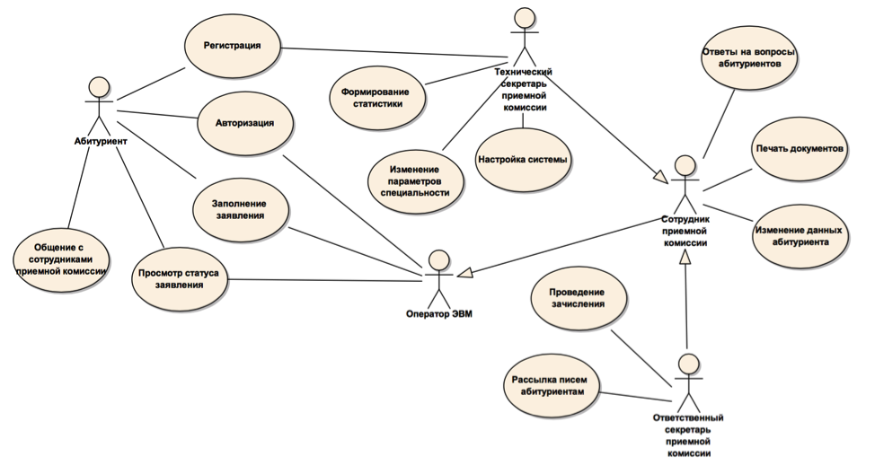
    <figcaption>Диаграмма вариантов использования</figcaption>
</figure>

Диаграмма вариантов использования разрабатываемого программного средства представлена на рисунке 2.1. На диаграмме можно выделить два основных составляющих элемента – актер и прецедент. Актер – стилизованный человек, обозначающий набор ролей пользователя, взаимодействующего с некоторой сущностью. Прецедент – эллипс с надписью, обозначающий выполняемые системой действия, приводящие к наблюдаемым актером результатам.

На основании представленной диаграммы вариантов использования можно сделать вывод, что в системе будет существовать пять основных актеров: абитуриент, оператор ЭВМ, технический секретарь приемной комиссии, сотрудник приемной комиссии, ответственный секретарь приемной комиссии.
Рассмотрим каждый из прецедентов более подробно для каждого актера.

### Абитуриент

Абитуриенту предоставляются следующие возможности:

1. регистрация: новый пользователь, желающий пользоваться программным средством, вводит свои данные в соответствующую регистрационную форму (уникальный идентификатор; пароль; электронную почту), после чего заполненную форму отправляет на сервер;
1. авторизация: пользователь, являющийся полноценным пользователем программного средства, вводит собственный уникальный идентификатор и пароль, указанный при регистрации, в форму, после чего отправляет эти данные на удаленный сервер, который проверяет их и предоставляет доступ к системе;
1. заполнение заявления: у авторизованного абитуриента есть возможность заполнить заявление необходимыми данными с проверкой системой введенных данных и отправки запроса на сервер;
1. просмотр статуса заявления: во время работы с системой абитуриент может просмотреть статус своего заявления, который может принимать значения «Заполнено полностью», «Заполнено не полностью», «Подано в университет», «Зачислен в университет», «Не зачислен», «Забрано»;
1. общение с сотрудниками приемной комиссии: абитуриент имеет возможность задать вопрос через сервис «Сообщения» и отслеживать статус темы с сообщениями в режиме реального времени.

### Оператор ЭВМ

Он является промежуточным звеном для таких ролей, как Технический секретарь приемной комиссии, Сотрудник приемной комиссии, Ответственный секретарь приемной комиссии. У всех данных ролей общим является авторизация, заполнение заявления, просмотр статуса заявления.

### Сотрудник приемной комиссии

Сотрудник приемной комиссии – унаследованная роль от Оператора ЭВМ, обладает всеми его функциями и дополнительно предоставляются возможности:

1. ответы на вопросы абитуриентов: в сервисе «Сообщения» сотрудник приемной комиссии может дать ответ на вопрос абитуриента либо перенаправить вопрос ответственному секретарю приемной комиссии, соответствующе пометив сообщение;
1. печать документов: на основании введенной в систему информации сотрудник может сформировать и распечатать ряд документов (расписку, титульный лист личного дела и т.д.);
1. изменение данных абитуриента: при проверке документов и нахождении несоответствия сотрудник может изменять данные об абитуриенте в системе.

### Ответственный секретарь приемной комиссии

Ответственный секретарь приемной комиссии – унаследованная роль от Сотрудника приемной комиссии, обладает всеми его функциями, а также:

1. рассылка писем абитуриентам: при необходимости ответственный секретарь может создавать рассылку на электронные адреса абитуриентов определенной выборки с информационными сообщениями о ходе приемной кампании;
1. проведение зачисления: ответственный секретарь может запустить процесс зачисления внутри системы, что автоматически изменит статусы заявлений всех абитуриентов, а также сформирует списки зачисленных и таблицы проходных баллов.

### Технический секретарь приемной комиссии

Технический секретарь приемной комиссии – унаследованная роль от Сотрудника приемной комиссии, обладает всеми его функциями, а также:

1. формирование статистики: технический секретарь может генерировать и публиковать статистику на сайте университета, на бумажном носителе, а также в сервисе «Статистика» системы;
1. настройка системы: технический секретарь обладает возможностью настраивать параметры системы, управлять правами пользователей;
1. регистрация: только технический секретарь может назначать пользователям права сотрудников приемной комиссии и выше;
1. изменение параметров специальности: технический секретарь имеет доступ к настройке данных о специальностей, вроде плана набора, названия специальности, формы и вида обучения, факультета и т.д.

## Спецификация функциональных требований

На основании анализа исходных данных для проектируемого программного средства можем выделить, что основной целью является создание качественного программного продукта, позволяющего решить существующие проблемы таких как:

- автоматизация процесса подачи заявления и зачисления в университет для абитуриента;
- автоматизация процесса принятия и обработки документов для сотрудников приемной комиссии;
- предоставление абитуриентам сервисов для общения с приемной комиссией в режиме реального времени, а также для дистанционного отслеживания статуса своего заявления.

В ходе разработки будут реализованы следующие возможности:

- функции настройки системы под нужды определенного университета;
- функциональность автоматизация работы с документами;
- функциональность для защищенности данных пользователей;
- функции экспорта документов в популярные форматы работы с данными (Word, Excel, PDF);
- функциональность отслеживания состояния системы в режиме реального времени;
- функция подачи заявления в университет через сеть Интернет;
- мобильная версия сервиса;
- функциональность формирования и печати всей необходимой документации (титульные листы личных дел, расписки, договора, статистика и т.д.);
- функция интеграции с базой данных РИКЗ для получения достоверных сведений о сертификатах ЦТ;
- функциональность формирования статистики поданных заявлений для публикации на сайте университета;
- функциональность генерации списков зачисленных и приказа о зачислении в университет;
- функция создания таблицы проходных баллов на специальности;
- функциональность разграничения прав доступа к различным сервисам системы посредством ролей пользователей;
- функциональность информационной рассылки абитуриентам на электронные ящики, указанные при создании личного электронного кабинета абитуриента;
- сервис сообщений между абитуриентом и приемной комиссией.

Проект представляет собой онлайн систему формирования заявления и проведения зачисления.

Доступ к системе будет предоставляться пяти категориям пользователей.

1. Абитуриент. Предоставляется возможность создания персонального электронного кабинета, заполнения заявления, редактирования его в любое время, общения с представителями приемной комиссии через сервис «Сообщения».
2. Оператор ЭВМ. Может создавать электронный кабинет для абитуриента, а также вносить дополнительные необходимые для приема документов данные.
3. Технический секретарь приемной комиссии. Имеет доступ к настройке системы, управляет правами пользователей системы, генерирует и публикует статистику поданных заявлений на сайте университета и в сервисе «Статистика».
4. Сотрудник приемной комиссии. Может отвечать на вопросы абитуриентов в сервисе «Сообщения», печатать необходимые документы на основе введенных в базу данных об абитуриенте, изменять данные абитуриентов по мере необходимости.
5. Ответственный секретарь приемной комиссии. Имеет право проводить зачисление в университет и рассылать письма на электронные ящики абитуриентов с информацией о ходе приемной кампании.

Для каждого вида пользователя предоставляется отдельный вход в свой кабинет. Для каждой роли предусмотрено наличие своего набора функций, который могут дублироваться для разных видов ролей.

Основные функции данного программного средства:

1. функции регистрации и аутентификации пользователя:
   - авторизация и аутентификация. Пользователь имеет доступ для входа в систему посредством ввода логина и пароля;
   - выход из системы. Для окончания работы пользователь выходит из системы. После успешного выхода система возвращает пользователя на страницу авторизации;
   - настройка аккаунта. Интерфейс, позволяющий пользователям изменить допустимые настройки своего аккаунта. Пользователь получает доступ для изменения данных своего аккаунта при нажатии иконки «Настройки» в правом верхнем углу страницы;
1. функции настройки системы под нужды определенного университета:
   - настройка информации об университете;
   - настройка плана набора в университет;
   - настройка набора факультетов и специальностей университета;
   - изменение модуля проведения зачисления в университет в соответствии с внутренним порядком приема документов;
1. функциональность автоматизация работы с документами:
   - формирование и печать расписок;
   - формирование и печать заявлений абитуриентов;
   - формирование и печать договор между студентами и университетом;
   - формирование и печать титульных листов личных дел абитуриентов;
   - формирование и печать справок в военно-учетный стол лицам мужского пола, зачисленным в вуз;
   - формирование и печать конвертов для извещений о зачислении абитуриентов в вуз;
1. функции экспорта документов в популярные форматы работы с данными (Word, Excel, PDF):
   - экспорт статистики поданных заявлений;
   - экспорт заявлений;
   - экспорт списка зачисленных (по специальностям, группам специальностей, вузу);
   - экспорт проходных баллов;
1. функциональность отслеживания состояния системы в режиме реального времени;
1. функция подачи заявления в университет через сеть Интернет:
   - оформление заявления в сети Интернет;
1. мобильная версия сервиса:
   - приложения для основных мобильных операционных систем (iOS, Android, Windows Phone);
   - мобильная веб-версия сайта системы для популярных браузеров (Safari, Chrome, Firefox, Internet Explorer, Opera);
1. функция интеграции с базой данных РИКЗ для получения достоверных сведений о сертификатах ЦТ:
   - получение данных абитуриента на основании введенных паспортных данных;
   - проверка введенных баллов для сертификатов;
1. функциональность формирования статистики поданных заявлений для публикации на сайте университета:
   - генерация статистики;
   - публикация на сайте университета;
   - печать бумажной версии статистики;
1. функциональность генерации списков зачисленных и приказа о зачислении в университет;
1. функциональность информационной рассылки абитуриентам на электронные ящики, указанные при создании личного электронного кабинета абитуриента:
   - выбор целевой аудитории рассылки;
   - создание и редактирования текста сообщения;
   - отправка писем;
   - отслеживания статуса рассылки сообщений;
1. сервис сообщений между абитуриентом и приемной комиссией;
   - просмотр тем сообщений;
   - создание ответов на сообщения абитуриентов;
   - закрытие или удаление темы.

# Проектирование программного средства

## Разработка программной архитектуры

Прежде чем приступать к непосредственной реализации программного средства, необходимо определиться с архитектурой коллективной обработки расписания, а также компонентов, на основе которых будет построено конечное приложение.

В первую очередь, необходимо провести анализ необходимой аппаратной конфигурации, на которой будут работать части конечного программного средства, и описать их взаимодействие между собой. Для описания узлов и их связей будем использовать диаграмму развертывания (рисунок 3.1).

<figure>
    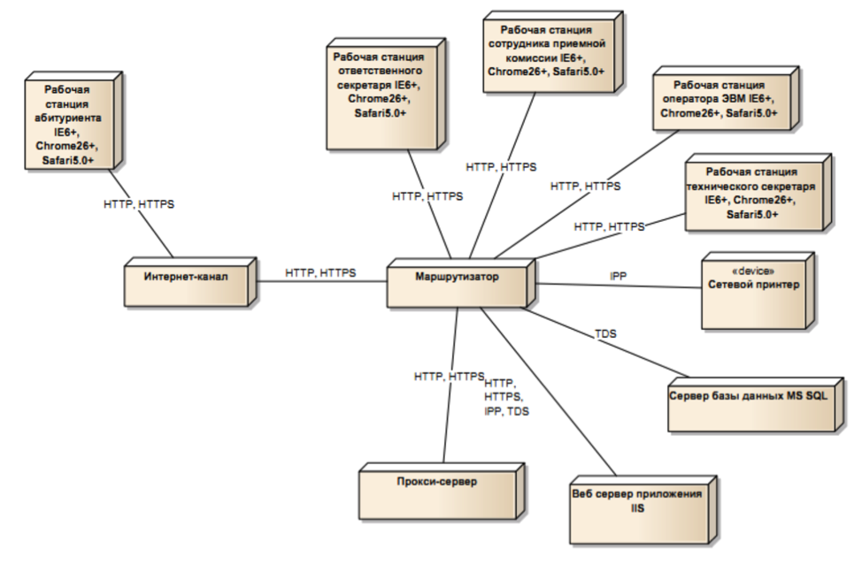
    <figcaption>Диаграмма развертывания</figcaption>
</figure>

На основе вышеизображенной диаграммы можно сделать следующие выводы:

1. узлы могут располагаться в различных частях мира и взаимодействовать между собой через сеть Интернет;
1. сервер базы данных поддерживаются в рабочем состоянии отдельно от основного сервера;
1. клиент, осуществляющий работу с системой с помощью HTTP, HTTPS;
1. HTTPS протокол применяется как клиентами, так и всевозможными серверами, с целью осуществления обмена запросами и ответами на них.

## Проектирование взаимодействия модулей системы

Данная модель выполнена по методологии IDEF0 (рисунок 3.2). Она описывает взаимодействия входных, выходных данных, а также механизм и управление отдельными модулями и взаимодействия между ними. Рассматривается с точки зрения ответственного секретаря приемной комиссии.

<figure>
    
    <figcaption>Модель системы</figcaption>
</figure>

На рисунке 3.3 изображена декомпозиция контекстной диаграммы и процесс проведения зачисления на группы специальностей в соответствии с Порядком приема в БГУИР в 2015 году.

<figure>
    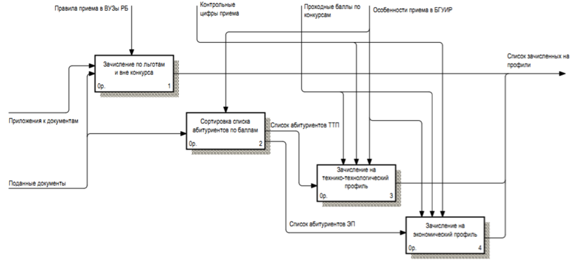
    <figcaption>Модель проведения зачисления на группы специальностей</figcaption>
</figure>

## Разработка модели базы данных

Неотъемлемой частью конечного программного средства является база данных, используемая системой в процессе работы. Информационную модель предметной области можно представить на языке IDEF1X. Модель базы данных представлена на рисунке 3.4, а также на листе формата А1 (см. Графическое приложение).

<figure>
    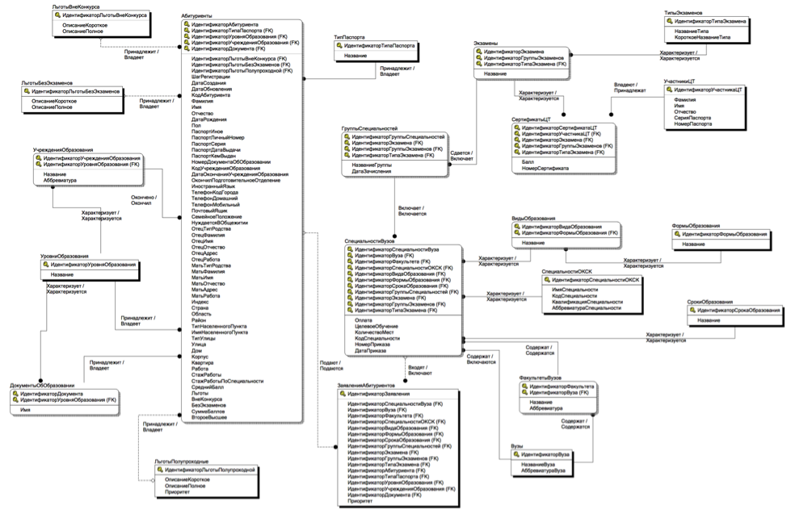
    <figcaption>Информационная модель предметной области</figcaption>
</figure>

В модели использованы три типа связей: не идентифицирующая ноль-или-один-ко-многим, не идентифицирующая многие-ко-многим и идентифицирующая один-ко-многим. Первая обозначена штриховой линией с ромбом со стороны родительской сущности и кружком со стороны дочерней сущности, вторая – штриховой линией с ромбом со стороны родительской сущности и кружком со стороны дочерней сущности, третья – линией с кружком со стороны дочерней сущности. При наличии связи «один ко многим» одна запись в одной таблице связана с множеством записей в другой таблице. Связь между таблицами организуется на основе общего поля. На стороне «один» должно выступать ключевое поле, содержащее уникальные значения – такое поле называют внешним ключом. Значения на стороне «многие» могут повторяться.

Организация связей между таблицами обеспечивает целостность данных. Система не допустит, чтобы одноименные поля в разных таблицах имели разные значения. Ввод данных автоматически контролируется. Рассмотрим сущности по-отдельности.

### Сущность «Абитуриенты»

Представляет данные об абитуриенте следующими полями:

- ИдентификаторАбитуриента – идентификатор абитуриента (первичный ключ);
- ИдентификаторТипаПаспорта – внешний ключ на сущность «ТипПаспорта»;
- ИдентификаторУровняОбразования – внешний ключ на сущность «УровниОбразования»;
- ИдентификаторУчрежденияОбразования – внешний ключ на сущность «УчрежденияОбразования»;
- ИдентификаторДокумента – внешний ключ на сущность «ДокументыОбОбразовании»;
- ИдентификаторЛьготыВнеКонкурса – внешний ключ на сущность «ЛьготыВнеКонкурса»;
- ИдентификаторЛьготыБезЭкзаменов – внешний ключ на сущность «ЛьготыБезЭкзаменов»;
- ИдентификаторЛьготыПолупроходной – внешний ключ на сущность «ЛьготыПолупроходной»;
- ШагРегистрации – этап принятия документов абитуриента;
- ДатаСоздания – дата создания записи об абитуриенте;
- ДатаОбновления – дата обновления записи об абитуриенте;
- КодАбитуриента – номер личного дела абитуриента;
- Фамилия – фамилия абитуриента;
- Имя – имя абитуриента;
- Отчество – отчество абитуриента;
- ДатаРождения – дата рождения абитуриента;
- Пол – пол абитуриента;
- ПаспортИное – нестандартный тип документа абитуриента;
- ПаспортЛичныйНомер – личный номер документа абитуриента;
- ПаспортСерия – серия документа абитуриента;
- ПаспортНомер – номер документа;
- ПаспортДатаВыдачи – дата выдачи документа;
- ПаспортКемВыдан – орган, выдавший документ;
- НомерДокументаОбОбразовании – идентификатор документа об образовании абитуриента;
- КодУчрежденияОбразования – код учреждения образования, которое абитуриент закончил в год подачи документов;
- ДатаОкончанияУчрежденияОбразования – дата окончания учреждения образования;
- ОкончилПодготовительноеОтделение – признак прохождения абитуриентом подготовительного отделения вуза;
- ИностранныйЯзык – иностранный язык, который абитуриент изучал в общеобразовательной школе;
- ТелефонКодГорода – код города домашнего телефона абитуриента;
- ТелефонДомашний – номер домашнего телефона абитуриента;
- ТелефонМобильный – номер мобильного телефона абитуриента;
- ПочтовыйЯщик – электронный адрес абитуриента;
- СемейноеПоложение – семейной положение абитуриента;
- НуждаетсяВОбщежитии – признак нужды абитуриента в общежитии при поступлении в вуз;
- ОтецТипРодства – тип родства отца (опекуна) абитуриента с абитуриентом;
- ОтецФамилия – фамилия отца (опекуна);
- ОтецИмя – имя отца (опекуна);
- ОтецОтчество – отчество отца (опекуна);
- ОтецАдрес – адрес отца (опекуна);
- ОтецРабота – место работы отца (опекуна);
- МатьТипРодства – тип родства матери (опекунши) абитуриента с абитуриентом;
- МатьФамилия – фамилия матери (опекунши);
- МатьИмя – имя матери (опекунши);
- МатьОтчество – отчество матери (опекунши);
- МатьАдрес – адрес матери (опекунши);
- МатьРабота – место работы матери (опекунши);
- Индекс – домашний индекс;
- Страна – страна проживания абитуриента;
- Область – области проживания;
- Район – район проживания;
- ТипНаселенногоПункта – тип населенного пункта;
- ИмяНаселенногоПункта – название населенного пункта;
- ТипУлицы – тип улицы;
- Улица – название улицы;
- Дом – номер дома;
- Корпус – номер корпуса;
- Квартира – номер квартиры;
- Работа – место работы абитуриента;
- СтажРаботы – общий стаж работы абитуриента;
- СтажРаботыПоСпециальности – стаж работы абитуриента по специальности, на которую подаются документы;
- СреднийБалл – средний балл документа об образовании;
- Льготы – льготы, указанные абитуриентом в Электронном кабинете;
- ВнеКонкурса – признак зачисления абитуриента вне конкурса;
- БезЭкзаменов – признак зачисления абитуриента без экзаменов;
- СуммаБаллов – общая сумма баллов абитуриента;
- ВтороеВысшее – признак получения абитуриентом второго высшего образования.

Сущность имеет идентифицирующие связи «многие к одному» с сущностями «ТипПаспорта», «Уровни образования», «Учреждения образования», «ДокументыОбОбразовании», а также не идентифицирующие связи «многие к одному или нулю» с сущностями «ЛьготыВнеКонкурса», «ЛьготыБезЭкзаменов» и «ЛьготыПолупроходные». Также сущность имеет не идентифицирующую связь «ноль или один ко многим» с сущностью «ЗаявленияАбитуриентов».

### Сущность «ВидыОбразования»

Представляет виды образования со следующими полями:

- ИдентификаторВидаОбразования – идентификатор вида образования (первичный ключ);
- ИдентификаторФормыОбразования – внешний ключ на сущность «ФормыОбразования»;
- Название – название вида образования.

Сущность имеет связь «многие к одному» с сущностью «ФормыОбразования» и связь «один ко многим» с сущностью «СпециальностиВузов».

### Сущность «Вузы»

Представляет описания вузов со следующими полями:

- ИдентификаторВуза – идентификатор вуза (первичный ключ);
- НазваниеВуза – наименование вуза;
- АббревиатураВуза – аббревиатура вуза.

Сущность имеет связь «один ко многим» с сущностью «СпециальностиВузов».

### Сущность «ГруппыСпециальностей»

Представляет группы специальностей со следующими полями:

- ИдентификаторГруппыСпециальностей – идентификатор группы специальностей (первичный ключ);
- ИдентификаторГруппыЭкзаменов – внешний ключ на сущность «ГруппыЭкзаменов»;
- НазваниеГруппы – название группы специальностей;
- ДатаЗачисления – дата проведения зачисления на группу специальностей.

Сущность имеет связь «один ко многим» с сущностью «СпециальностиВузов» и связь «многие ко многим» с сущностью «Экзамены».

### Сущность «ДокументыОбОбразовании»

Представляет документы о получении образования со следующими полями:

- ИдентификаторДокумента – идентификатор документа об образовании (первичный ключ);
- ИдентификаторУровняОбразования – внешний ключ на сущность «УровниОбразования»;
- Имя – название документа об образовании.

Сущность имеет связь «один ко многим» с сущностью «Абитуриенты».

### Сущность «ЗаявленияАбитуриентов»

Представляет заявления абитуриентов со следующими полями:

- ИдентификаторЗаявления – идентификатор заявления абитуриента (первичный ключ);
- ИдентификаторСпециальностиВуза – внешний ключ на сущность «СпециальностиВузов»;
- ИдентификаторАбитуриента – внешний ключ на сущность «Абитуриенты»;
- Приоритет – порядковый номер указания выбранной специальности абитуриентом в заявлении.

Сущность имеет связь «многие к одному» с сущностями «Абитуриенты» и «СпециальностиВузов».

### Сущность «ЛьготыБезЭкзаменов»

Представляет описания видов льгот без экзаменов со следующими полями:

- ИдентификаторЛьготыБезЭкзаменов – идентификатор льготы (первичный ключ);
- ОписаниеКороткое – короткое описание льготы;
- ОписаниеПолное – полное описание льготы.

Сущность имеет связь «один ко многим» с сущностью «Абитуриенты».

### Сущность «ЛьготыВнеКонкурса»

Представляет описания видов льгот вне конкурса со следующими полями:

- ИдентификаторЛьготыВнеКонкурса – идентификатор льготы (первичный ключ);
- ОписаниеКороткое – короткое описание льготы;
- ОписаниеПолное – полное описание льготы.

Сущность имеет связь «один ко многим» с сущностью «Абитуриенты».

### Сущность «ЛьготыПолупроходные»

Представляет описания видов полупроходных льгот со следующими полями:

- ИдентификаторЛьготыПолупроходной – идентификатор льготы (первичный ключ);
- ОписаниеКороткое – короткое описание льготы;
- ОписаниеПолное – полное описание льготы;
- Приоритет – приоритет льготы при полупроходном балле.

Сущность имеет связь «многие ко многим» с сущностью «Абитуриенты».

### Сущность «СертификатыЦТ»

Представляет сертификаты централизованного тестирования со следующими полями:

- ИдентификаторСертификатаЦТ – идентификатор сертификата ЦТ (первичный ключ);
- ИдентификаторУчастникаЦТ – внешний ключ на сущность «УчастникиЦТ»;
- ИдентификаторЭкзамена – внешний ключ на сущность «Экзамены»;
- Балл – балл сертификата;
- НомерСертификата – номер сертификата.

Сущность имеет связь «многие к одному» с сущностью «УчастникиЦТ».

### Сущность «СпециальностиВузов»

Представляет специальности вузов со следующими полями:

- ИдентификаторСпециальностиВуза – идентификатор специальности (первичный ключ);
- ИдентификаторВуза – внешний ключ на сущность «Вузы»;
- ИдентификаторФакультета – внешний ключ на сущность «ФакультетыВузов»;
- ИдентификаторСпециальностиОКСК – внешний ключ на сущность «СпециальностиОКСК»;
- ИдентификаторВидаОбразования – внешний ключ на сущность «ВидыОбразования»;
- ИдентификаторСрокаОбразования – внешний ключ на сущность «СрокиОбразования»;
- ИдентификаторГруппыСпециальностей – внешний ключ на сущность «ГруппыСпециальностей»;
- Оплата – признак платной формы обучения;
- ЦелевоеОбучение – признак целевого получения образования;
- КоличествоМест – количество мест на специальность;
- КодСпециальности – код специальности;
- НомерПриказа – номер приказа о зачислении на специальность;
- ДатаПриказа – дата приказа о зачислении на специальность.

Сущность имеет связь «один ко многим» с сущностями «ГрупыСпециальностей», «ФакультетыВузов», «Вузы», «ВидыОбразования», «СрокиОбразования», а также связь «многие к одному» с сущностями «ЗаявленияАбитуриентов».

### Сущность «СпециальностиОКСК»

Представляет специальности в общем классификаторе специальностей и квалификаций со следующими полями:

- ИдентификаторСпециальностиОКСК – идентификатор специальности (первичный ключ);
- ИмяСпециальности – наименование специальности;
- КодСпециальности – код специальности;
- КвалификацияСпециальности – квалификация специальности;
- АббревиатураСпециальности – аббревиатура специальности.

Сущность имеет связь «многие к одному» с сущностью «СпециальностиВузов».

### Сущность «СрокиОбразования»

Представляет сроки получения образования со следующими полями:

- ИдентификаторСрокаОбразования – идентификатор срока получения образования (первичный ключ);
- Название – название срока получения образования.

Сущность имеет связь «один ко многим» с сущностью «СпециальностиВузов».

### Сущность «ТипПаспорта»

Представляет типы документов, удостоверяющих личность, со следующими полями:

- ИдентификаторТипаПаспорта – идентификатор типа документа (первичный ключ);
- Название – название типа документа.

Сущность имеет связь «один ко многим» с сущностью «Абитуриенты».

### Сущность «ТипыЭкзаменов»

Представляет типы вступительных испытаний со следующими полями:

- ИдентификаторТипаЭкзамена – идентификатор типа экзамена (первичный ключ);
- НазваниеТипа – название типа;
- КороткоеНазваниеТипа – короткое название типа экзамена.

Сущность имеет связь «один ко многим» с сущностью «Экзамены».

### Сущность «УровниОбразования»

Представляет уровни получения образования со следующими полями:

- ИдентификаторУровняОбразования – идентификатор уровня (первичный ключ);
- Название – наименование уровня получения образования.

Сущность имеет связь «один ко многим» с сущностями «УчрежденияОбразования», «ДокументыОбОбразовании», «Абитуриенты».

### Сущность «УчастникиЦТ»

Представляет участников централизованного тестирования со следующими полями:

- ИдентификаторУчастникаЦТ – идентификатор участника ЦТ (первичный ключ);
- Фамилия – фамилия участника;
- Имя – имя участника;
- Отчество – отчество участника;
- СерияПаспорта – серия паспорта участника ЦТ;
- НомерПаспорта – номер паспорта участника ЦТ.

Сущность имеет связь «один ко многим» с сущностью «СертификатыЦТ».

### Сущность «УчрежденияОбразования»

Представляет виды учреждений образования со следующими полями:

- ИдентификаторУчрежденияОбразования – идентификатор вида учреждения образования (первичный ключ);
- ИдентификаторУровняОбразования – внешний ключ на сущность «УровниОбразования»;
- Название – наименование учреждения образования;
- Аббревиатура – аббревиатура учреждения образования.

Сущность имеет связь «один ко многим» с сущностью «Абитуриенты» и связь «многие к одному» с сущностью «УровниОбразования».

### Сущность «ФакультетыВузов»

Представляет факультеты вузов со следующими полями:

- ИдентификаторФакультета – идентификатор факультета (первичный ключ);
- ИдентификаторВуза – внешний ключ на сущность «Вузы»;
- Название – наименование факультета;
- Аббревиатура – аббревиатура факультета.

Сущность имеет связь «один ко многим» с сущностью «СпециальностиВузов» и связь «многие к одному» с сущностью «Вузы».

### Сущность «ФормыОбразования»

Представляет формы получения образования со следующими полями:

- ИдентификаторФормыОбразования – идентификатор формы получения образования (первичный ключ);
- Название – наименование формы получения образования.

Сущность имеет связь «один ко многим» с сущностью «ВидыОбразования».

### Сущность «Экзамены»

Представляет вступительные испытания со следующими полями:

- ИдентификаторЭкзамена – идентификатор экзамена (первичный ключ);
- ИдентификаторГруппыЭкзаменов – идентификатор группы вступительных испытаний (вторичный ключ);
- ИдентификаторТипаЭкзамена – внешний ключ на сущность «ТипыЭкзаменов»;
- Название – наименование вступительного испытания.

Сущность имеет связь «один ко многим» с сущностями «СертификатыЦТ» и «ГруппыСпециальностей» и связь «многие к одному» с сущностью «ТипыЭкзаменов».

## Разработка схемы алгоритма работы с программой

Схема алгоритма выполнена на листе формата А1 (см. Графическое приложение), а также на рисунке 3.5. Данная схема отображает алгоритм работы с сайтом. Браузер пытается подключиться и загрузить страницу. Далее пользователь имеет ряд путей работы: переходы по ссылкам внутри сайта и использование его разделов. Если пользователь закрывает вкладку или переходит по внешней ссылке, то работа с сайтом закончена.

<figure>
    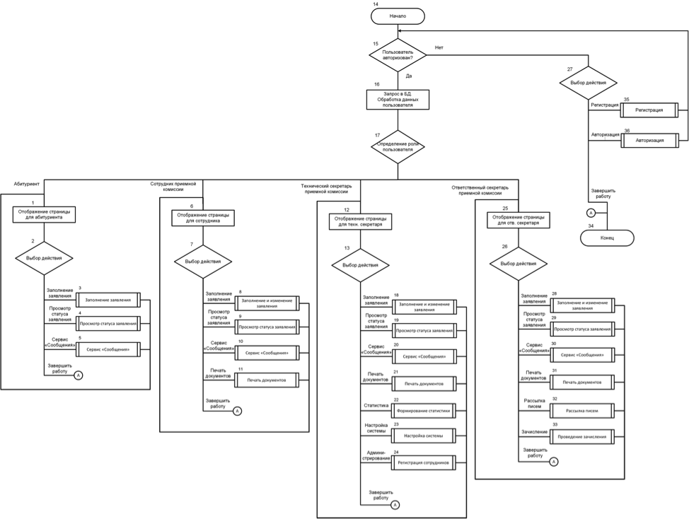
    <figcaption>Схема алгоритма работы с программой</figcaption>
</figure>

## Разработка алгоритма входа пользователя в систему

Вход пользователя в систему состоит из аутентификации и авторизации. Аутентификация представляет собой поиск соответствия пользователя названному им идентификатору. Авторизация – предоставление этому пользователю возможностей в соответствии с положенными ему правами. Алгоритм аутентификации представлен на рисунке 3.6.

<figure>
    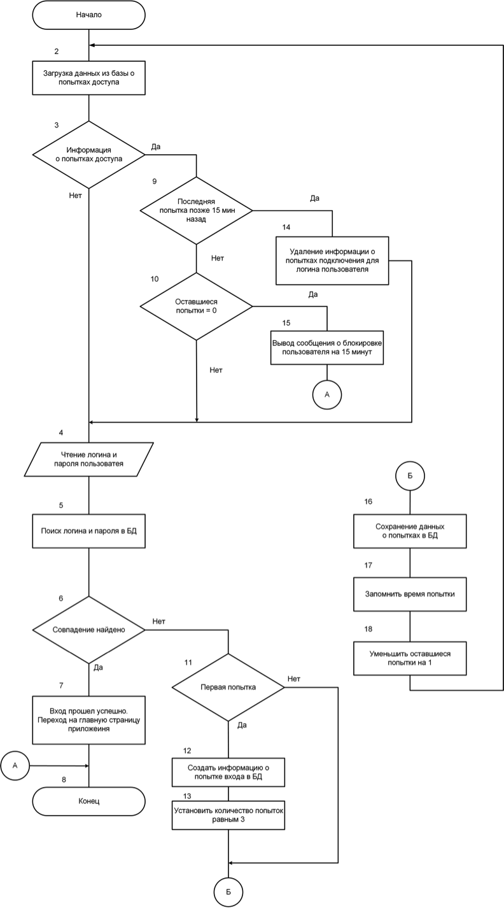
    <figcaption>Схема алгоритма входа с блокировкой</figcaption>
</figure>

Данный алгоритм реализует функцию аутентификации в системе с блокировкой на 15 минут по троекратному вводу неверных данных пользователя.

Сразу после входа на страницу аутентификации система пробует извлечь из контекста приложения данные об уже произведенных пользователем неудачных попытках входа в систему.

Если данные доступны, то система проверяет, как давно была произведена последняя неудачная попытка входа в систему. Если более 15 минут назад, то информация о попытках доступа стирается и пользователю предоставляется доступ к полям ввода идентификационных данных. Если менее 15 минут, то проверяется количество оставшихся попыток, и если попыток не осталось, то приложение перенаправляет пользователя на страницу с сообщением, что его адрес заблокирован на 15 минут, после чего алгоритм прекращает свою работу.

Если у пользователя еще остались попытки или данные о попытках отсутствуют, программа ждет ввода имени пользователя и пароля, после чего ищет пользователя с таким именем и паролем в БД. Если поиск завершился успешно, то пользователя аутентифицирован и может начинать работу с программным средством. В противном случае, происходит сохранение текущего времени, как времени последней неудачной попытки, и уменьшение количества оставшихся попыток на 1, а если это первая попытка, то предварительно инициализируется и сохраняется в контекст приложения информация о количестве оставшихся попыток равным трем.

## Разработка алгоритма обработки заявлений абитуриентов

Одной из важных функциональных возможностей системы является обработки заявлений абитуриентов. Данная функциональность доступна только для роли «Оператор ЭВМ» и наследуемых от нее.

В начале работы система составляет запрос к БД на получение данных о существующих в системе заявлениях (блок 11). После чего формируется код страницы и отображается таблица (блок 12). Оператору ЭВМ предоставляется выбор, какое действие он совершит далее:

- обработка отдельного заявления;
- поиск необходимого заявления;
- фильтр (по специальности или дате подаче заявления);
- завершение работы по обработке заявлений.

После настройки фильтра или поиска необходимого заявления (блок 18 и 21) оператор возвращается на страницу отображения заявлений, но уже с  измененными параметрами для отображения.

С отдельным заявлением оператор может выполнить следующие действия:

- удалить заявление (блоки 2, 3);
- отредактировать заявление (блоки 8, 9);
- изменить статус заявления (блоки 14-17).

<figure>
    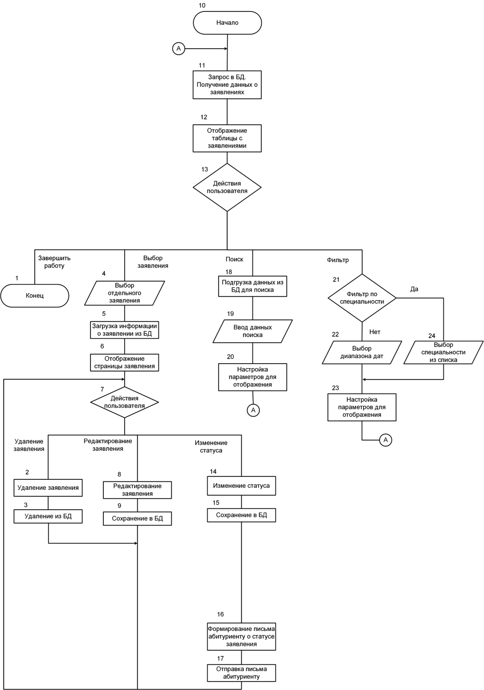
    <figcaption>Схема алгоритма обработки заявок пользователя</figcaption>
</figure>

# Создание программного средства

Спецификация функциональных требований и спроектированная архитектура программного средства служат фундаментом, на котором основывается выбор наиболее подходящих технологий для разработки программного средства. Успешное и обоснованное завершение данных этапов позволит создать расширяемое, надежное и функциональное приложение, призванное решать поставленные задачи.

## Обоснование выбора средств разработки ПС

Для разработки программного продукта были выбраны технология .NET MVC и язык JavaScript, являющийся самым популярным для разработки клиентской части приложения.

### Технология REST

REST (сокр. англ. Representational State Transfer, «передача состояния представления» или «передача репрезентативного состояния») – стиль по-строения архитектуры распределенного приложения. Был описан и популяризован в 2000 году Роем Филдингом, одним из создателей протокола HTTP. Самой известной системой, построенной в значительной степени по архитектуре REST, является современная Всемирная паутина.

Данные в REST должны передаваться в виде небольшого количества стандартных форматов (например, HTML, XML, JSON). Сетевой протокол (как и HTTP) должен поддерживать кэширование, не должен зависеть от сетевого слоя, не должен сохранять информацию о состоянии между парами «запрос-ответ». Утверждается, что такой подход обеспечивает масштабируемость системы и позволяет ей эволюционировать с новыми требованиями [14].

Данная технология отвечает за различные реакции программного продукта на какие-либо запросы к уровню промежуточного сервера.

### Протокол шифрования SSL

SSL (англ. Secure Sockets Layer – уровень защищённых сокетов) – криптографический протокол, который обеспечивает безопасность связи. Он использует асимметричную криптографию для аутентификации ключей об-мена, симметричное шифрование для сохранения конфиденциальности, коды аутентификации сообщений для целостности сообщений. Протокол широко используется для обмена мгновенными сообщениями и передачи голоса че-рез IP (англ. Voice over IP – VoIP) в таких приложениях, как электронная почта, Интернет-факс и др.

SSL изначально разработан компанией Netscape Communications для добавления протокола HTTPS в свой веб-браузер Netscape Navigator. Впоследствии, на основании протокола SSL 3.0 был разработан и принят стандарт RFC, получивший имя TLS.

Протокол SSL позволяет общаться клиенту с сервером в сети, предотвращая перехват или фальсификацию. Так как протоколы могут работать либо без SSL, либо поверх SSL, то для клиента необходимо указать серверу, хочет ли он установить соединение SSL или нет. Есть две возможности сделать это. Одним из вариантов является использование различных номеров портов для соединения SSL (например, порт 443 для HTTPS). Другой заключается в использовании регулярного номера порта, сервер установит соединение с клиентом, используя протокол конкретного механизма (например, STARTTLS для почты и новостных протоколов). После того как клиент и сервер решили использовать SSL, они ведут переговоры, отслеживая состояние соединения с помощью процедуры рукопожатия. Вовремя этого рукопожатия клиент и сервер соглашаются на различные параметры, используемые для установки безопасного соединения. После завершения процедуры рукопожатия начинается защищенное соединение. Клиент и сервер используют сеансовые ключи для шифрования и дешифрования данных, которые они посылают друг другу. Это нормальный алгоритм работы по защищенному ка-налу. В любое время, в связи с внутренним или внешним раздражителем (автоматическое вмешательство или вмешательство пользователя), любая из сторон может пересмотреть сеанс связи. В этом случае весь процесс повторяется. SSL работает модульным способом [15].

В протоколе SSL все данные передаются в виде записей-объектов, со-стоящих из заголовка и передаваемых данных.

Данная технология отвечает за безопасную передачу различных данных между клиентской частью и сервером данных.

### Язык программирования JavaScript

JavaScript – прототипно-ориентированный сценарный язык программирования. Является диалектом языка ECMAScript.

JavaScript обычно используется как встраиваемый язык для программного доступа к объектам приложений. Наиболее широкое применение находит в браузерах как язык сценариев для придания интерактивности веб-страницам.

Основные архитектурные черты: динамическая типизация, слабая типизация, автоматическое управление памятью, прототипное программирование, функции как объекты первого класса.

На JavaScript оказали влияние многие языки, при разработке была цель сделать язык похожим на Java, но при этом лёгким для использования непрограммистами. Языком JavaScript не владеет какая-либо компания или организация, что отличает его от ряда языков программирования, используемых в веб-разработке.

Название «JavaScript» является зарегистрированным товарным знаком компании Oracle Corporation.

JavaScript является объектно-ориентированным языком, но используемое в языке прототипирование обуславливает отличия в работе с объектами по сравнению с традиционными класс-ориентированными языками. Кроме того, JavaScript имеет ряд свойств, присущих функциональным языкам – функции как объекты первого класса, объекты как списки, карринг, анонимные функции, замыкания – что придаёт языку дополнительную гибкость.

Несмотря на схожий с Си синтаксис, JavaScript по сравнению с языком Си имеет коренные отличия:

- объекты, с возможностью интроспекции;
- функции как объекты первого класса;
- автоматическое приведение типов;
- автоматическая сборка мусора;
- анонимные функции.

В языке отсутствуют такие полезные вещи, как:

- модульная система: JavaScript не предоставляет возможности управлять зависимостями и изоляцией областей видимости;
- стандартная библиотека: в частности, отсутствует интерфейс программирования приложений по работе с файловой системой, управлению потоками ввода-вывода, базовых типов для бинарных данных;
- стандартные интерфейсы к веб-серверам и базам данных;
- система управления пакетами, которая бы отслеживала зависимости и автоматически устанавливала их.

Данный язык является основополагающим в реализации клиентской части программного средства, реализованного в рамках этого дипломного проекта.

### Технология AJAX

Asynchronous Javascript and XML – подход к построению интерактивных пользовательских интерфейсов веб-приложений, заключающийся в «фоновом» обмене данными браузера с веб-сервером. В результате, при обновлении данных веб-страница не перезагружается полностью, и веб-приложения становятся быстрее и удобнее.

AJAX – не самостоятельная технология, а концепция использования нескольких смежных технологий. AJAX базируется на двух основных принципах:

1. Использование технологии динамического обращения к серверу «на лету», без перезагрузки всей страницы полностью, например:
    - с использованием XMLHttpRequest (основной объект);
    - через динамическое создание дочерних фреймов;
    - через динамическое создание тега <script>;
    - через динамическое создание тега , как это реализовано в google analytics.

1. Использование DHTML для динамического изменения содержания страницы.

Действия с интерфейсом преобразуются в операции с элементами DOM (англ. Document Object Model), с помощью которых обрабатываются данные, доступные пользователю, в результате чего представление их изменяется. Здесь же производится обработка перемещений и щелчков мышью, а также нажатий клавиш. Каскадные таблицы стилей, или CSS (англ. Cascading Style Sheets), обеспечивают согласованный внешний вид элементов приложения и упрощают обращение к DOM-объектам. Объект XMLHttpRequest (или подобные механизмы) используется для асинхронного взаимодействия с сервером, обработки запросов пользователя и загрузки в процессе работы необходимых данных.

Три из этих четырех технологий – CSS, DOM и JavaScript – составляют DHTML (англ. Dynamic HTML) [16]. По мнению некоторых специалистов средства DHTML, появившиеся в 1997 году, подавали большие надежды, но так и не оправдали их.

В качестве формата передачи данных могут использоваться фрагменты простого текста, HTML-кода, JSON или XML.

Данная технология применяется для взаимодействия клиентской части с серверной без необходимости полной перезагрузки страницы на клиентской стороне.

### Язык программирования C#

C#  – объектно-ориентированный язык программирования, который относится к семье языков с C-подобным синтаксисом, из них его синтаксис наиболее близок к C++ и Java. Язык имеет статическую типизацию, поддерживает полиморфизм, перегрузку операторов (в том числе операторов явного и неявного приведения типа), делегаты, атрибуты, события, свойства, обобщённые типы и методы, итераторы, анонимные функции с поддержкой замыканий, LINQ, исключения, комментарии в формате XML.

Переняв многое от своих предшественников – языков C++, Pascal, Модула, Smalltalk и, в особенности, Java – С#, опираясь на практику их использования, исключает некоторые модели, зарекомендовавшие себя как проблематичные при разработке программных систем, например, C# в отличие от C++ не поддерживает множественное наследование классов (между тем допускается множественное наследование интерфейсов).

C# разрабатывался как язык программирования прикладного уровня для CLR и, как таковой, зависит, прежде всего, от возможностей самой CLR. Это касается, прежде всего, системы типов C#, которая отражает BCL. Присутствие или отсутствие тех или иных выразительных особенностей языка диктуется тем, может ли конкретная языковая особенность быть транслирована в соответствующие конструкции CLR. CLR предоставляет C#, как и всем другим .NET-ориентированным языкам, многие возможности, которых лишены «классические» языки программирования.

На данном языке полностью написан серверный код разработанного программного средства.

Кэширование используется для ускорения вызовов и обращения к страницам сайта при помощи сохранения результатов их работы в файл.

### База данных Microsoft SQL Server

Microsoft SQL Server – система управления реляционными базами данных (СУРБД), разработанная корпорацией Microsoft. Основной используемый язык запросов – Transact-SQL, создан совместно Microsoft и Sybase. Transact-SQL является реализацией стандарта ANSI/ISO по структурированному языку запросов (SQL) с расширениями. Используется для работы с базами данных размером от персональных до крупных баз данных масштаба предприятия; конкурирует с другими СУБД в этом сегменте рынка.

30 июня 2010 года Скотт Гатри в своём блоге анонсировал выход новой мобильной версии SQL Server – SQL Server Compact 4.0, ориентированной в первую очередь на веб-приложения, созданные на основе технологии ASP.NET 4. В качестве достоинств новой версии Гатри выделил отсутствие необходимости в установке программы, а также совместимость с API .NET Framework (поддержка технологий ADO.NET, Entity Framework, NHibernate и др., возможность работы с Visual Studio 2010 и Visual Web Developer 2010 Express) и последними на тот момент версиями SQL Server и SQL Azure [17].

7 июля 2010 года Амбриш Мишра, менеджер проекта SQL Server Compact, в официальном блоге команды разработчиков SQL Server CE представил версию CTP1 нового SQL Server Compact 4.0. В качестве нововведений (помимо указанных Скоттом Гатри) указывались повышенная надёжность, улучшение алгоритма шифрования SHA 2, совместимость с файлами БД версии Compact 3.5, упрощение установки (в том числе и поддержка режимов WOW64 и 64-битных естественных приложений), снижение использования виртуальной памяти, технология делегирования полномочий Allow Partially Trusted Caller’s Attribute (APTCA), поддержка WebMatrix Beta и Visual Studio 2010, поддержка Paging Queries в языке T-SQL. При этом версия CTP1 обладала определёнными проблемами (некорректная работа деинсталляции через командную строку, проблемы с совместимостью с актуальной на тот момент версией ADO.NET Entity Framework CTP3 и др.).

СУБД Microsoft SQL Server включают следующие важные для реализации проекта возможности:

- хранимые процедуры и функции;
- обработчики ошибок;
- курсоры;
- триггеры;
- представления;
- информационная схема (так называемый системный словарь, содержащий метаданные).

Подводя итог выше сказанного, можно сказать, что для разработки программного средства автоматизации приемной кампании БГУИР выбраны самые актуальные, современные и качественные технологии, которые включают в себя огромный потенциал возможностей.

## Используемые модули и фреймворки

При разработке программного средства использованы фреймворки ASP.NET MVC Framework для написания серверной части кода, jQuery – для написания клиентской части кода и Entity Framework – для обеспечения взаимодействия СУБД с бизнес-слоем приложения.

### ASP.NET MVC Framework

ASP.NET MVC Framework – фреймворк для создания веб-приложений, который реализует шаблон Model-view-controller. Данный фреймворк добавлен Microsoft в ASP.NET.
Платформа ASP.NET MVC базируется на взаимодействии трех компонентов: контроллера, модели и представления. Контроллер принимает запросы, обрабатывает пользовательский ввод, взаимодействует с моделью и представлением и возвращает пользователю результат обработки запроса [18].

Модель представляет слой, описывающий логику организации данных в приложении. Представление получает данные из контроллера и генерирует элементы пользовательского интерфейса для отображения информации.

Для управления разметкой и вставками кода в представлении используется движок представлений. До версии MVC 5 использовались два движка:

Web Forms и Razor. Начиная с MVC 5 единственным движком, встроенным по умолчанию, является Razor. Движок WebForms использует файлы .aspx, а Razor - файлы .cshtml и .vbhtml для хранения кода представлений. Основой синтаксиса Razor является знак @, после которого осуществляется переход к коду на языках C#/VB.NET. Также возможно и использование сторонних движков. Файлы представлений не являются стандартными статическими страницами с кодом html, а в процессе генерации контроллером ответа с использованием представлений компилируются в классы, из которых затем генерируется страница html.

При обработке запросов фреймворк ASP.NET MVC опирается на систему маршрутизации, которая сопоставляет все входящие запросы с определенными в системе маршрутами, которые указывают какой контроллер и метод должен обработать данный запрос. Встроенный маршрут по умолчанию предполагает трехзвенную структуру: контроллер/действие/параметр.

### jQuery

jQuery – библиотека JavaScript, фокусирующаяся на взаимодействии JavaScript и HTML. Библиотека jQuery помогает легко получать доступ к любому элементу DOM, обращаться к атрибутам и содержимому элементов DOM, манипулировать ими. Также библиотека jQuery предоставляет удобный API для работы с AJAX [19].

Точно так же, как CSS отделяет визуализацию от структуры HTML, JQuery отделяет поведение от структуры HTML. Например, вместо прямого указания на обработчик события нажатия кнопки управление передаётся JQuery, которая идентифицирует кнопки и затем преобразует его в обработчик события клика. Такое разделение поведения и структуры также называется принципом ненавязчивого JavaScript.

Библиотека jQuery содержит функциональность, полезную для максимально широкого круга задач. Тем не менее, разработчиками библиотеки не ставилась задача совмещения в jQuery функций, которые подошли бы всюду, поскольку это привело бы к большому коду, большая часть которого не востребована. Поэтому была реализована архитектура компактного универсального ядра библиотеки и плагинов. Это позволяет собрать для ресурса именно ту JavaScript-функциональность, которая на нём была бы востребована.

### Entity Framework

ADO.NET Entity Framework (EF) – объектно-ориентированная технология доступа к данным, является object-relational mapping (ORM) решением для .NET Framework от Microsoft. Предоставляет возможность взаимодействия с объектами как посредством LINQ в виде LINQ to Entities, так и с использованием Entity SQL. Для облегчения построения web-решений используется как ADO.NET Data Services (Astoria), так и связка из Windows Communication Foundation и Windows Presentation Foundation, позволяющая строить многоуровневые приложения, реализуя один из шаблонов проектирования MVC, MVP или MVVM.

Entity SQL представляет собой язык, подобный языку SQL, который позволяет выполнять запросы к концептуальным моделям в Entity Framework.

Изначально с самой первой версии Entity Framework поддерживал подход Database First, который позволял по готовой базе данных сгенерировать модель edmx. Затем эта модель использовалась для подключения к базе данных. Позже был добавлен подход Model First. Он позволял создать вручную с помощью визуального редактора модель edmx, и по ней создать базу данных. Начиная с версии 5.0 предпочтительным подходом становится Code First. Его суть – сначала пишется код модели на c#, а затем по нему генерируется база данных. При этом модель edmx уже не используется.

## Описание классов и методов

В системе используется шаблон проектирования MVC, благодаря которому код, более понятный по структуре, логика и отображение разделены между собой. Рассмотрим основные классы приложения.

### Класс AbiturRepos

Класс обработки действий с записями абитуриентов. Содержит следующие методы:

- FixErrorsInSpecialities – исправить несоответствия между моделями сайта приемной комиссии и электронным кабинетом абитуриента;
- GetList – получить список абитуриентов;
- GetListByZach – получить список зачисленных абитуриентов;
- GetListByZachForPrint_Spravki – получить список зачисленных абитуриентов с полями для печати справок;
- GetListByZachForPrint_Letters – получить список зачисленных абитуриентов извещений;
- Details – получить детальную информацию об абитуриенте;
- Edit – редактировать информацию об абитуриенте; 
- GetProfile_FromSite – получить профиль абитуриента с Электронного кабинета абитуриента;
- GetCertf – получить сертификат ЦТ по серии и номеру паспорта абитуриента;
- Save – сохранить изменения в БД;
- GetList_FromPK – получить список абитуриентов с сайта приемной комиссии;
- Details_FromPK – получить детальную информацию об абитуриенте с сайта приемной комиссии;
- GetProfile_FromPK – получить профиль абитуриента с сайта приемной комиссии;
- PrepareForEdit – подготовить запись к редактированию через интерфейс;
- New – создать новую запись об абитуриенте;
- PrepareForSave – подготовить запись для сохранения;
- ConvertToDb_PK – сформировать запись, пригодную для сохранения в БД;
- CheckStatus – получить статус заявления абитуриента;
- Save_ToPK – сохранить изменения в БД приемной комиссии;
- IsCanSave – проверить возможность сохранения изменений;
- Delete – удалить запись;
- Delete_PK – удалить запись из БД приемной комиссии;
- AddToOchered – добавить абитуриента в очередь;
- AddToOchered_FromPK – добавить абитуриента в очередь на сайте приемной комиссии;
- AddToBSUIR – добавить абитуриента на сайт Электронный кабинет;
- RemoveFromBsuir – удалить абитуриента с сайта Электронный кабинет;
- GetSpecCodeFirstSpec – получить первую специальность с указанным кодом специальности;
- ZachToBSUIR – провести зачисление абитуриента.

### Класс ExamRepos

Класс работы с записями о вступительных испытаниях. Основные методы класса:

- GetList – получить список доступных вступительных испытаний;
- GetListForFilter – получить список доступных вступительных испытаний для фильтра;
- GetExamTypes – получить список типов вступительных испытаний;
- GetExams – получить список вступительных испытаний для конкретной специальности;
- FillExamsFields – заполнить поля для отображения в интерфейсе приложения;
- HasVnExam – проверить специальность на необходимость сдачи внутреннего экзамена.

### Класс FacultyRepos

Класс работы с записями о факультетах вуза. Реализует следующие методы:

- GetList – получить список факультетов;
- GetList_Filter – получить список факультетов, отфильтрованный по параметрам;
- GetById – получить факультет с указанным идентификатором;
- ConvertToModel – вернуть пригодную для отображения на интерфейсе модель факультета.

### Класс FormaObuchRepos

Класс работы с записями о формах обучения. Содержит методы:

- GetList – получить список форм обучения;
- GetList_Filter – получить список форм обучения, отфильтрованный по параметрам.

### Класс LgotyRepos

Класс работы со льготами. Реализует следующие методы:

- GetBezEkzList – получить список льгот без экзаменов;
- GetVneKonkList – получить список льгот вне конкурса;
- GetPoluprList – получить список полупроходных льгот.

### Класс MembershipRepos

Класс управления доступом пользователей к действиям на сайте. Имеет методы:

- CanEditInSite – проверить возможность редактирования на сайте Электронный кабинет;
- CanEditInOchered – проверить возможность редактирования записи в очереди;
- CanEditInVuz – проверить возможность редактирования записи, принятой в обработку в вуз;
- SaveUserPermissions – сохранить права доступа пользователя;
- GetUserPermissions – получить права доступа пользователя;
- IsUserHasPermission – проверить право пользователя на действие;
- GetUserAndPermissions – получить пользователя и его права доступа;
- GetUserById – получить пользователя по идентификатору;
- GetUsers – получить список пользователей;
- ChangePass – сменить пароль пользователя;
- DeleteUser – удалить пользователя.

### Класс ObrazovRepos

Класс работы с записями об образовании. Имеет следующие методы:

- GetList_ObrUroven – получить список уровней получения образования;
- GetList_ObrDokType – получить список типов документов об образовании;
- GetList_ObrUchregd – получить список типов учреждений образования;
- GetList_InYaz – получить список иностранных языков.

### Класс OKSKRepos

Класс работы с локальным общим классификатором специальностей и квалификаций. Содержит методы:

- GetList – получить список специальностей;
- Get – получить специальность по идентификатору;
- New – создать новую специальность;
- Save – сохранить изменения;
- Delete – удалить специальность.

### Класс PassportRepos

Класс работы с типами документов, удостоверяющих личность. Реализует метод:

- GetList_Types – получить список типов документов.

### Класс PrintRepos

Класс работы с документами для печати. Содержит следующие методы:

- Zayvlenie – сгенерировать заявление для абитуриента;
- Raspiska – сгенерировать расписку для абитуриента;
- GetPdfStream – получить поток работы с PDF;
- SetDataToHtml_Zayavlenie – перевести данные заявления абитуриента в HTML;
- SetDataToHtml_Raspiska – перевести данные расписки абитуриента в HTML;
- GetAbiturSpecialitiesToHtml – получить HTML для специальностей абитуриента;
- GetAbiturDocumentsToHtml – получить HTML для документов абитуриента;
- GetAbiturStage – сформировать код стажа работы абитуриента;
- StreamFromString – получить поток из строки;
- CreatePrint – создать PDF;
- SetStyle_Font – установить стиль ячейки;
- Spravki – сгенерировать справки для абитуриентов;
- SetAbitursToEvenCount – привести количество абитуриентов к четному;
- CopySpravkaTemplateToFolder – скопировать шаблон справки в рабочую папку;
- Letters – сгенерировать извещения для зачисленных;
- Envelops – сгенерировать конверты для абитуриентов.

### Класс SpecGroupRepos

Класс работы с группами специальностей. Реализует следующие методы:

- GetList – получить список групп специальностей;
- Delete – удалить группу специальностей;
- Details – получить группу специальностей.

### Класс SpecRepos

Класс работы со специальностями. Имеет методы:

- GetList_Filter – получить отфильтрованный список специальностей;
- GetList – получить список специальностей;
- GetSpec – получить специальность по идентификатору;
- GetCountSpec – получить количество специальностей в группе;
- GetGroupId – получить идентификатор группы специальностей;
- GetSpecCode – получить код специальности;
- GetByGroupId – получить специальности в группе специальностей;
- GetByOKSKId – получить специальности по коду ОКСК;
- GetByFacltyId – получить специальности по факультету;
- ConvertToModel – перевести в модель для отображения в интерфейсе.

### Класс ZachRepos

Класс проведения зачисления. Содержит методы:

- Zachislit – провести зачисление в группу специальностей;
- ZachislitNaSpec – провести зачисление на специальность;
- CreateOtchet – создать отчет о зачислении;
- Report_ProhodnieBall – получить отчет о проходных баллах;
- Report_Student – получить отчет о зачисленных студентах;
- Report_Abitur – получить отчет об абитуриентах;
- GetReport – получить файл отчета.

# Тестирование программного средства

Проведено тестирование программного средства. Целью данного испытания было ознакомление с программным средством и проверка его работоспособности.

Установка и тестирование программного средства производилась на персональном компьютере с установленной операционной системой Windows 8. ПС протестировано в последних версиях наиболее популярных браузеров: Google Chrome, Safari, Mozilla Firefox, Internet Explorer, Opera.

<table>
    <caption>Набор тест-кейсов модуля «Авторизация»</caption>
    <tr>
        <th>№ тест-кейса</th>
        <th>Тестируемая функциональность</th>
        <th>Последовательность действий</th>
        <th>Ожидаемый результат</th>
        <th>Полученный результат</th>
    </tr>
    <tr>
        <td>1</td>
        <td>Авторизация. Валидация ошибок</td>
        <td><ol><li>Запустить приложение.</li><li>Нажать на кнопку «Войти».</li></ol></td>
        <td><ol><li>Сообщение под полевом ввода логина «Пожалуйста, заполните поле Имя пользователя».</li></ol></td>
        <td>Тест успешно пройден</td>
    </tr>
    <tr>
        <td>2</td>
        <td>Авторизация. Валидация ошибок</td>
        <td><ol><li>Запустить приложение.</li><li>Ввести заведомо ложный логин и пароль.</li><li>Нажать на кнопку «Войти».</li></ol></td>
        <td><ol><li>Сообщение под полевом ввода логина «Введенные имя и пароль неверны».</li></ol></td>
        <td>Тест успешно пройден</td>
    </tr>
</table>

Следующий набор тест-кейсов рассматривается под ролью «Сотрудник приемной комиссии». Шаг ввода корректного пароля и логина выполнен.

<table>
    <caption>Набор тест-кейсов модуля «Абитуриенты»</caption>
    <tr>
        <th>№ тест-кейса</th>
        <th>Тестируемая функциональность</th>
        <th>Последовательность действий</th>
        <th>Ожидаемый результат</th>
        <th>Полученный результат</th>
    </tr>
    <tr>
        <td>3</td>
        <td>Абитуриенты. Отображение таблицы абитуриентов. </td>
        <td>
            <ol>
                <li>Переход на страницу просмотра списка абитуриентов.</li>
            </ol>
        </td>
        <td>
            <ol>
                <li>Отображение таблицы абитуриентов со статусом «Очередь».</li>
                <li>Фильтр не заполнен.</li>
            </ol>
        </td>
        <td>Тест успешно пройден</td>
    </tr>
    <tr>
        <td>4</td>
        <td>Абитуриенты. Отображение таблицы абитуриентов. </td>
        <td>
            <ol>
                <li>Переход на страницу просмотра списка абитуриентов.</li>
                <li>Ввод в поле «Фамилия» заведомо некорректных данных.</li>
                <li>Нажатие кнопки «Получить данные».</li>
            </ol>
        </td>
        <td>
            <ol>
                <li>Отображение сообщения «Ничего не найдено».</li>
            </ol>
        </td>
        <td>Тест успешно пройден</td>
    </tr>
    <tr>
        <td>5</td>
        <td>Абитуриенты. Отображение таблицы абитуриентов. Добавление в очередь.</td>
        <td>
            <ol>
                <li>Переход на страницу просмотра списка абитуриентов.</li>
                <li>Переход в категорию «Сайт».</li>
                <li>Выбор абитуриента из таблицы.</li>
                <li>Нажатие кнопки «Добавить в очередь».</li>
                <li>Переход в категорию «Очередь».</li>
            </ol>
        </td>
        <td>
            <ol>
                <li>Добавленный с сайта в очередь абитуриент отображается в таблице категории «Очередь».</li>
            </ol>
        </td>
        <td>Тест успешно пройден</td>
    </tr>
    <tr>
        <td>6</td>
        <td>Абитуриенты. Отображение таблицы абитуриентов. Добавление в очередь.</td>
        <td>
            <ol>
                <li>Переход на страницу просмотра списка абитуриентов.</li>
                <li>Нажатие кнопки «Создать».</li>
                <li>Заполнение формы.</li>
                <li>Нажатие кнопки «Сохранить».</li>
            </ol>
        </td>
        <td>
            <ol>
                <li>Добавленный абитуриент отображается в таблице категории «Очередь».</li>
            </ol>
        </td>
        <td>Тест успешно пройден</td>
    </tr>
    <tr>
        <td>7</td>
        <td>Абитуриенты. Отображение таблицы абитуриентов. Принятие документов</td>
        <td>
            <ol>
                <li>Переход на страницу просмотра списка абитуриентов.</li>
                <li>Выбор абитуриента из таблицы.</li>
                <li>Нажатие кнопки «Принять документы».</li>
                <li>Ввести номер личного дела.</li>
                <li>Переход в категорию «БГУИР».</li>
            </ol>
        </td>
        <td>
            <ol>
                <li>Добавленный абитуриент отображается в таблице категории «БГУИР».</li>
            </ol>
        </td>
        <td>Тест успешно пройден</td>
    </tr>
</table>

Следующий набор тест-кейсов рассматривается под ролью «Сотрудник приемной комиссии». Шаг ввода корректного пароля и логина выполнен. Осуществлен переход на страницу создания абитуриента в очередь.

<table>
    <caption>Набор тест-кейсов модуля «Абитуриенты»</caption>
    <tr>
        <th>№ тест-кейса</th>
        <th>Тестируемая функциональность</th>
        <th>Последовательность действий</th>
        <th>Ожидаемый результат</th>
        <th>Полученный результат</th>
    </tr>
    <tr>
        <td>8</td>
        <td>Абитуриенты. Создание записи.</td>
        <td>
            <ol>
                <li>Переход на страницу создания записи.</li>
            </ol>
        </td>
        <td>
            <ol>
                <li>Отображение формы создания записи.</li>
            </ol>
        </td>
        <td>Тест успешно пройден</td>
    </tr>
    <tr>
        <td>9</td>
        <td>Абитуриенты. Создание записи.</td>
        <td>
            <ol>
                <li>Нажатие кнопки «Сохранить» без ввода данных.</li>
            </ol>
        </td>
        <td>
            <ol>
                <li>Сообщения о необходимости заполнить обязательные поля.</li>
            </ol>
        </td>
        <td>Тест успешно пройден</td>
    </tr>
    <tr>
        <td>10</td>
        <td>Абитуриенты. Создание записи.</td>
        <td>
            <ol>
                <li>Ввод фамилии, имени и отчества.</li>
            </ol>
        </td>
        <td>
            <ol>
                <li>Сообщение о возможной потере введенных данных.</li>
            </ol>
        </td>
        <td>Тест успешно пройден</td>
    </tr>
    <tr>
        <td>11</td>
        <td>Абитуриенты. Создание записи.</td>
        <td>
            <ol>
                <li>Ввод в «Расчет среднего балла» нескольких значений от 0 до 15.</li>
            </ol>
        </td>
        <td>
            <ol>
                <li>Значение 0 заменяется на 10.</li>
                <li>Значения больше 9 заменяются на 1.</li>
            </ol>
        </td>
        <td>Тест успешно пройден</td>
    </tr>
    <tr>
        <td>12</td>
        <td>Абитуриенты. Создание записи.</td>
        <td>
            <ol>
                <li>Ввод серии и номера паспорта абитуриента, сдавшего ЦТ.</li>
                <li>Нажатие кнопки «ЦТ».</li>
            </ol>
        </td>
        <td>
            <ol>
                <li>Отображение предметов и баллов ЦТ в соответствующих полях.</li>
            </ol>
        </td>
        <td>Тест успешно пройден</td>
    </tr>
    <tr>
        <td>13</td>
        <td>Абитуриенты. Создание записи.</td>
        <td>
            <ol>
                <li>Заполнение раздела «Адрес».</li>
                <li>Нажатие кнопки «Адрес абитуриента».</li>
            </ol>
        </td>
        <td>
            <ol>
                <li>Появление в поле адреса родителя адреса абитуриента.</li>
            </ol>
        </td>
        <td>Тест успешно пройден</td>
    </tr>
    <tr>
        <td>14</td>
        <td>Абитуриенты. Создание записи.</td>
        <td>
            <ol>
                <li>Заполнение информации о матери.</li>
                <li>Нажатие кнопки «Мать» в графе «Представитель».</li>
            </ol>
        </td>
        <td>
            <ol>
                <li>Появление информации матери в соответствующих полях.</li>
            </ol>
        </td>
        <td>Тест успешно пройден</td>
    </tr>
    <tr>
        <td>15</td>
        <td>Абитуриенты. Создание записи.</td>
        <td>
            <ol>
                <li>Введение мобильного телефона в формате «291234567».</li>
            </ol>
        </td>
        <td>
            <ol>
                <li>Номер телефона преобразован в «+375 (29) 123-45-67».</li>
            </ol>
        </td>
        <td>Тест успешно пройден</td>
    </tr>
    <tr>
        <td>16</td>
        <td>Абитуриенты. Создание записи. Специальности.</td>
        <td>
            <ol>
                <li>Переход во вкладку «Специальности».</li>
            </ol>
        </td>
        <td>
            <ol>
                <li>Отображение фильтра специальностей.</li>
                <li>Отображение списка выбора специальностей.</li>
            </ol>
        </td>
        <td>Тест успешно пройден</td>
    </tr>
    <tr>
        <td>17</td>
        <td>Абитуриенты. Создание записи. Специальности.</td>
        <td>
            <ol>
                <li>Переход во вкладку «Специальности».</li>
                <li>Выбор факультета.</li>
            </ol>
        </td>
        <td>
            <ol>
                <li>Список специальностей принадлежит только выбранному факультету.</li>
            </ol>
        </td>
        <td>Тест успешно пройден</td>
    </tr>
    <tr>
        <td>18</td>
        <td>Абитуриенты. Создание записи. Специальности.</td>
        <td>
            <ol>
                <li>Переход во вкладку «Специальности».</li>
                <li>Выбор факультета и специальности.</li>
                <li>Нажатие кнопки «Очистить форму».</li>
            </ol>
        </td>
        <td>
            <ol>
                <li>Появление предупреждения возможности потери данных.</li>
            </ol>
        </td>
        <td>Тест успешно пройден</td>
    </tr>
    <tr>
        <td>19</td>
        <td>Абитуриенты. Создание записи. Специальности.</td>
        <td>
            <ol>
                <li>Переход во вкладку «Специальности».</li>
                <li>Выбор параметров специальностей.</li>
                <li>Выбор факультета.</li>
                <li>Выбор специальности.</li>
                <li>Нажатие кнопки «Очистить форму».</li>
                <li>Нажатие «Очистить».</li>
            </ol>
        </td>
        <td>
            <ol>
                <li>Форма очищена от введенных ранее данных.</li>
            </ol>
        </td>
        <td>Тест успешно пройден</td>
    </tr>
    <tr>
        <td>20</td>
        <td>Абитуриенты. Создание записи. Льготы.</td>
        <td>
            <ol>
                <li>Переход во вкладку «Льготы».</li>
                <li>Выбор «Без экзаменов».</li>
            </ol>
        </td>
        <td>
            <ol>
                <li>Раскрывшийся список со списком льгот с возможностью выбора чекбоксом.</li>
            </ol>
        </td>
        <td>Тест успешно пройден</td>
    </tr>
</table>

Успешность прохождения тестов показывает корректность работы программы с реальными данными и соответствие функциональным требованиям.

# Руководство по установке и использованию

## Серверная часть

Для корректной работы данного программного средства необходим сервер следующей минимальной конфигурации:

- OC: Windows (версии 7 или 8.1);
- Процессор:  Pentium® III 800 МГц или AMD Athlon;
- RAM:  1024 Мб;
- HDD: 2 Гб свободного места.

Дополнительно: наличие установленной в операционной системе СУБД Microsoft SQL Server, интерпретатора и компилятора языка программирования C#, предустановленный в ОС набор серверов IIS 7.5, а также пакетный менеджер NuGet.

Эти действия необходимы для развертывания серверной части приложения. После чего необходимо перейти в папку с приложением и в консоли Developer Command Prompt for VS2012 выполнить следующую команду:

`msbuild Priem_BSUIR.sln /p:DeployOnBuild=true /p:PublishProfile=Staging`

Данная команда выполняет компиляцию, построение, установку и обновление существующих в приложении модулей и фреймворков. После успешного обновления и установки пакетов выполняется запуск сервера. Для этого необходимо выполнить следующие команды:

`net start iisadmin`
`net start w3svc`

Команда запустит службу IIS. После конфигурирования сервера сайтом можно пользоваться через любой браузер, установленный в системе.

## Клиентская часть

### Вход в систему

При первом входе в систему на экран выводится предупреждение о том, что системой разрешено пользоваться только сотрудникам приемной комиссии (рис. 6.1).

<figure>
    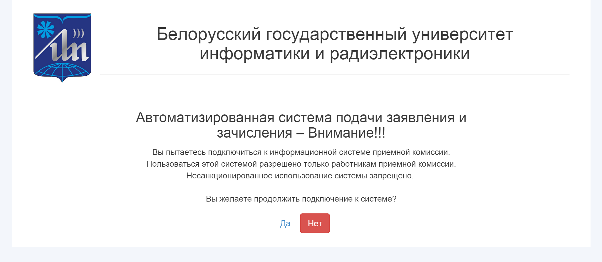
    <figcaption>Экран предупреждения</figcaption>
</figure>

Для продолжения работы с системой необходимо нажать кнопку «Да». Если дальнейшая работа с системой не предполагается, нажмите кнопку «Нет».

При нажатии на кнопку «Нет» происходит перенаправление на сайт priem.bsuir.by.

При нажатии на кнопку «Да» система перенаправляет пользователя на страницу авторизации (рис. 6.2).

<figure>
    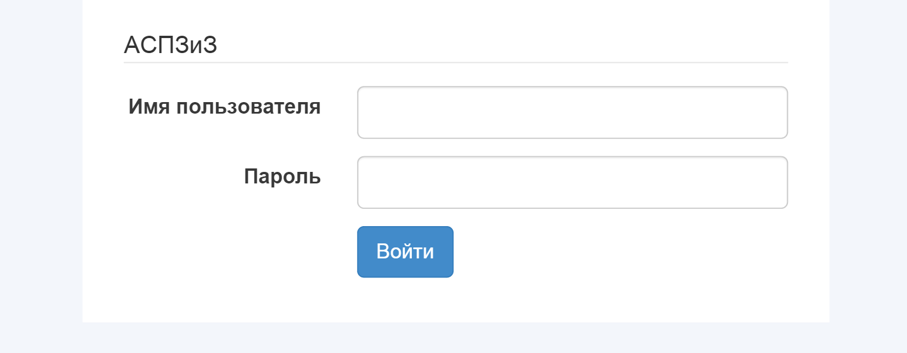
    <figcaption>Страница авторизации</figcaption>
</figure>

При вводе некорректных данных система выдаст соответствующее сообщение (рис. 6.3).

<figure>
    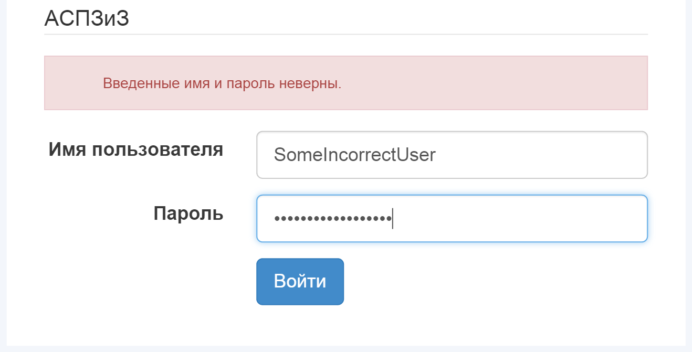
    <figcaption>Сообщение об ошибке</figcaption>
</figure>

### Меню системы

При вводе подходящих имени и пароля открывается доступ к странице главного меню системы, из которого можно перейти в необходимые разделы (рис. 6.4).

<figure>
    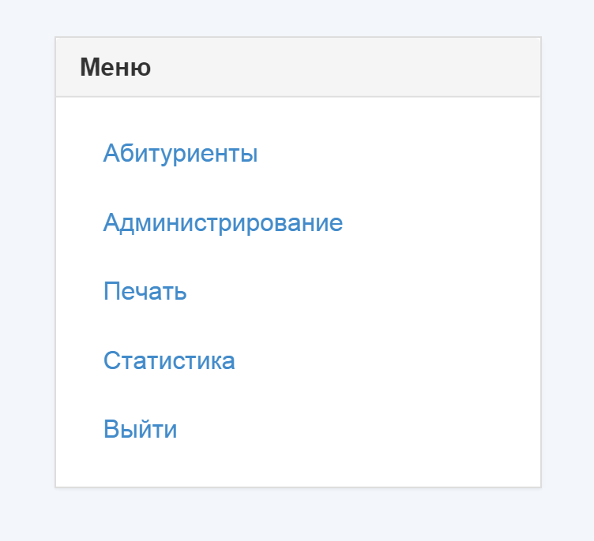
    <figcaption>Меню системы</figcaption>
</figure>

### Абитуриенты

Для работы с данными абитуриентов необходимо перейти в пункт меню «Абитуриенты». Имя текущего модуля отображается вверху страницы (рис. 6.5).

<figure>
    
    <figcaption>Имя текущего модуля</figcaption>
</figure>

Работа с абитуриентами возможна из следующих списков:

- Сайт. В данном списке отображаются абитуриенты, зарегистрировавшиеся в «Электронном кабинете БГУИР»
- Очередь. В данном списке показаны пользователи, добавленные в очередь операторами приемной комиссии.
- БГУИР. В данном списке находятся абитуриенты, полностью прошедшие процедуру подачи документов в БГУИР, но еще не зачисленные в университет.
- БГУИР (зачисл.). В этом списке показаны зачисленные системой и решением приемной комиссии абитуриенты.
- БГУИР (не зачисл.). В данном списке отображаются абитуриенты, не прошедшие по конкурсу в университет, но еще не забравшие свои документы из приемной комиссии.
- Забрали. В это списке показаны абитуриенты, забравшие свои документы из приемной комиссии на каком-либо из этапов их подачи в БГУИР.

Выбор режима осуществляется при помощи выпадающего списка вверху страницы (рис. 6.6).

<figure>
    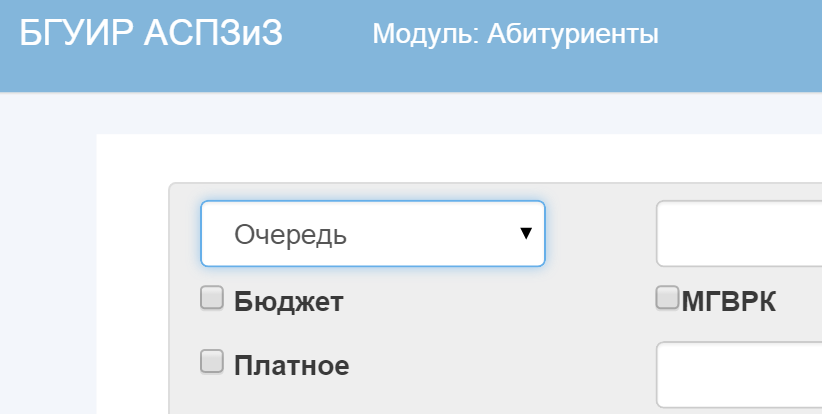
    <figcaption>Выпадающий список выбора режима работы</figcaption>
</figure>

<figure>
    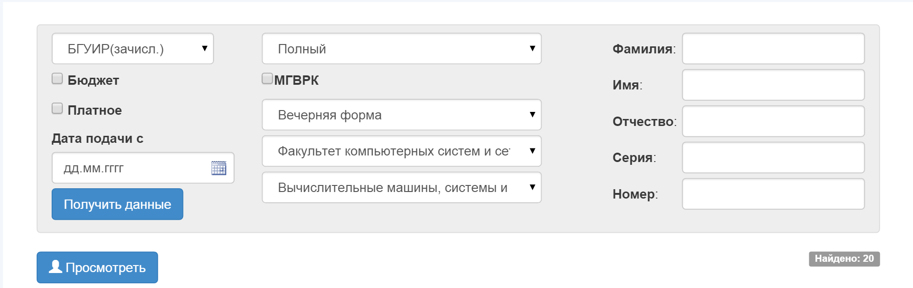
    <figcaption>Фильтр поиска</figcaption>
</figure>

Для удобства поиска абитуриентов по различных параметрам в системе предусмотрен фильтр поиска (рис. 6.7), доступный вверху страницы модуля «Абитуриенты». Поиск возможен по следующим параметрам, указанным в заявлении абитуриента:

- вид обучения;
- дата подачи заявления;
- срок обучения;
- форма обучения;
- факультет;
- специальность;
- фамилия;
- имя;
- отчество;
- серия и номер документа, удостоверяющего личность;
- признак окончания обучения в МГВРК.

При нажатии на кнопку «Получить данные» найденные результаты отображаются в таблице под фильтром (рис. 6.8).

<figure>
    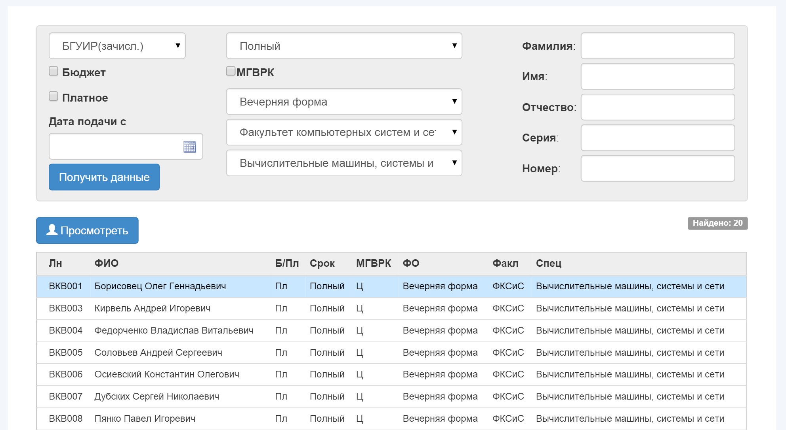
    <figcaption>Результаты фильтрации списка абитуриентов</figcaption>
</figure>

Количество найденных результатов отображается в правом верхнем углу списка. Для перехода в режим работы с отдельным абитуриентом необходимо нажать кнопку «Просмотреть» после выбора абитуриента кликом мышки из списка.

Для занесения абитуриента в очередь необходимо перейти в режим «Очередь» и нажать кнопку «Создать» (рис. 6.9).

<figure>
    
    <figcaption>Кнопка «Создать»</figcaption>
</figure>

### Заполнение электронного заявления

Заполнение электронного заявления состоит из трех этапов:

а) указание личной информации:

- ФИО (рис. 6.10);
- дата рождения;
- пол;
- семейное положение;
- тип документа, удостоверяющего личность (рис. 6.11);
- идентификационный номер документа;
- серия, номер, дата выдачи и кем документ выдан;
- балл сертификата ЦТ или вступительного испытания (рис. 6.12);
- номер сертификата ЦТ;
- балл по предмету в документе об образовании;
- уровень образования (рис. 6.13);
- учреждение образования;
- документ об окончании УО;
- номер учебного заведения или аббревиатура;
- номер документа об окончании УО;
- дата окончания;
- изучаемый в УО иностранный язык;
- признак окончания подготовительного отделения вуза;
- почтовый индекс;
- страна, область, район, населенный пункт, улица, дом и/или квартира проживания (рис. 6.14);
- признак нужды в проживании в общежитии во время обучения в вузе;
- домашний телефон (рис. 6.15);
- мобильный телефон;
- электронная почта;
- льготы при зачислении (рис. 6.16);
- место работы, должность, стаж и стаж по специальности (рис. 6.17);
- информация о родителях (рис. 6.18);
- данные законного представителя для несовершеннолетних (рис. 6.19).

<figure>
    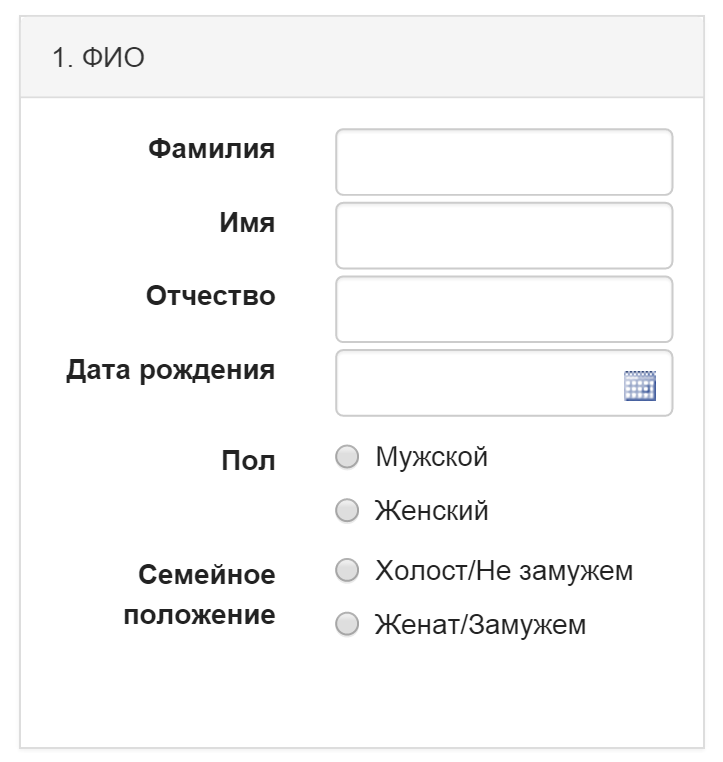
    <figcaption>Личная информация: ФИО</figcaption>
</figure>

<figure>
    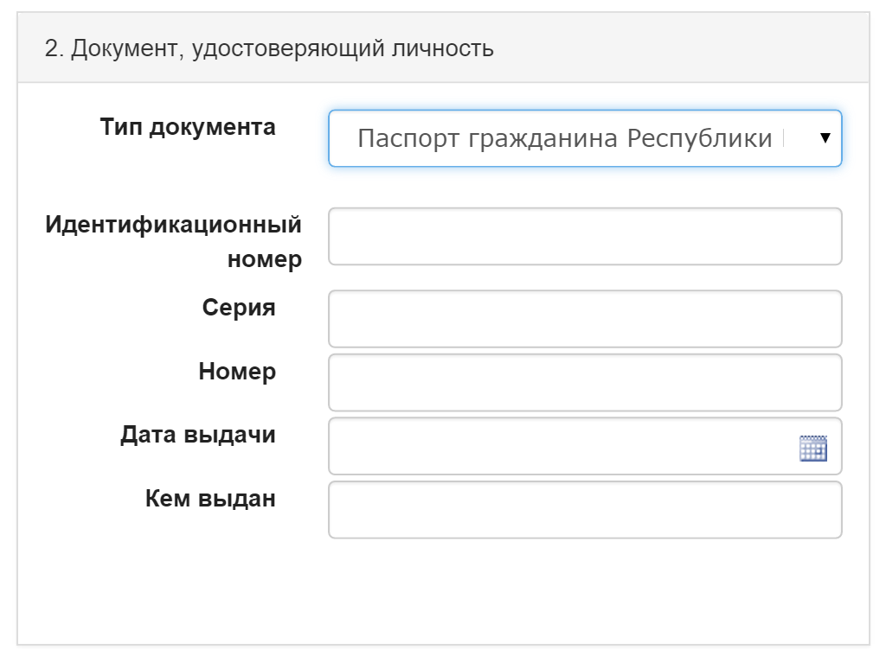
    <figcaption>Личная информация: документ, удостоверяющий личность</figcaption>
</figure>

<figure>
    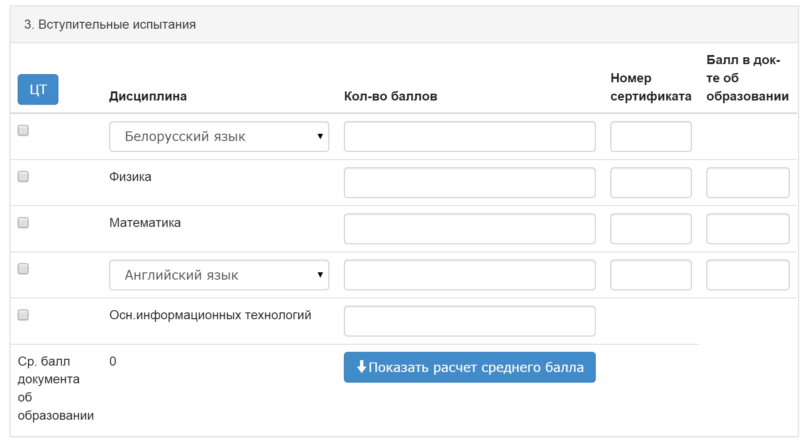
    <figcaption>Личная информация: вступительные испытания</figcaption>
</figure>

<figure>
    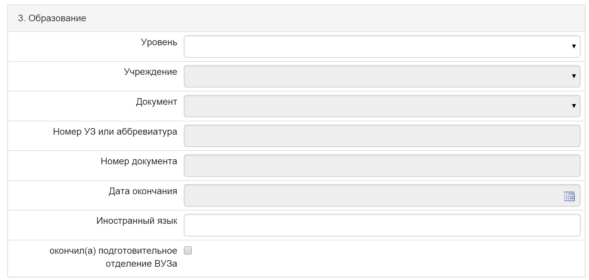
    <figcaption>Личная информация: образование</figcaption>
</figure>

<figure>
    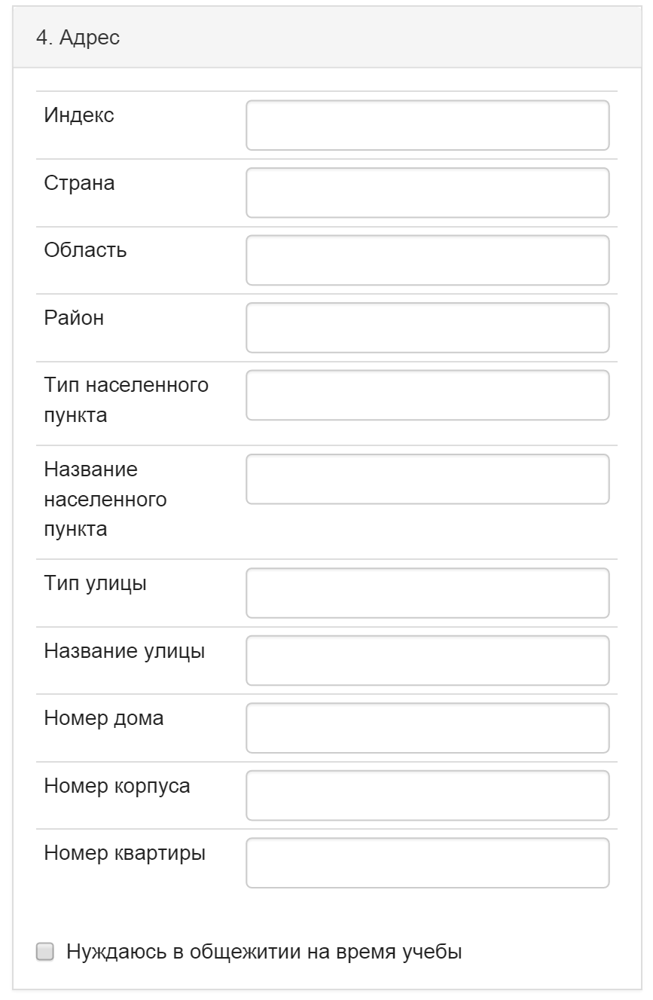
    <figcaption>Личная информация: адрес</figcaption>
</figure>

<figure>
    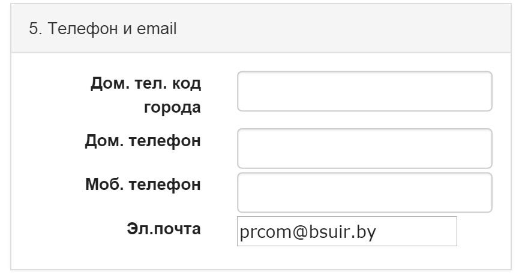
    <figcaption>Личная информация: телефон и email</figcaption>
</figure>

<figure>
    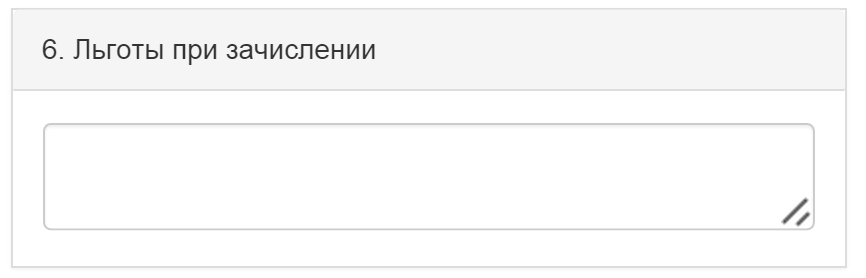
    <figcaption>Личная информация: льготы при зачислении</figcaption>
</figure>

<figure>
    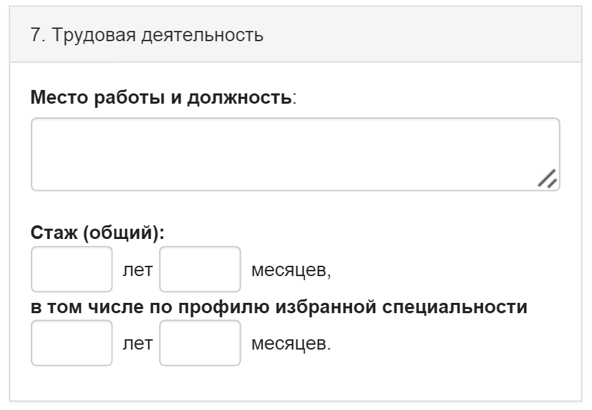
    <figcaption>Личная информация: трудовая деятельность</figcaption>
</figure>

<figure>
    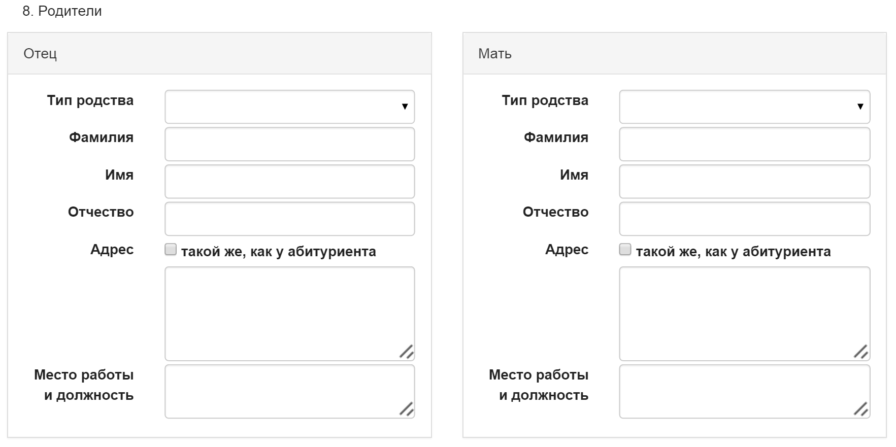
    <figcaption>Личная информация: родители</figcaption>
</figure>

<figure>
    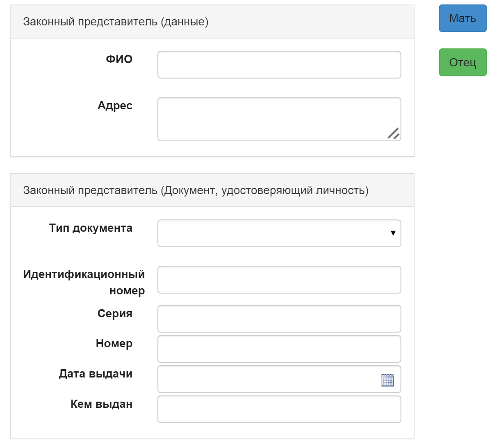
    <figcaption>Личная информация: законный представитель</figcaption>
</figure>

б) указание специальностей в порядке приоритета (рис. 6.20):

- признак второго высшего образования;
- вид обучения;
- срок обучения;
- приоритет специальности;
- форма обучения;
- факультет;
- специальность.

<figure>
    
    <figcaption>Специальности</figcaption>
</figure>

в) данные о льготах при поступлении (рис. 6.21):
- без экзаменов;
- вне конкурса;
- преимущество при равном количестве баллов при зачислении.

<figure>
    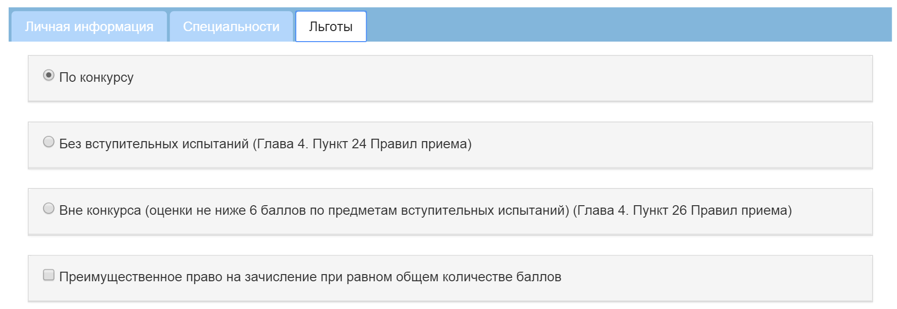
    <figcaption>Льготы</figcaption>
</figure>

Для сохранения заявления необходимо нажать кнопку «Сохранить». Для отмены заполнения заявления нажмите кнопку «Назад» (рис. 6.22).

<figure>
    
    <figcaption>Кнопки сохранения и отмены</figcaption>
</figure>

### Особенности заполнения заявления

При попытке сохранить заявления без заполнения обязательных полей система выдаст соответствующее сообщение (рис. 6.23).

<figure>
    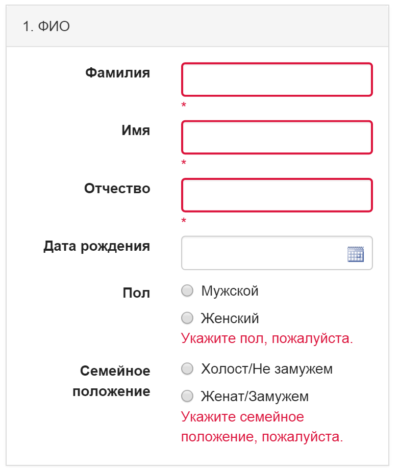
    <figcaption>Сообщения о необходимости заполнения обязательных полей</figcaption>
</figure>

При нажатии кнопки «ЦТ» в разделе «3. Вступительные испытания» система автоматически заполнит раздел данными о сертификатах ЦТ из базы данных РИКЗ на основании введенных данных о документе, удостоверяющем личность, в разделе 2.

Кнопка «Показать расчет среднего балла» открывает поле автоматического подсчета среднего балла документа об образовании на основании оценок в документе (рис. 6.24).

<figure>
    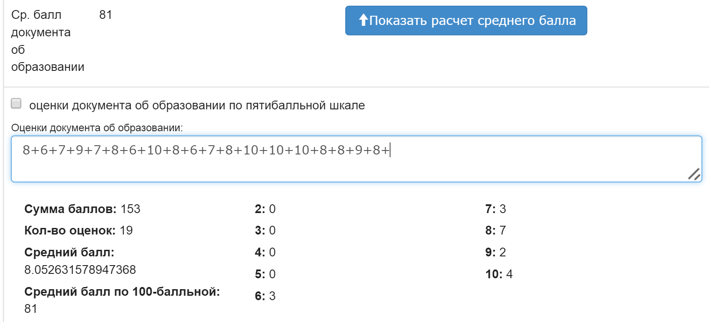
    <figcaption>Расчет среднего балла</figcaption>
</figure>

При необходимости перевода оценок из пятибалльной в десятибалльную шкалу нужно поставить галочку в пункте «оценки документа об образовании по пятибалльной шкале». Средний балл считается в режиме реального времени на основании уже введенных баллов.

Если у пользователя имеется электронный кабинет, то в поле email раздела 5 подставляется его электронный адрес из электронного кабинета. Иначе выставляется значение по умолчанию prcom@bsuir.by.

Для ускорения заполнения заявления в разделе «8. Родители» фамилии и адреса родителей заполняются автоматически при выставлении галочки «такой же, как у абитуриента».

Данные законного представителя заполняются автоматически при нажатии кнопок «Отец» или «Мать»  на основании введенных ранне данных родителей.

Кнопка «Очистить» во вкладке «Специальности» очищает все введенные пользователем данные в этой вкладке, предварительно требуя подтверждения пользователя (рис. 6.25).

<figure>
    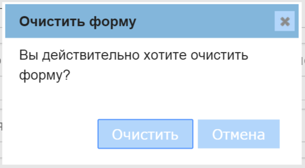
    <figcaption>Окно подтверждения очистки формы</figcaption>
</figure>

Приоритет специальности в списке можно менять перетаскиванием с зажатой кнопкой мыши строки специальности в таблице.

При выборе льготы во вкладке «Льготы» необходимо указать в раскрывающемся списке конкретное наименование льготы (рис. 6.26).

<figure>
    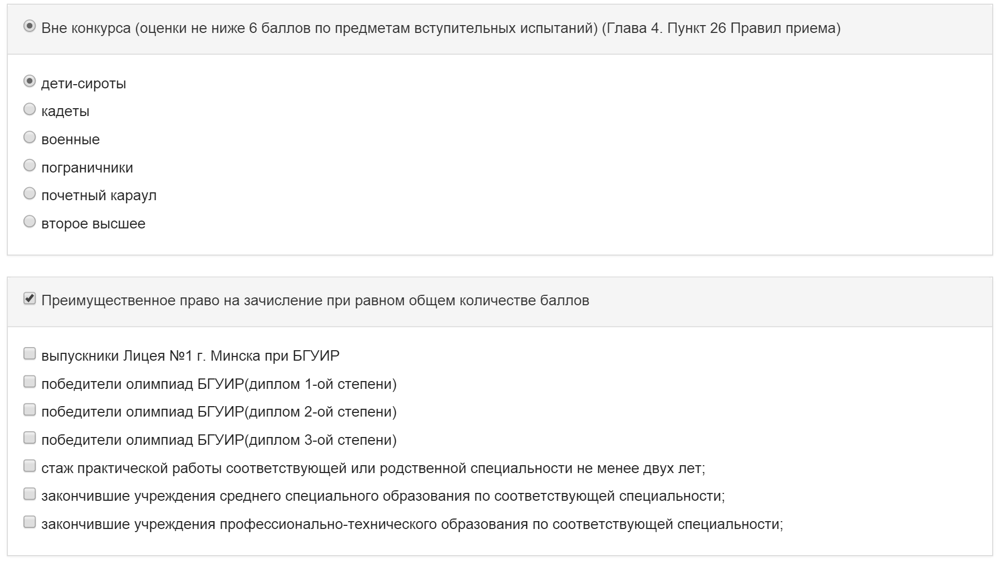
    <figcaption>Выбор льготы</figcaption>
</figure>

При попытке выйти из режима заполнения заявления с введенными в форму данными нажатием на кнопку «Назад» без сохранения система потребует подтверждения перехода у пользователя (рис. 6.27).

<figure>
    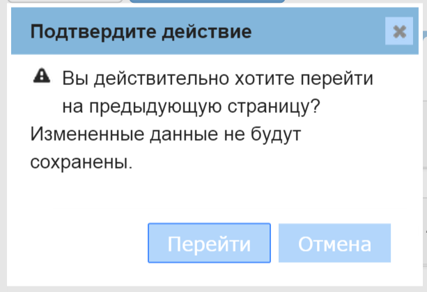
    <figcaption>Окно подтверждения перехода</figcaption>
</figure>

При успешном сохранении заявления абитуриент должен появиться в списке «Очередь».

### Принятие документов

При дальнейшем рассмотрении заявление абитуриента выбирается из списка «Очередь», после чего становятся доступными следующие действия с заявлением (рис. 6.28):

- редактирование данных заявления;
- удаление заявления;
- создание электронного кабинета на основании заявлении;
- принятие документов у абитуриента.

<figure>
    
    <figcaption>Доступные действия с заявлением</figcaption>
</figure>

Режим редактирования аналогичен режиму создания нового заявления.

После нажатия кнопки «Принять документы» необходимо будет ввести номер личного дела абитуриента во всплывающем окне (рис. 6.29).

<figure>
    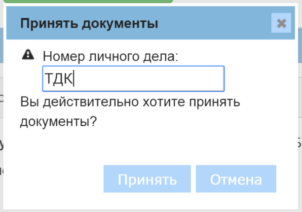
    <figcaption>Окно принятия документов</figcaption>
</figure>

Помимо этого в режиме Очереди доступна вкладка «Печать», в которой направить на печатающее устройство как само заявление в формате PDF (рис. 6.30), так и необходимые для оформление личного дела документы (обложка личного дела, расписка, договор). 

После принятия документов заявление абитуриента попадает в список «БГУИР», где находится до процедуры выдачи заявления или зачисления.

<figure>
    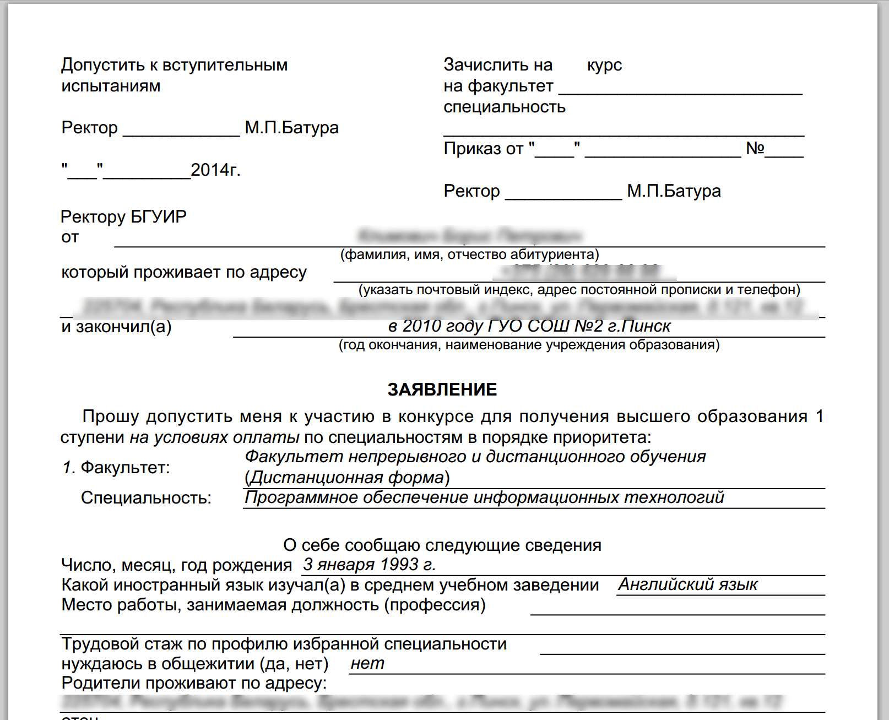
    <figcaption>Генерируемое в формате PDF заявление</figcaption>
</figure>

### Зачисление

В момент зачисления становится доступной кнопка «Зачислить» (рис. 6.31).

<figure>
    
    <figcaption>Кнопки управления заявлением</figcaption>
</figure>

По ее нажатию появляется диалоговое окно указания специальности, на которую зачисляется абитуриент (рис. 6.32).

<figure>
    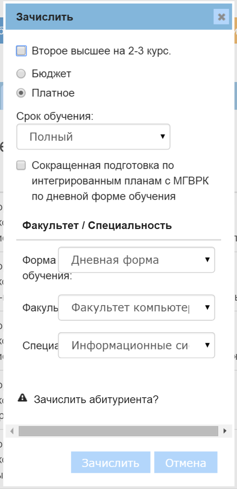
    <figcaption>Окно выбора специальности, на которую зачисляется абитуриент</figcaption>
</figure>

При успешном проведении зачисления появляется соответствующее уведомление. Заявление попадает в список «БГУИР (зачисл.)» (рис. 6.33).

<figure>
    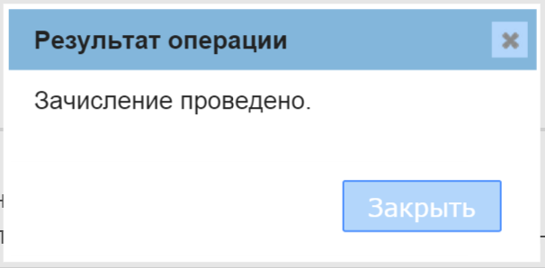
    <figcaption>Окно уведомления об успешности проведения зачисления</figcaption>
</figure>

Из списка «Забрали» абитуриента можно вернуть в очередь либо удалить его заявление из базы данных приемной комиссии предназначенными для этого кнопками (рис. 6.34).

<figure>
    
    <figcaption>Кнопки управления заявлением</figcaption>
</figure>

### Модуль Администрирование

Второй пункт меню, доступный администраторам системы – Администрирование (рис. 6.35). 

<figure>
    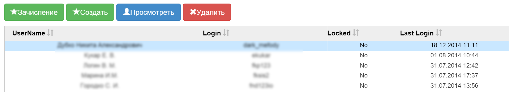
    <figcaption>Страница администрирования</figcaption>
</figure>

На данной странице есть кнопки создания, просмотра и удаления пользователей системы. При создании каждому пользователю устанавливается логин, пароль, полное имя для печати и набор флагов доступа к определенным функциям системы, среди которых:

- сайт
- сайт. Редактировать;
- сайт. Удалять;
- сайт. Создать кабинет;
- сайт. Добавить в очередь;
- очередь;
- очередь. Создать;
- очередь. Редактировать;
- очередь. Удалять;
- очередь. Создать кабинет;
- очередь. Принять документы;
- университет;
- университет. Редактировать;
- университет. Создать кабинет;
- университет. Выдать документы;
- университет. Зачислять;
- забранные;
- забранные. Удалять;
- забранные. Добавить в очередь;
- статистика;
- статистика. Для сайта;
- статистика. Подробно;
- статистика. Для печати;
- администрирование.

Помимо этого на этой странице находится кнопка «Зачисление», нажатие на которую вызывает работу алгоритма проведения предварительного зачисления абитуриентов в университет согласно модели зачисления данного ВУЗ-а. Результатов работы алгоритма является Excel-таблица со списком зачисленных и не зачисленных в университет и на конкретные специальности абитуриентов, а также статистика заполнения мест по специальностям.

### Печать

Третий пункт меню – Печать (рис. 6.36). В нем доступна работа с документами, которые необходимо подготовить для печати и отправки зачисленных абитуриентам (конверты, письма, справки в военкомат).

<figure>
    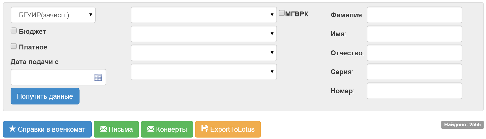
    <figcaption>Страница «Печать»</figcaption>
</figure>

Каждая кнопка при нажатии формирует необходимые документы для абитуриентов, находящихся в списке после фильтрации, собирает их в один архив в формате zip и отдает его на скачивание пользователю.

### Статистика

Пункт меню «Статистика» генерирует и отдает на скачивание статистику поданных заявлений с разбиением по диапазонам баллов в формате Excel (рис. 6.38). Статистика настраивается полями выбора временного диапазона подачи заявлений (рис. 6.37).

<figure>
    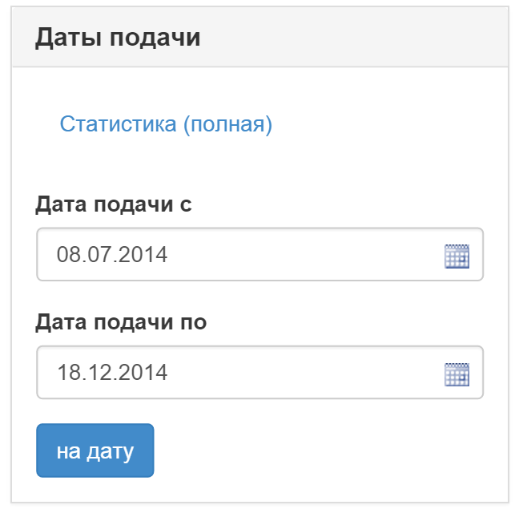
    <figcaption>Настройка статистики</figcaption>
</figure>

<figure>
    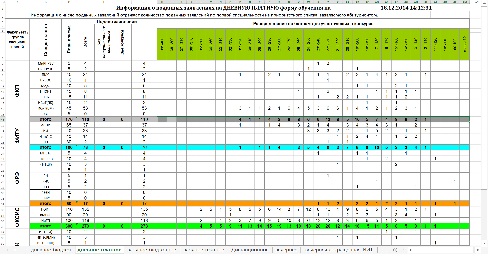
    <figcaption>Пример сгенерированного документа статистики</figcaption>
</figure>

### Выход из системы
Нажатие на кнопку меню «Выйти» вернет вас на страницу предупреждения о доступе к системе только сотрудникам приемной комиссии.

# Технико-экономическое обоснование эффективности разработки и внедрения ПС

## Введение

Целью данного дипломного проекта является разработка программного средства автоматизации приемной кампании БГУИР.

Программное средство относится к категории продукции, которая реализуется по рыночным отпускным ценам. Выбор целесообразного с финансовой точки зрения проекта связан с его экономической оценкой и расчетом экономического эффекта. Именно поэтому разрабатываемые ПС должны иметь не только совершенную техническую и технологическую основу, но и быть выгодными с экономической точки зрения.

В данном разделе приведен расчет экономической эффективности внедрения автоматизированной системы подачи заявлений и зачисления в приемные комиссии университетов. Целью технико-экономического обоснования программного средства является определение экономической выгодности создания данного программного продукта и его дальнейшего использования в реальной жизни для выполнения бизнес-задач.

Разработанное программное средство позволяет исключить из процесса зачисления в университет человеческое вмешательство, упрощает работу по приему и учету документов в приемной комиссии университета, дает возможность автоматизировать формирование статистической информации приемной кампании вуза, а также предусматривает поэтапную организацию работы с документами, что позволит снизить временные затраты и упростить организацию процесса управления работой приемной комиссии университета. Использование системы значительно увеличит производительность труда сотрудников организации и экономическую эффективность организации. 

Программное средство относится ко второй группе сложности. Категория новизны продукта – «В». Дополнительный коэффициент сложности ПО – 0,12.

Расчеты выполнены на основании методического пособия [20].

## Расчет сметы затрат и цены ПС

### Расчет трудоемкости разработки ПС и численности исполнителей

Исходные данные для расчета представлены в таблице 7.1.

# Организация безопасных условий труда инженеров-программистов в БГУИР

Охрана труда – важнейшая государственная задача, т. к. в ее основе лежит забота о здоровье и жизни людей. Значимость этой функции государства подтверждается принятым и действующим «Законом Республики Беларусь Об охране труда» (№356-З от 23.06.2008 г.). Определение охраны труда содержится в этом законе, а также в СТБ 18001 «Системы управления охраной труда. Общие требования». Согласно данным документам, охрана труда – это система обеспечения безопасности жизни и здоровья работающих в процессе трудовой деятельности, включающая правовые, социально-экономические, организационные, технические, психофизиологические, санитарно-гигиенические, лечебно-профилактические, реабилитационные и иные мероприятия и средства.

БГУИР сегодня – крупный научно-образовательный инновационный центр, в структуру которого входят 10 факультетов, 38 кафедр, научно-исследовательская часть, Институт повышения квалификации и переподготовки руководящих работников и специалистов по информационным технологиям и радиоэлектронике.

Общая численность работников университета – более 2000 человек, из них численность профессорско-преподавательского состава – более 750 человек, в том числе более 50 докторов наук и более 270 кандидатов наук. В научно-исследовательской части работают на постоянной основе более 220 человек. Обеспечение безопасных условий труда для всех сотрудников университета – важная часть политики руководства БГУИР.

Одной из стратегических целей вуза в системе менеджмента качества и системе охраны труда является обеспечение безопасных условий труда, сохранение жизни, здоровья и работоспособности работников в процессе их трудовой деятельности, профилактика производственного травматизма и профессиональных заболеваний. 

Для достижения этой цели БГУИР определяет следующие основные направления политики университета в области охраны туда: 

- предупреждать возникновение происшествий в университете (несчастных случаев, аварийных ситуаций, инцидентов и т.д.); 
- обеспечить функционирование, проводить оценку и постоянно улучшать систему управления охраной труда в соответствие с требованиями государственного стандарта СТБ 18001; 
- обеспечить соблюдение требований нормативных правовых и технических нормативных правовых актов в области охраны труда Республики Беларусь, а также других требований в области охраны труда, принятых на себя университетом; 
- обеспечить снижение рисков производственного травматизма и профессиональных заболеваний.

В БГУИР разработано, принято и функционирует утвержденное ректором «Руководство по системе управления охраной труда» (Р СУОТ 01-2011 от 06.07.2011 г.).

Руководство университета гарантирует обеспечение необходимыми ресурсами, создание всех условий для выполнения Политики в области охраны труда и результативного функционирования системы управления охраной труда.

Выполнение Политики в области охраны труда – обязанность каждого сотрудника университета.

Руководство университета по системе управления охраной труда (СУОТ) устанавливает требования к осуществлению деятельности БГУИР в области охраны труда, в т. ч. по устранению или минимизации рисков для работающих (работников) и других заинтересованных сторон, которые могут подвергаться опасностям, связанным с деятельностью организации. Требования, изложенные в руководстве по СУОТ и стандартах по СУОТ, являются обязательными для руководства БГУИР, руководителей структурных подразделений и работников БГУИР.

Схема организационной структуры СУОТ БГУИР представлена на рисунке 8.1.

<figure>
    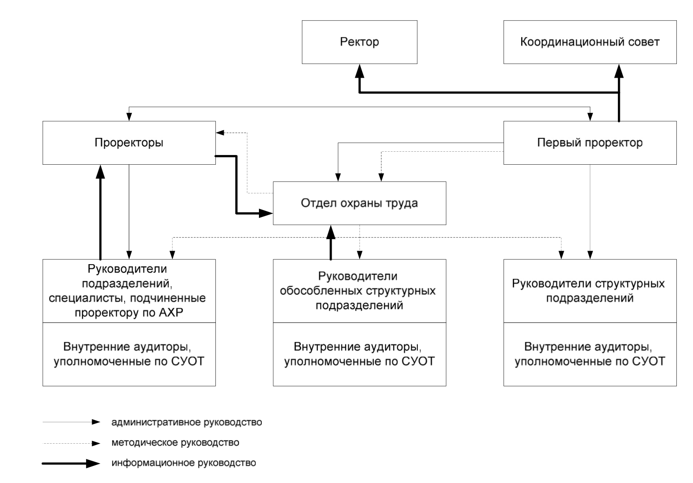
    <figcaption>Схема организационной структуры СУОТ БГУИР</figcaption>
</figure>

Инженеры-программисты работают в научно-исследовательской части университета. Работа инженера-программиста преимущественно связана с умственным трудом, требует напряжения сенсорного аппарата, внимания, памяти и постоянной активности мыслительных процессов. При выполнении работ на персональном компьютере (ПК) согласно ГОСТ-у 12.0.003-74 “ССБТ. Опасные и вредные производственные факторы. Классификация” могут иметь место следующие факторы [21]:

- повышенная температура поверхностей ПК;
- повышенная или пониженная температура воздуха рабочей зоны;
- повышенная или пониженная влажность воздуха;
- повышенный или пониженный уровень отрицательных и положительных аэроионов;
- повышенное значение напряжения в электрической цепи, замыкание;
- повышенный уровень статического электричества;
- повышенный уровень электромагнитных излучений;
- повышенная напряженность электрического поля;
- отсутствие или недостаток естественного света;
- недостаточная искусственная освещенность рабочей зоны;
- повышенная яркость света;
- повышенная контрастность;
- прямая и отраженная блесткость;
- зрительное напряжение;
- монотонность трудового процесса;
- нервно-эмоциональные перегрузки.

Поэтому необходимо правильно организовать инженеру-программисту рабочее место, что позволит достигнуть максимального комфорта и предотвратит излишнюю нагрузку на организм, а также позволит увеличить производительность труда.

Исходя из общих принципов организации рабочего места инженера-программиста, в нормативно-методологических документах сформулированы требования к конструкции рабочего места. К ним относятся:

- требования к конструкции рабочего места;
- требования к размерам рабочей поверхности;
- требования к пространству для ног;
- требования к параметрам зон, в которых размещаются устройства ввода информации;
- требования к параметрам зон, в которых размещаются средства отображения  информации;
- требования к взаимному расположению устройств ввода информации и средств отображения информации;
- требования к рабочему стулу в соответствии с техническими свойствами рабочего места и физиологическими параметрами человека.

Несоблюдение этих требований приведет к снижению работоспособности и утомляемости инженера-программиста.

Основным рабочим положением инженера-программиста является положение сидя. Основным оборудованием рабочего места являются:

- монитор;
- системный блок;
- клавиатура;
- компьютерная мышь;
- рабочий стол;
- стул;
- подставка для ног;
- шкафы и полки.

Согласно ГОСТ 12.2.032-78 рабочее место и взаимное расположение всех его элементов должно соответствовать антропометрическим, физиологическим и психологическим требованием, как показано на рисунке 8.2.

<figure>
    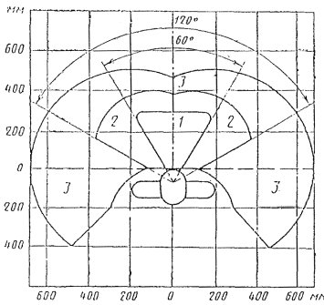
    <figcaption>Зоны для выполнения ручных операций и размещения органов управления</figcaption>
</figure>

То, что требуется для выполнения работ чаще, расположено в зоне легкой досягаемости рабочего пространства. Таким образом, размещение оборудования на рабочем месте следующее:

- монитор установлен в центре зоны 3;
- клавиатура находится в зоне 1;
- мышь находится в зоне 1 или 2;
- системный блок расположен в правой части зоны 3;
- литература и документация, постоянно необходимые при работе, располагаются в левой части зоны досягаемости ладони – 2;
- литература, используемая в работе крайне редко, помещена в выдвижные ящики рабочего стола или на полках в зоне 3.

При проектировании письменного стола, изображенного на рисунке 3, в БГУИР учитываются следующие параметры:

- высота стола выбрана с учетом возможности сидеть свободно, в удобной позе (высота рабочих столов в университете 750 мм, длина стола составляет 1500 мм, а ширина 720 мм);
- поверхность для письма имеет не менее 40 мм в глубину и не менее 600 мм в ширину;
- под рабочей поверхностью предусмотрено пространство для ног (высота не менее 600 мм, ширина не менее 500 мм, глубина не менее 400 мм);
- нижняя часть стола сконструирована так, чтобы инженер-программист мог удобно сидеть, не был вынужден поджимать ноги;
- поверхность стола обладает свойствами, исключающими появление бликов в поле зрения работника;
- конструкция стола предусматривает наличие выдвижных ящиков (не менее 3 для хранения документации, листингов, канцелярских принадлежностей, личных вещей).

<figure>
    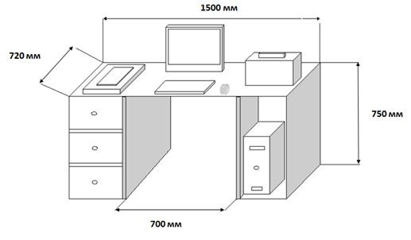
    <figcaption>Параметры письменного стола для инженера-программиста</figcaption>
</figure>

Также в БГУИР для создания благоприятных условий труда уделяется внимание правильному эстетическому оформлению рабочих мест. Это делается для облегчения обстановки, влияющей на производительность труда. Окраска помещений и мебели благодаря своей нейтральности – малонасыщенные оттенки голубого цвета – способствует созданию благоприятных условий для зрительного восприятия.

В рабочем помещении для выполнения работником поставленных задач присутствует как естественное, так и искусственное освещение. Из осветительных приборов используются светильники типа ОД. Каждый светильник комплектуется двумя лампами. Размещаются светильники двумя рядами, по четыре в каждом ряду.

В настоящее время в вузе создается оптимальный микроклимат за счёт эффективной организации системы вентиляции, кондиционирования воздуха и отопительной системы.

Уровень шума не превышает допустимые значения.

Таким образом, изложенные выше условия обеспечивают комфортные условия труда для разработки инженерами-программистами БГУИР программного средства автоматизации деятельности приемной комиссии, снижают их утомляемость и риск возникновения профессиональных заболеваний.

<h1 class="unnumered">Заключение</h1>

В ходе работы над дипломным проектом проанализированы системы упрощения подачи заявлений в различные органы. Исследованы разные направления и подходы к решению задач, связанных с разработкой программного средства для данных систем.

Проведен анализ предметной области, исследованы существующие аналоги. Результатом этого анализа явилось обобщение достоинств и недостатков существующих решений, которые учтены при разработке функциональных требований к разработанному программному средству. Наиболее часто встречающимся недостатком у имеющихся решений оказалось отсутствие комплексного решения всех поставленных требований. На отечественном рынке на сегодняшний день нет подобных средств, позволяющих гибко производить прием документов и автоматизировать зачисление вузы. Удобный пользовательский интерфейс поможет за кратчайшие сроки обучиться работе с программой.

На основе функциональных требований было произведено проектирование программного средства. В нем представлены разработка архитектуры ПС, разработка модели базы данных, разработка алгоритма программного средства и алгоритмов отдельных модулей. В разделе разработки архитектуры ПС приведена обобщенная схема взаимодействия клиент-сервер и общая архитектура системы. Также детально рассмотрена схема алгоритма входа с блокировкой, схема алгоритма работы с программным средством. В разделе представлена диаграммы взаимодействия модулей системы по методологии IDEF0, а также диаграмма развертывания приложения.

Согласно требованиям были сформированы тестовые наборы, которые успешно пройдены в ходе тестовых испытаний программного средства. Успешность прохождения тестов показывает корректность работы программы с реальными данными, соответствие функциональным требованиям.

На завершающем этапе подробно описана методика использования программного средства, которая позволяет за достаточно быстрые сроки освоить работу с программой.

Также в ходе работы над дипломным проектом рассмотрена экономическая сторона проектирования и разработки программного средства, рассчитаны экономический эффект от внедрения программного средства и показатели эффективности использования программного средства у пользователя. В результате расчётов подтвердилась целесообразность разработки. Рентабельность разработки составила почти 40%, а инвестиции, вложенные в разработку, окупаются за два года.

В разделе охраны труда отображены результаты исследования по обеспечению безопасных условий труда и комфортных условий микроклимата для разработки программного средства инженерами-программистами в БГУИР.

Главной целью при разработке программного средства было поставлено устранение основных недостатков существующих аналогов, а также раз-работка и реализация всего основного функционала. В ходе работы над дипломным проектом эта цель была успешно достигнута: разработан минималистический, удобный, интуитивно понятный пользовательский интерфейс; программное средство имеет повышенную надежность хранения данных и отказоустойчивость благодаря использованию современных технологий защиты данных и грамотной архитектуре системы; разработанное ПС позволяет автоматизировать деятельность приемной комиссии, связанную с приемом, хранением и обработкой документов, как полученных от абитуриентов, так и внутренних, а также зачислением абитуриентов в ВУЗ.

Т.к. программа является веб-приложением, обеспечена поддержка всех современных браузеров.

<h1 class="unnumered">Список использованных источников</h1>

[1] Interfax.by [Электронный ресурс]. – Электронные данные. – Режим доступа: http://www.interfax.by/article/80878
[2] Abitur.bsuir.by [Электронный ресурс]. – Электронные данные. – Режим доступа: http://abitur.bsuir.by/
[3] Кодекс Республики Беларусь от 13.01.2011 N 243-З (ред. от 13.12.2011) "Кодекс Республики Беларусь об образовании" // Консультант Плюс – Беларусь [Электронный ресурс] / Нац. центр правовой информ. Республики Беларусь. – Минск, 2012.
[4] Правила приема в высшие учебные заведения [Текст]: указ Президента Республики Беларусь от 07.02.2006 № 80 // Собрание законодательства. – Минск, 2006. – 26 с.
[5] Порядок приема для получения высшего образования I ступени в учреждение образования «Белорусский государственный университет информатики и радиоэлектроники» на 2015 год [Текст]: постановление Министерства Образования Республики Беларусь от 13.04.2015 г. // Собрание законодательства. – Минск, 2015. – 11 с.
[6] Система программ «1С:Образование 4.1. Школа 2.0» [Электронный ресурс]. – Электронные данные. – Режим доступа: http://edu.1c.ru/
[7] Система электронной подачи заявления [Электронный ресурс]. – Электронные данные. – Режим доступа: http://beldor.centr.by
[8] Портал государственных и муниципальных услуг Санкт-Петербурга [Электронный ресурс]. – Электронные данные. – Режим доступа: http://gu.spb.ru
[9] Интернет ресурс приемной комиссии Российского Государственного Геологоразведочного университета [Электронный ресурс]. – Электронные данные. – Режим доступа: http://mgri-rggru.ru/abitur/
[10] Флэнаган, Д. JavaScript. Подробное руководство / Д. Флэнаган. – М.: Символ-Плюс, 2008. – 992 с.
[11] Agibetov, A. Essence of JSON / A. Agibetov. – L.: LAP Lambert Academic Publishing, 2013. – 52 с.
[12] Скит,  Д. C# для профессионалов: тонкости программирования, 3-е издание, новый перевод / Д. Скит – М.: Вильямс, 2014. – 608 с.
[13] Ларман, К. Применение UML 2.0 и шаблонов проектирования – 3-е издание / К. Ларман – М.: Вильямс, 2006. – 736 с.
[14] REST vs WebSocket Comparison and Benchmarks [Электронный ресурс]. – Электронные данные. – Режим доступа: http://blog.arungupta.me/rest-vs-websocket-comparison-benchmarks
[15] Thomas, S. SSL & TLS Essentials: Securing the Web – 1-st. / S. Thomas – L.: Wiley, 2000. – 224 с.
[16] Фримен, Э. Изучаем HTML, XHTML и CSS / Э. Фримен – П.: Питер, 2010. – 656 с.
[17] Петкович, Д. Microsoft SQL Server 2008. Руководство для начинающих / Д. Петкович – C.: БХВ-Петербург, 2009. – 752 с.
[18] Фримен, А. ASP.NET MVC 5 с примерами на C# 5.0 для профессионалов, 5-е издание / А. Фримен – М.: Вильямс, 2014. – 736 с.
[19] Вулстон, Д. Ajax и платформа .NET 2.0 для профессионалов / Д. Вулстон – М.: Вильямс, 2007. — 464 с.
[20] Технико-экономическое обоснование дипломных проектов: Методическое пособие для студентов всех специальностей БГУИР. В 4-ч. Ч. 4: Проекты программного обеспечения / В. А. Палицын. – Минск: БГУИР, 2006 г. – 76 с.
[21] Алексеев, С.В. Гигиена труда / С.В. Алексеев, В.Р. Усенко – Санкт-Петербург, 2009. – 24 с.

# ПРИЛОЖЕНИЕ А
## (обязательное)
## Текст программного модуля сервера

<pre><code>
namespace ASPZiZ_PK.Areas.Admin.Controllers
{
    public class SpecialitiesController : ControllerExtensions
    {
        //
        // GET: /Admin/Specialities/

        public ActionResult Index()
        {
            return RedirectToAction("OKSK");
        }

        #region OKSK
        public ActionResult OKSK(string command, string id)
        {
            string viewPath = "OKSK/";
            string actionName = CurrentAction;
            short idInt = -1;
            short.TryParse(id, out idInt);
            switch (command)
            {
                case "New": { return View(viewPath + "Edit", OKSKRepos.New()); }
                case "Edit":
                    {
                        OKSK_Speciality_Model model = OKSKRepos.Get(idInt);
                        if (model == null) return RedirectToAction("OKSK", new { command = "List" });
                        return View(viewPath + "Edit", model);
                    }
                case "Details":
                    {
                        OKSK_Speciality_Model model = OKSKRepos.Get(idInt);
                        if (model == null) return RedirectToAction("OKSK", new { command = "List" });
                        ViewBag.Specialities = SpecRepos.GetByOKSKId(model.Id);
                        return View(viewPath + "Details", model);
                    }
                case "List": return View(viewPath + "List", OKSKRepos.GetList());
                default: { return RedirectToAction("OKSK", new { command = "List" }); }
            }
        }

        [HttpPost]
        [ValidateAntiForgeryToken]
        public ActionResult OKSK_Save(OKSK_Speciality_Model model)
        {
            OKSKRepos.Save(model);
            return RedirectToAction("OKSK", new { command = "Details", id = model.Id });
        }

        [HttpPost]
        [ValidateAntiForgeryToken]
        public ActionResult OKSK_Delete(short id)
        {
            KeyValuePair&lt;bool, string&gt; result = OKSKRepos.Delete(id);
            if (result.Key)
                return RedirectToAction("OKSK", new { command = "List" });
            else
                return RedirectToAction("OKSK", new { command = "Details", id = id });
        } 
        #endregion

        public ActionResult Faculty(string command, string id)
        {
            string viewPath = "Faculty/";
            string actionName = CurrentAction;
            short idInt = -1;
            short.TryParse(id, out idInt);
            switch (command)
            {
                //case "New": { return View(viewPath + "Edit", FacultyRepos.New()); }
                case "Edit":
                    {
                        FacultyModel model = FacultyRepos.GetById(idInt);
                        if (model == null) return RedirectToAction(actionName, new { command = "List" });
                        return View(viewPath + "Edit", model);
                    }
                case "Details":
                    {
                        FacultyModel model = FacultyRepos.GetById(idInt);
                        if (model == null) return RedirectToAction(actionName, new { command = "List" });
                        ViewBag.Specialities = SpecRepos.GetByFacltyId(model.Id);
                        return View(viewPath + "Details", model);
                    }
                case "List": return View(viewPath + "List", FacultyRepos.GetList());
                default: { return RedirectToAction(actionName, new { command = "List" }); }
            }
        }

        [HttpPost]
        [ValidateAntiForgeryToken]
        public ActionResult Faculty_Save(FacultyModel model)
        {
            //FacultyRepos.Save(model);
            return RedirectToAction("Faculty", new { command = "Details", id = model.Id });
        }

    }

    [Authorize]
    public class UsersController : ControllerExtensions
    {
        private string _moduleName = "Абитуриенты";
        public ActionResult Index()
        {
            return RedirectToAction("List");
        }

        public ActionResult List()
        {
            UserModel userCurr = CurrentUser;
            if (userCurr != null) { if (!userCurr.Permissions.Adm) return RedirectToLoginPage(); }
            else RedirectToLoginPage();

            IEnumerable&lt;UserModel&gt; users = MembershipRepos.GetUsers();
            return View(users);
        }

        public ActionResult Details(string id)
        {
            UserModel userCurr = CurrentUser;
            if (userCurr != null) { if (!userCurr.Permissions.Adm) return RedirectToLoginPage(); }
            else RedirectToLoginPage();

            ViewBag.IsNew = false;
            return View(MembershipRepos.GetUserById(id));
        }

        [HttpPost]
        public ActionResult Save(UserModel model)
        {
            UserModel userCurr = CurrentUser;
            if (userCurr != null) { if (!userCurr.Permissions.Adm) return RedirectToLoginPage(); }
            else RedirectToLoginPage();

            if (!string.IsNullOrWhiteSpace(model.Password)) { MembershipRepos.ChangePass(model.Login, model.Password); }
            ProfileUser profile = ProfileUser.GetProfile(model.Login);
            profile.IsGroup = false;
            profile.FullName = model.UserName;
            profile.RequirePasswordChange = false;
            profile.Save();
            MembershipRepos.SaveUserPermissions(model);
            return RedirectToAction("List");
        }

        public ActionResult New()
        {
            UserModel userCurr = CurrentUser;
            if (userCurr != null) { if (!userCurr.Permissions.Adm) return RedirectToLoginPage(); }
            else RedirectToLoginPage();

            UserModel model = new UserModel();
            model.Permissions = new PermissionsModel();
            ViewBag.IsNew = true;
            return View("Details", model);
        }

        [HttpPost]
        public ActionResult Create(UserModel model)
        {
            UserModel userCurr = CurrentUser;
            if (userCurr != null) { if (!userCurr.Permissions.Adm) return RedirectToLoginPage(); }
            else RedirectToLoginPage();

            MembershipCreateStatus createStatus;
            MembershipUser mu = Membership.CreateUser(model.Login, model.Password, model.Login, null, null, true, null, out createStatus);

            if (createStatus == MembershipCreateStatus.Success)
            {
                ProfileUser profile = ProfileUser.GetProfile(model.Login);
                profile.IsGroup = false;
                profile.FullName = model.UserName;
                profile.RequirePasswordChange = false;
                profile.Save();
                model.UserID = Guid.Parse(mu.ProviderUserKey.ToString());
                MembershipRepos.SaveUserPermissions(model);
            }
            else
            {
                ViewBag.IsNew = true;
                return View("Details", model);
            }
            return RedirectToAction("List");
        }

        public ActionResult Delete(string id)
        {
            UserModel userCurr = CurrentUser;
            if (userCurr != null) { if (!userCurr.Permissions.Adm) return RedirectToLoginPage(); }
            else RedirectToLoginPage();

            MembershipRepos.DeleteUser(id);
            return RedirectToAction("List");
        }
    }
}

namespace ASPZiZ_PK.Controllers
{
    [Authorize]
    public class AbiturController : ControllerExtensions
    {
        private string SessionId_Filter = "asdfji238jcSIo";
        private bool IsAccess(ref AbiturListFilterModel filter, UserModel userCurr)
        {
            bool isAccess = false;
            bool isFirst = true;
            while (!isAccess &amp;&amp; filter.RegStepId &lt;= 254)
            {
                switch ((RegistrationStep)filter.RegStepId)
                {
                    case RegistrationStep.NotActivate:
                    case RegistrationStep.SiteActivate:
                    case RegistrationStep.SiteFull:
                    case RegistrationStep.SiteNotFull: if (userCurr.Permissions.Site) isAccess = true; else if (isFirst) { isFirst = false; filter.RegStepId = (byte)RegistrationStep.SiteActivate; } else filter.RegStepId++; break;

                    case RegistrationStep.Ochered: if (userCurr.Permissions.Och) isAccess = true; else if (isFirst) { isFirst = false; filter.RegStepId = (byte)RegistrationStep.SiteActivate; } else filter.RegStepId++; break;
                    case RegistrationStep.BSUIR:
                    case RegistrationStep.BSUIRno:
                    case RegistrationStep.BSUIRyes: if (userCurr.Permissions.Univ) isAccess = true; else if (isFirst) { isFirst = false; filter.RegStepId = (byte)RegistrationStep.SiteActivate; } else filter.RegStepId++; break;

                    case RegistrationStep.ZabralDok: if (userCurr.Permissions.Zabr) isAccess = true; else if (isFirst) { isFirst = false; filter.RegStepId = (byte)RegistrationStep.SiteActivate; } else filter.RegStepId++; break;
                    default: filter.RegStepId++; break;
                }
            }
            return isAccess;

        }

        public ActionResult Index()
        {
            return RedirectToAction("List");
        }
        public ActionResult List(string regStep, string[] sortParams)
        {
            byte rs;
            AbiturListFilterModel filter = null;
            if (Session != null)
            {
                object tmp = Session[SessionId_Filter];
                if (tmp != null)
                    filter = (AbiturListFilterModel)tmp;
            }
            if (byte.TryParse(regStep, out rs) == false) return RedirectToAction("List", new { regStep = (byte)RegistrationStep.Ochered });// rs = (byte)RegistrationStep.Ochered;
            if (filter == null) { filter = new AbiturListFilterModel() { RegStepId = rs }; }

            UserModel userCurr = CurrentUser;
            if (userCurr != null) { if (!IsAccess(ref filter, userCurr)) return RedirectToLoginPage(); }
            else RedirectToLoginPage();

            AbiturListModel model = new AbiturListModel()
            {
                Abiturs = AbiturRepos.GetList(filter),
                Filter = filter
            };
            FillViewData_ListAction(filter, userCurr);
            if (Session != null)
            {
                Session.Remove(SessionId_Filter);
                Session.Add(SessionId_Filter, filter);
            }
            return View(model);
        }

        private void FillViewData_ListAction(AbiturListFilterModel filter, UserModel currUser)
        {
            ViewData["RegStepList"] = new SelectList(DDL_Model.GetEnum_RegistrationStep(currUser), "Id", "Name", filter.RegStepId.ToString());
            ViewData["SrokObuchList"] = new SelectList(SrokObuchRepos.GetList(true), "Id", "Name", (filter.SrokObId.HasValue ? filter.SrokObId.Value.ToString() : "0"));
            ViewData["FormaObuchList"] = new SelectList(FormaObuchRepos.GetList_Filter(filter.IsPlatn, filter.SrokObId, filter.isCelev, true), "Id", "Name", (filter.FormObId.HasValue ? filter.FormObId.Value.ToString() : "0"));
            ViewData["FacultyList"] = new SelectList(FacultyRepos.GetList_Filter(filter.IsPlatn, filter.FormObId, filter.SrokObId, filter.isCelev), "Id", "Name", (filter.FacltId.HasValue ? filter.FacltId.Value.ToString() : "0"));
            ViewData["SpecialityList"] = new SelectList(SpecRepos.GetList_Filter(filter.IsPlatn, filter.FormObId, filter.SrokObId, filter.isCelev, filter.FacltId), "Id", "Name", (filter.SpecId.HasValue ? filter.SpecId.Value.ToString() : "0"));
        }

        [HttpPost]
        public ActionResult PostActionToUpdateAbiturs(AbiturListFilterModel filter, string[] sortParams)
        {
            UserModel userCurr = CurrentUser;
            if (userCurr != null) { if (!IsAccess(ref filter, userCurr)) return RedirectToLoginPage(); }
            else RedirectToLoginPage();

            AbiturListModel model = new AbiturListModel()
            {
                Abiturs = AbiturRepos.GetList(filter),
                Filter = filter
            };
            if (Session != null)
            {
                Session.Remove(SessionId_Filter);
                Session.Add(SessionId_Filter, filter);
            }
            return PartialView("partial_AbiturList", model);
        }

       
        [HttpPost]
        public ActionResult ReloadExams(short specId)
        {
            List&lt;AbiturExamModel&gt; exams = ExamRepos.GetExams(new short[1] { specId });
            ViewData["ExamTypes"] = new SelectList(ExamRepos.GetExamTypes(), "Id", "Name");
            return PartialView("Edit_Exams_Exams", exams);
        }

        public ActionResult New(string regStep)
        {
            UserModel userCurr = CurrentUser;
            if (userCurr != null) { if (!userCurr.Permissions.Och || !userCurr.Permissions.Och_New) return RedirectToLoginPage(); }
            else RedirectToLoginPage();

            ProfileAbiturModel model = AbiturRepos.New();
            FillViewData(model);
            ViewBag.tabIndex = "0";
            return View("Edit", model);
        }

        public ActionResult Delete(string regStep, string id)
        {
            byte rs = 0;
            if (byte.TryParse(regStep, out rs) == false) { return RedirectToAction("List"); }

            Guid abtId = Guid.Empty;
            if (Guid.TryParse(id, out abtId) == false) return RedirectToAction("List");

            UserModel userCurr = CurrentUser;
            if (userCurr != null)
            {
                if (((RegistrationStep)rs == RegistrationStep.Ochered &amp;&amp; userCurr.Permissions.Och &amp;&amp; userCurr.Permissions.Och_Del)
                    || ((RegistrationStep)rs == RegistrationStep.ZabralDok &amp;&amp; userCurr.Permissions.Zabr &amp;&amp; userCurr.Permissions.Zabr_Del))
                {
                    KeyValuePair&lt;bool, string&gt; res = AbiturRepos.Delete(abtId, (RegistrationStep)rs);
                    return RedirectToAction("List");
                }

            }
            return RedirectToLoginPage();
        }

        public ActionResult Details(string regStep, string id, string tab)
        {
            byte rs = 0;
            if (byte.TryParse(regStep, out rs) == false) { return RedirectToAction("List"); }

            Guid abtId = Guid.Empty;
            if (Guid.TryParse(id, out abtId) == false) return RedirectToAction("List");

            ProfileAbiturModel model = AbiturRepos.Details(abtId, (RegistrationStep)rs);

            if (model.Predstavitel == null)
                model.Predstavitel = new Dogovor_Predstavitel();
            ViewData["PassportList"] = new SelectList(PassportRepos.GetList_Types(), "Id", "Name", model.Predstavitel.PassportTypeId.ToString());
            ViewBag.tabIndex = (string.IsNullOrWhiteSpace(tab) == true) ? "0" : tab;
            if (model.RegStep == RegistrationStep.BSUIR
                || model.RegStep == RegistrationStep.BSUIRno
                || model.RegStep == RegistrationStep.BSUIRyes)
                FillViewData_Zachisl(model);
            return View(model);
        }

        [HttpGet]
        public ActionResult Edit(byte regStep, string id, string tab)
        {
            Guid abtId = Guid.Empty;
            if (Guid.TryParse(id, out abtId) == false) return RedirectToAction("List");
            UserModel userCurr = CurrentUser;
            RegistrationStep rs = (RegistrationStep)regStep;
            if (userCurr != null)
            {
                if ((regStep &lt;= (byte)RegistrationStep.SiteFull &amp;&amp; userCurr.Permissions.Site &amp;&amp; userCurr.Permissions.Site_Edit)
                    || (rs == RegistrationStep.Ochered &amp;&amp; userCurr.Permissions.Och &amp;&amp; userCurr.Permissions.Och_Edit)
                    || ((rs == RegistrationStep.BSUIR || rs == RegistrationStep.BSUIRno || rs == RegistrationStep.BSUIRyes)
                            &amp;&amp; userCurr.Permissions.Univ &amp;&amp; userCurr.Permissions.Univ_Edit))
                {
                    ProfileAbiturModel model = AbiturRepos.Edit(abtId, rs);
                    FillViewData(model);
                    ViewBag.tabIndex = (string.IsNullOrWhiteSpace(tab) == true) ? "0" : tab;
                    return View(model);
                }
            }
            return RedirectToLoginPage();
        }
        private void FillViewData(ProfileAbiturModel model)
        {
            if (model == null) return;
            ViewData["ObrUrovenList"] = new SelectList(ObrazovRepos.GetList_ObrUroven(), "Id", "Name", model.Obr_UrovenId.ToString());
            ViewData["ObrUchregdList"] = new SelectList(ObrazovRepos.GetList_ObrUchregd(model.Obr_UrovenId), "Id", "Name", model.Obr_UchregId.ToString());
            ViewData["ObrDokTypeList"] = new SelectList(ObrazovRepos.GetList_ObrDokType(model.Obr_UrovenId), "Id", "Name", model.Obr_DokTypeId.ToString());

            ViewData["PassportList"] = new SelectList(PassportRepos.GetList_Types(), "Id", "Name", model.PassportTypeId.ToString());

            ViewData["TipRodstva_Otec"] = RoditelModel.GetTipRodstvaList(true, (model.Otec != null ? (model.Otec.TipRodstva ?? " ") : " "));
            ViewData["TipRodstva_Mat"] = RoditelModel.GetTipRodstvaList(false, (model.Mat != null ? (model.Mat.TipRodstva ?? " ") : " "));

            ViewData["ExamTypes"] = new SelectList(ExamRepos.GetExamTypes(), "Id", "Name");

            FillViewData_Zayavlenie(model);
        }

        private void FillViewData_Zayavlenie(ProfileAbiturModel model)
        {
            if (model.Zayvlenie == null) return;
            bool isAnySpeciality = model.Zayvlenie.Any();
            ViewData["FormaObuchList"] = new SelectList(FormaObuchRepos.GetList(), "Id", "Name", (isAnySpeciality ? model.Zayvlenie[0].FormaObuchId.ToString(CultureInfo.InvariantCulture) : "0"));
            ViewData["SrokObuchList"] = new SelectList(SrokObuchRepos.GetList(true), "Id", "Name", (isAnySpeciality ? model.Zayvlenie[0].SrokObuchId.ToString(CultureInfo.InvariantCulture) : "0"));
            ViewData["SpecSSUZList"] = new SelectList(SSUZRepos.GetList(true), "Id", "Name", (model.SSUZ_SpecId.HasValue ? model.SSUZ_SpecId.Value.ToString(CultureInfo.InvariantCulture) : "0"));

            if (isAnySpeciality == false) return;
            SpecialnostModel spDef = model.Zayvlenie[0];
            List&lt;FormaObuchModel&gt; foList = FormaObuchRepos.GetList(spDef.isPlatn, spDef.SrokObuchId, spDef.isCelev, false, model.SSUZ_SpecId ?? 0, spDef.SpecialnostId);
            List&lt;FacultyModel&gt; fcltList;
            List&lt;SpecModelDDL&gt; specList;

            if (foList.Count == 1 &amp;&amp; foList[0].Id != 0) fcltList = FacultyRepos.GetList(spDef.isPlatn, spDef.FormaObuchId, spDef.SrokObuchId, spDef.isCelev, model.SSUZ_SpecId ?? 0, spDef.SpecialnostId);
            else fcltList = new List&lt;FacultyModel&gt;() { new FacultyModel() { Id = 0, Name = "" } };

            if (fcltList.Count == 1 &amp;&amp; fcltList[0].Id != 0) specList = SpecRepos.GetList(spDef.isPlatn, spDef.FormaObuchId, spDef.SrokObuchId, spDef.isCelev, spDef.FacultetId, model.SSUZ_SpecId ?? 0, spDef.SpecialnostId);
            else specList = new List&lt;SpecModelDDL&gt;() { new SpecModelDDL() { Id = 0, Name = "" } };

            foreach (SpecialnostModel z in model.Zayvlenie)
            {
                if (z.SpecialnostId != 0)
                {
                    //ViewData["FormaObuch_" + z.Prioritet] = new SelectList(foList, "Id", "Name", z.FormaObuchId.ToString());
                    ViewData["Faculty_" + z.Prioritet] = new SelectList(FacultyRepos.GetList(z.isPlatn, z.FormaObuchId, z.SrokObuchId, z.isCelev, model.SSUZ_SpecId ?? 0, z.SpecialnostId), "Id", "Name", z.FacultetId.ToString());
                    ViewData["Speciality_" + z.Prioritet] = new SelectList(SpecRepos.GetList(z.isPlatn, z.FormaObuchId, z.SrokObuchId, z.isCelev, z.FacultetId, model.SSUZ_SpecId ?? 0, z.SpecialnostId), "Id", "Name", z.SpecialnostId.ToString());
                }
                else
                {
                    //ViewData["FormaObuch_" + z.Prioritet] = new SelectList(foList, "Id", "Name", "0");
                    ViewData["Faculty_" + z.Prioritet] = new SelectList(fcltList, "Id", "Name", "0");
                    ViewData["Speciality_" + z.Prioritet] = new SelectList(specList, "Id", "Name", "0");
                }
            }
        }

        private void FillViewData_Zachisl(ProfileAbiturModel model)
        {
            if (model.Zayvlenie == null) return;

            if (model.Zayvlenie.Count &lt;= 0) return;
            SpecialnostModel spDef = (model.Zach_Specialnost == null ? model.Zayvlenie[0] : model.Zach_Specialnost);

            ViewData["SrokObuchList"] = new SelectList(SrokObuchRepos.GetList(true), "Id", "Name", spDef.SrokObuchId.ToString());

            List&lt;FormaObuchModel&gt; foList = FormaObuchRepos.GetList(spDef.isPlatn, spDef.SrokObuchId, spDef.isCelev, false, 0, spDef.SpecialnostId);
            List&lt;FacultyModel&gt; fcltList;
            List&lt;SpecModelDDL&gt; specList = new List&lt;SpecModelDDL&gt;();

            if ((foList.Count == 1 &amp;&amp; foList[0].Id != 0) || spDef != null) fcltList = FacultyRepos.GetList(spDef.isPlatn, spDef.FormaObuchId, spDef.SrokObuchId, spDef.isCelev, 0, spDef.SpecialnostId);
            else fcltList = new List&lt;FacultyModel&gt;() { new FacultyModel() { Id = 0, Name = "" } };

            if ((fcltList.Count == 1 &amp;&amp; fcltList[0].Id != 0) || spDef != null) specList = SpecRepos.GetList(spDef.isPlatn, spDef.FormaObuchId, spDef.SrokObuchId, spDef.isCelev, spDef.FacultetId, model.SSUZ_SpecId ?? 0, spDef.SpecialnostId);
            else specList = new List&lt;SpecModelDDL&gt;() { new SpecModelDDL() { Id = 0, Name = "" } };

            ViewData["FormaObuch_Zach"] = new SelectList(foList, "Id", "Name", (model.Zach_Specialnost != null ? model.Zach_Specialnost.FormaObuchId.ToString() : "0"));
            ViewData["Faculty_Zach"] = new SelectList(fcltList, "Id", "Name", (model.Zach_Specialnost != null ? model.Zach_Specialnost.FacultetId.ToString() : "0"));
            ViewData["Speciality_Zach"] = new SelectList(specList, "Id", "Name", (model.Zach_Specialnost != null ? model.Zach_Specialnost.SpecialnostId.ToString() : "0"));
        }

        [HttpPost]
        [ActionName("Edit")]
        public ActionResult Save(ProfileAbiturModel model, string tabIndex)
        {
            UserModel userCurr = CurrentUser;
            if (userCurr != null)
            {
                RegistrationStep rs = (RegistrationStep)model.RegStepId;
                if (MembershipRepos.CanEditInSite(rs, userCurr) || MembershipRepos.CanEditInOchered(rs, userCurr) || MembershipRepos.CanEditInVuz(rs, userCurr))
                {
                    model.AbiturId = model.AbiturId;
                    model.Zayvlenie = AbiturRepos.FixErrorsInSpecialities(model.Zayvlenie);

                    if (Request != null &amp;&amp; Request.Form != null)
                    {
                        short ssuzSpecId = 0;
                        if (short.TryParse(Request.Form["SpecSSUZ"], out ssuzSpecId)) { model.SSUZ_SpecId = ssuzSpecId; } else { model.SSUZ_SpecId = (short?)null; }
                    }
                    model = AbiturRepos.PrepareForSave(model);
                    if (ModelState.IsValid)
                    {
                        KeyValuePair&lt;bool, string&gt; result = AbiturRepos.Save(model, rs);
                        return RedirectToAction("Details", new { regStep = (byte)rs, id = model.AbiturId, tab = tabIndex });
                    }
                    else
                    {
                        model = AbiturRepos.PrepareForEdit(model);
                        FillViewData(model);
                        return View("Edit", model);
                    }
                }
            }
            return RedirectToLoginPage();
        }

        [OutputCache(Duration = 3600, VaryByParam = "urovenId")]
        [HttpGet]
        public JsonResult GetObrDDL(byte urovenId)
        {
            var resDokType = new SelectList(ObrazovRepos.GetList_ObrDokType(urovenId), "Id", "Name", "0");
            var resUchr = new SelectList(ObrazovRepos.GetList_ObrUchregd(urovenId), "Id", "Name", "0");
            var resList = new[] { resDokType, resUchr };
            var jr = Json(resList, JsonRequestBehavior.AllowGet);
            return jr;
        }

        //[OutputCache(Duration = 3600, VaryByParam = "platn;srokObuchId;celev;specId;ekzId_1;ekzId_2")]
        [HttpGet]
        public JsonResult GetFormObuch(bool platn, byte srokObuchId, bool celev, byte? specId, short? ssuzSpecId)
        {
            var resList = FormaObuchRepos.GetList(platn, srokObuchId, celev, true, ssuzSpecId ?? 0, specId);
            JsonResult jr = Json(new SelectList(resList, "Id", "Name", 0), JsonRequestBehavior.AllowGet);
            return jr;
        }

        //[OutputCache(Duration = 3600, VaryByParam = "platn;formaObuch;srokObuch;celev;idFaclt;specId;ekzId_1;ekzId_2")]
        [HttpGet]
        public JsonResult GetSpec(bool platn, byte formaObuch, byte srokObuch, bool celev, short idFaclt, byte? specId, short? ssuzSpecId)
        {
            JsonResult jr = Json(SpecRepos.GetList(platn, formaObuch, srokObuch, celev, idFaclt, ssuzSpecId ?? 0, specId), JsonRequestBehavior.AllowGet);
            return jr;
        }

        //[OutputCache(Duration = 3600, VaryByParam = "platn;formaObuchId;srokObuchId;celev;specId")]
        [HttpGet]
        public JsonResult GetFaculties(bool platn, byte formaObuchId, byte srokObuchId, bool celev, byte? specId, short? ssuzSpecId)
        {
            var resList = FacultyRepos.GetList(platn, formaObuchId, srokObuchId, celev, ssuzSpecId ?? 0, specId);
            JsonResult jr = Json(new SelectList(resList, "Id", "Name", 0), JsonRequestBehavior.AllowGet);
            return jr;
        }

        [HttpGet]
        [OutputCache(Duration = 2)]
        public JsonResult AddToTurn(string regStep, string id, string s)
        {
            byte rs = 0;
            if (byte.TryParse(regStep, out rs) == false) { return Json(new KeyValuePair&lt;bool, string&gt;(false, "Ошибка добавления. Неверный шаг регистрации.")); }

            Guid abtId = Guid.Empty;
            if (Guid.TryParse(id, out abtId) == false) return Json(new KeyValuePair&lt;bool, string&gt;(false, "Ошибка добавления. Неверный идентификатор абитуриента."));

            UserModel userCurr = CurrentUser;
            if (userCurr != null)
            {
                RegistrationStep regStepE = (RegistrationStep)rs;
                if ((regStepE &lt;= RegistrationStep.SiteFull &amp;&amp; userCurr.Permissions.Och &amp;&amp; userCurr.Permissions.Site_AddToOcher)
                    || (regStepE == RegistrationStep.ZabralDok &amp;&amp; userCurr.Permissions.Zabr &amp;&amp; userCurr.Permissions.Zabr_AddToOcher))
                {
                    KeyValuePair&lt;bool, string&gt; res = AbiturRepos.AddToOchered((RegistrationStep)rs, abtId);
                    JsonResult js = Json(new KeyValuePair&lt;bool, string&gt;(true, "Абитуриент добавлен в очередь."), JsonRequestBehavior.AllowGet);
                    return js;
                }
            }
            JsonResult jsEr = Json(new KeyValuePair&lt;bool, string&gt;(false, "В доступе отказано."), JsonRequestBehavior.AllowGet);
            return jsEr;
        }

        [HttpGet]
        public JsonResult GetSpecCode(string regStep, string id, string s)
        {
            byte rs = 0;
            if (byte.TryParse(regStep, out rs) == false) { return Json(new KeyValuePair&lt;bool, string&gt;(false, "Ошибка. Неверный шаг регистрации.")); }

            Guid abtId = Guid.Empty;
            if (Guid.TryParse(id, out abtId) == false) return Json(new KeyValuePair&lt;bool, string&gt;(false, "Ошибка. Неверный идентификатор абитуриента."));

            UserModel userCurr = CurrentUser;
            if (userCurr != null)
            {
                RegistrationStep regStepE = (RegistrationStep)rs;
                if (regStepE == RegistrationStep.Ochered &amp;&amp; userCurr.Permissions.Och &amp;&amp; userCurr.Permissions.Och_AddToBsuir)
                {
                    KeyValuePair&lt;bool, string&gt; res = AbiturRepos.GetSpecCodeFirstSpec((RegistrationStep)rs, abtId);

                    JsonResult js = Json(new KeyValuePair&lt;bool, string&gt;(res.Key, res.Value), JsonRequestBehavior.AllowGet);
                    return js;
                }
            }
            JsonResult jsEr = Json(new KeyValuePair&lt;bool, string&gt;(false, "В доступе отказано."), JsonRequestBehavior.AllowGet);
            return jsEr;
        }

        [HttpGet]
        public JsonResult ZachToBsuir(string regStep, string id, string specId, string s)
        {
            byte rs = 0;
            if (byte.TryParse(regStep, out rs) == false) { return Json(new KeyValuePair&lt;bool, string&gt;(false, "Ошибка. Неверный шаг регистрации.")); }

            Guid abtId = Guid.Empty;
            if (Guid.TryParse(id, out abtId) == false) return Json(new KeyValuePair&lt;bool, string&gt;(false, "Ошибка. Неверный идентификатор абитуриента."));

            UserModel userCurr = CurrentUser;
            if (userCurr != null)
            {
                RegistrationStep regStepE = (RegistrationStep)rs;
                if ((regStepE == RegistrationStep.BSUIR || regStepE == RegistrationStep.BSUIRno || regStepE == RegistrationStep.BSUIRyes)
                   &amp;&amp; userCurr.Permissions.Univ &amp;&amp; userCurr.Permissions.Univ_BsuirZach)
                {
                    short specIdZach;
                    KeyValuePair&lt;bool, string&gt; res = AbiturRepos.ZachToBSUIR(abtId, (short.TryParse(specId, out specIdZach) ? specIdZach : (short?)null));
                    JsonResult js = Json(new KeyValuePair&lt;bool, string&gt;(true, "Зачисление проведено."), JsonRequestBehavior.AllowGet);
                    return js;
                }
            }
            JsonResult jsEr = Json(new KeyValuePair&lt;bool, string&gt;(false, "В доступе отказано."), JsonRequestBehavior.AllowGet);
            return jsEr;
        }

        [HttpGet]
        public JsonResult AddToBsuir(string regStep, string id, string abtCode, string s)
        {
            byte rs = 0;
            if (byte.TryParse(regStep, out rs) == false) { return Json(new KeyValuePair&lt;bool, string&gt;(false, "Ошибка. Неверный шаг регистрации.")); }

            Guid abtId = Guid.Empty;
            if (Guid.TryParse(id, out abtId) == false) return Json(new KeyValuePair&lt;bool, string&gt;(false, "Ошибка. Неверный идентификатор абитуриента."));

            UserModel userCurr = CurrentUser;
            if (userCurr != null)
            {
                RegistrationStep regStepE = (RegistrationStep)rs;
                if (regStepE == RegistrationStep.Ochered &amp;&amp; userCurr.Permissions.Och &amp;&amp; userCurr.Permissions.Och_AddToBsuir)
                {
                    KeyValuePair&lt;bool, string&gt; res = AbiturRepos.AddToBSUIR((RegistrationStep)rs, abtId, abtCode);
                    JsonResult js = Json(new KeyValuePair&lt;bool, string&gt;(true, "Документы приняты."), JsonRequestBehavior.AllowGet);
                    return js;
                }
            }
            JsonResult jsEr = Json(new KeyValuePair&lt;bool, string&gt;(false, "В доступе отказано."), JsonRequestBehavior.AllowGet);
            return jsEr;
        }

        [HttpGet]
        public JsonResult RemoveFromBsuir(string regStep, string id, string s)
        {
            byte rs = 0;
            if (byte.TryParse(regStep, out rs) == false) { return Json(new KeyValuePair&lt;bool, string&gt;(false, "Ошибка. Неверный шаг регистрации.")); }

            Guid abtId = Guid.Empty;
            if (Guid.TryParse(id, out abtId) == false) return Json(new KeyValuePair&lt;bool, string&gt;(false, "Ошибка. Неверный идентификатор абитуриента."));

            UserModel userCurr = CurrentUser;
            if (userCurr != null)
            {
                RegistrationStep regStepE = (RegistrationStep)rs;
                if ((regStepE == RegistrationStep.BSUIR || regStepE == RegistrationStep.BSUIRno || regStepE == RegistrationStep.BSUIRyes)
                        &amp;&amp; userCurr.Permissions.Univ &amp;&amp; userCurr.Permissions.Univ_RemoveFromBsuir)
                {
                    KeyValuePair&lt;bool, string&gt; res = AbiturRepos.RemoveFromBsuir((RegistrationStep)rs, abtId);
                    JsonResult js = Json(new KeyValuePair&lt;bool, string&gt;(false, "Документы выданы."), JsonRequestBehavior.AllowGet);
                    return js;
                }
            }
            JsonResult jsEr = Json(new KeyValuePair&lt;bool, string&gt;(false, "В доступе отказано."), JsonRequestBehavior.AllowGet);
            return jsEr;
        }

        [HttpGet]
        public JsonResult GetCertfCT(string id, string passSer, string passNom, string s)
        {
            List&lt;CertificatModel&gt; cert = AbiturRepos.GetCertf(passSer, passNom);
            JsonResult js = Json(cert, JsonRequestBehavior.AllowGet);
            return js;
        }

        [HttpPost]
        public ActionResult PostActionToUpdateSpec(byte specId)
        {
            SpecialnostModel spModel = SpecRepos.GetSpec(specId);
            var prof = new ProfileAbiturModel() { Zayvlenie = new List&lt;SpecialnostModel&gt;() };
            if (spModel != null)
            {
                int countSpec = SpecRepos.GetCountSpec(spModel.GroupId);
                prof.isCelev = spModel.isCelev;
                prof.isPlatn = spModel.isPlatn;
                prof.CountSpecInGroup = countSpec;
                spModel.Prioritet = 1;
                prof.Zayvlenie.Add(spModel);
                prof = AbiturRepos.PrepareForEdit(prof);

                FillViewData_Zayavlenie(prof);
            }
            return PartialView("Edit_Specialties_Specs", prof);
        }

        public ActionResult Print_Zayvlenie(string s, string regStep, string id)
        {
            byte rs = 0;
            if (byte.TryParse(regStep, out rs) == false) { return RedirectToAction("List"); }

            Guid abtId = Guid.Empty;
            if (Guid.TryParse(id, out abtId) == false) return RedirectToAction("List");
            ProfileAbiturModel model = AbiturRepos.Edit(abtId, (RegistrationStep)rs);

            byte[] result = PrintRepos.Zayvlenie(model);

            var output = new MemoryStream();
            output.Write(result, 0, result.Length);
            output.Position = 0;
            string documentName = "Заявление в "+ Constants.VuzShortName +"_" + model.AbiturFam + ".pdf";
            return new UnicodeFileContentResult(result, "application/pdf", documentName);
            //return new BinaryContentResult(result, "application/pdf", documentName);
        }

        public UnicodeFileContentResult Print_Raspiska(string s,
            string regStep,
            string id,
            string fio,
            string adr,
            string dokType,
            string dokTypeNot,
            string dokLN,
            string dokSer,
            string dokNom,
            string dokData,
            string dokKem
            )
        {
            byte rs = 0;
            byte.TryParse(regStep, out rs);

            Guid abtId = Guid.Empty;
            Guid.TryParse(id, out abtId);
            ProfileAbiturModel model = AbiturRepos.Edit(abtId, (RegistrationStep)rs);

            Dogovor_Predstavitel predstv = null;
            if (fio != null) predstv = new Dogovor_Predstavitel()
               {
                   FIO = fio,
                   Dokument = (!string.IsNullOrWhiteSpace(dokType) ? dokType : dokTypeNot),
                   DokumentSeriya = dokSer,
                   DokumentNomer = dokNom,
                   DokumentVidan_Data = dokData,
                   DokumentVidan_Kem = dokKem,
                   DokumentIdentification = dokLN,
                   Adres = adr
               };

            string path = HttpContext.Server.MapPath(ASPZiZ_PK.Constants.TemplatesPath);
            ExcelExportData fsed = PrintRepos.CreatePrint(model, CurrentUser.UserName, path, predstv);
            return new UnicodeFileContentResult(fsed.FileStream, fsed.FileType, fsed.FileName);

            //byte rs = 0;
            //if (byte.TryParse(regStep, out rs) == false) { return RedirectToAction("List"); }

            //Guid abtId = Guid.Empty;
            //if (Guid.TryParse(id, out abtId) == false) return RedirectToAction("List");
            //ProfileAbiturModel model = AbiturRepos.Edit(abtId, (RegistrationStep)rs);

            //byte[] result = PrintRepos.Raspiska(model);

            //var output = new MemoryStream();
            //output.Write(result, 0, result.Length);
            //output.Position = 0;
            //string documentName = "Расписка в БГУИР_" + model.AbiturFam + ".pdf";
            //return new BinaryContentResult(result, "application/pdf", documentName);
        }

        public class BinaryContentResult : ActionResult
        {
            private string ContentType;
            private byte[] ContentBytes;
            private string FileName;

            public BinaryContentResult(byte[] contentBytes, string contentType, string filename)
            {
                this.ContentBytes = contentBytes;
                this.ContentType = contentType;
                this.FileName = filename;
            }

            public override void ExecuteResult(ControllerContext context)
            {
                var response = context.HttpContext.Response;
                response.Clear();
                response.Cache.SetCacheability(HttpCacheability.NoCache);
                response.ContentType = this.ContentType;
                response.AddHeader("Content-Disposition", "inline; filename=" + this.FileName);

                var stream = new MemoryStream(this.ContentBytes);
                stream.WriteTo(response.OutputStream);
                stream.Dispose();
            }
        }
    }
    public class AccountController : Controller
    {
        public ActionResult Index() { return View(); }

        public ActionResult LogOn() { return View(); }

        [Authorize]
        public ActionResult LogOff()
        {
            FormsAuthentication.SignOut();
            return RedirectToAction("Index", "Home");
        }

        public RedirectToRouteResult RedirectAfterLonOn()
        {
            return RedirectToAction("Menu", "Home");
        }

        [ValidateAntiForgeryToken]
        [HttpPost]
        public ActionResult LogOn(LogOnModel model, string returnUrl)
        {
            if (ModelState.IsValid)
            {
                if (Membership.ValidateUser(model.UserName, model.UserPassword))
                {
                    ChangeSessionId();
                    FormsAuthentication.SetAuthCookie(model.UserName, false);
                    if (Url.IsLocalUrl(returnUrl) &amp;&amp; returnUrl.Length &gt; 1 &amp;&amp; returnUrl.StartsWith("/")
                    &amp;&amp; !returnUrl.StartsWith("//") &amp;&amp; !returnUrl.StartsWith("/\\")) return Redirect(returnUrl);
                    else return RedirectAfterLonOn();
                }
                else
                {
                    ModelState.AddModelError("", "The user name or password provided is incorrect.");
                }
            }

            return View(model);
        }

        private void ChangeSessionId()
        {
            /* изменение id сессии */
            SessionIDManager manager = new SessionIDManager();

            HttpApplication ctx = HttpContext.ApplicationInstance;

            string oldId = manager.GetSessionID(ctx.Context);
            string newId = manager.CreateSessionID(ctx.Context);

            bool isAdd = false;
            bool isRedir = false;

            manager.SaveSessionID(ctx.Context, newId, out isRedir, out isAdd);

            HttpModuleCollection mods = ctx.Modules;
            SessionStateModule ssm = (SessionStateModule)mods.Get("Session");
            FieldInfo[] fields = ssm.GetType().GetFields(BindingFlags.NonPublic | BindingFlags.Instance);
            SessionStateStoreProviderBase store = null;
            FieldInfo rqIdField = null, rqLockIdField = null, rqStateNotFoundField = null;
            foreach (FieldInfo field in fields)
            {
                if (field.Name.Equals("_store")) store = (SessionStateStoreProviderBase)field.GetValue(ssm);
                if (field.Name.Equals("_rqId")) rqIdField = field;
                if (field.Name.Equals("_rqLockId")) rqLockIdField = field;
                if (field.Name.Equals("_rqSessionStateNotFound")) rqStateNotFoundField = field;
            }
            object lockId = rqLockIdField.GetValue(ssm);
            if ((lockId != null) &amp;&amp; (oldId != null)) store.ReleaseItemExclusive(ctx.Context, oldId, lockId);
            rqStateNotFoundField.SetValue(ssm, true);
            rqIdField.SetValue(ssm, newId);
        }

        [Authorize]
        [HttpPost]
        public ActionResult ContinueSession()
        {
            return Json(new { continueSession = true });
        }

        #region Status Codes
        private static string ErrorCodeToString(MembershipCreateStatus createStatus)
        {
            // See http://go.microsoft.com/fwlink/?LinkID=177550 for
            // a full list of status codes.
            switch (createStatus)
            {
                case MembershipCreateStatus.DuplicateUserName:
                    return "User name already exists. Please enter a different user name.";

                case MembershipCreateStatus.DuplicateEmail:
                    return "A user name for that e-mail address already exists. Please enter a different e-mail address.";

                case MembershipCreateStatus.InvalidPassword:
                    return "The password provided is invalid. Please enter a valid password value.";

                case MembershipCreateStatus.InvalidEmail:
                    return "The e-mail address provided is invalid. Please check the value and try again.";

                case MembershipCreateStatus.InvalidAnswer:
                    return "The password retrieval answer provided is invalid. Please check the value and try again.";

                case MembershipCreateStatus.InvalidQuestion:
                    return "The password retrieval question provided is invalid. Please check the value and try again.";

                case MembershipCreateStatus.InvalidUserName:
                    return "The user name provided is invalid. Please check the value and try again.";

                case MembershipCreateStatus.ProviderError:
                    return "The authentication provider returned an error. Please verify your entry and try again. If the problem persists, please contact your system administrator.";

                case MembershipCreateStatus.UserRejected:
                    return "The user creation request has been canceled. Please verify your entry and try again. If the problem persists, please contact your system administrator.";

                default:
                    return "An unknown error occurred. Please verify your entry and try again. If the problem persists, please contact your system administrator.";
            }
        }
        #endregion
    }

    [Authorize]
    public class AdminController : ControllerExtensions
    {
        private string _moduleName = "Абитуриенты";
        public ActionResult Index()
        {
            return RedirectToAction("Users");
        }

       

        public ActionResult Users()
        {
            UserModel userCurr = CurrentUser;
            if (userCurr != null) { if (!userCurr.Permissions.Adm) return RedirectToLoginPage(); }
            else RedirectToLoginPage();

            IEnumerable&lt;UserModel&gt; users = MembershipRepos.GetUsers();
            return View(users);
        }

        public ActionResult Details(string id)
        {
            UserModel userCurr = CurrentUser;
            if (userCurr != null) { if (!userCurr.Permissions.Adm) return RedirectToLoginPage(); }
            else RedirectToLoginPage();

            ViewBag.IsNew = false;
            return View(MembershipRepos.GetUserById(id));
        }

        [HttpPost]
        public ActionResult Save(UserModel model)
        {
            UserModel userCurr = CurrentUser;
            if (userCurr != null) { if (!userCurr.Permissions.Adm) return RedirectToLoginPage(); }
            else RedirectToLoginPage();

            if (!string.IsNullOrWhiteSpace(model.Password)) { MembershipRepos.ChangePass(model.Login, model.Password); }
            ProfileUser profile = ProfileUser.GetProfile(model.Login);
            profile.IsGroup = false;
            profile.FullName = model.UserName;
            profile.RequirePasswordChange = false;
            profile.Save();
            MembershipRepos.SaveUserPermissions(model);
            return RedirectToAction("Users");
        }

        public ActionResult New()
        {
            UserModel userCurr = CurrentUser;
            if (userCurr != null) { if (!userCurr.Permissions.Adm) return RedirectToLoginPage(); }
            else RedirectToLoginPage();

            UserModel model = new UserModel();
            model.Permissions = new PermissionsModel();
            ViewBag.IsNew = true;
            return View("Details", model);
        }

        [HttpPost]
        public ActionResult Create(UserModel model)
        {
            UserModel userCurr = CurrentUser;
            if (userCurr != null) { if (!userCurr.Permissions.Adm) return RedirectToLoginPage(); }
            else RedirectToLoginPage();

            MembershipCreateStatus createStatus;
            MembershipUser mu = Membership.CreateUser(model.Login, model.Password, model.Login, null, null, true, null, out createStatus);

            if (createStatus == MembershipCreateStatus.Success)
            {
                ProfileUser profile = ProfileUser.GetProfile(model.Login);
                profile.IsGroup = false;
                profile.FullName = model.UserName;
                profile.RequirePasswordChange = false;
                profile.Save();
                model.UserID = Guid.Parse(mu.ProviderUserKey.ToString());
                MembershipRepos.SaveUserPermissions(model);
            }
            else
            {
                ViewBag.IsNew = true;
                return View("Details", model);
            }
            return RedirectToAction("Users");
        }

        public ActionResult Delete(string id)
        {
            UserModel userCurr = CurrentUser;
            if (userCurr != null) { if (!userCurr.Permissions.Adm) return RedirectToLoginPage(); }
            else RedirectToLoginPage();

            MembershipRepos.DeleteUser(id);
            return RedirectToAction("Users");
        }
    }
    
    public class HomeController : ControllerExtensions
    {
        public ActionResult Index()
        {
            return View();
        }

        [Authorize]
        public ActionResult Menu()
        {
            UserModel user = UserCurrent.Get(User);
            if ((user.Permissions.Site || user.Permissions.Och || user.Permissions.Univ || user.Permissions.Zabr)
                &amp;&amp; !user.Permissions.Adm &amp;&amp; !user.Permissions.Stat &amp;&amp; !user.Permissions.Zachislenie)
                return RedirectToAction("List", "Abitur");

            return View();
        }

        [Authorize]
        public ActionResult Turn()
        {
             UserModel user = UserCurrent.Get(User);
             if (user.Permissions.Site || user.Permissions.Och || user.Permissions.Univ || user.Permissions.Zabr)
             {
                 return RedirectToAction("List", "Abitur");
             }
             return RedirectToLoginPage();
            
        }
    }

    public class PrintController : ControllerExtensions
    {
        //
        // GET: /Print/

        private string SessionId_Filter = "tmp";

        public ActionResult Index()
        {
            return RedirectToAction("List");
        }

        public ActionResult List(string regStep, string[] sortParams)
        {
            byte rs = (byte)RegistrationStep.BSUIRyes;
            AbiturListFilterModel filter = null;
            if (Session != null)
            {
                object tmp = Session[SessionId_Filter];
                if (tmp != null)
                    filter = (AbiturListFilterModel)tmp;
            }
            if (filter == null)
            {
                filter = new AbiturListFilterModel() { RegStepId = rs };
            }

            UserModel userCurr = CurrentUser;
            AbiturListModel model = new AbiturListModel()
            {
                Abiturs = AbiturRepos.GetListByZach(filter),
                Filter = filter
            };
            FillViewData_ListAction(filter, userCurr);
            if (Session != null)
            {
                Session.Remove(SessionId_Filter);
                Session.Add(SessionId_Filter, filter);
            }
            return View(model);
        }

        public void ExportToLotus(AbiturListFilterModel filter)
        {
            List&lt;AbiturPrintModel&gt; abiturs = AbiturRepos.GetListByZachForPrint_Spravki(filter);
            string path = HttpContext.Server.MapPath(ASPZiZ_PK.Constants.TemplatesPath);
            Core.Print.ExportToLotus.ExportData(path);
        }

        public FileContentResult Spravki(AbiturListFilterModel filter)
        {
            List&lt;AbiturPrintModel&gt; abiturs = AbiturRepos.GetListByZachForPrint_Spravki(filter);
            string path = HttpContext.Server.MapPath(ASPZiZ_PK.Constants.TemplatesPath);
            ExcelExportData fsed = PrintRepos.Spravki(abiturs, path);
            return File(fsed.FileStream, fsed.FileType, fsed.FileName);
        }

        public FileContentResult Letters(AbiturListFilterModel filter)
        {
            List&lt;AbiturPrintModel&gt; abiturs = AbiturRepos.GetListByZachForPrint_Letters(filter);
            string path = HttpContext.Server.MapPath(ASPZiZ_PK.Constants.TemplatesPath);
            ExcelExportData fsed = PrintRepos.Letters(abiturs, path);
            return File(fsed.FileStream, fsed.FileType, fsed.FileName);
            //return RedirectToAction("List");
        }

        public FileContentResult Envelops(AbiturListFilterModel filter)
        {
            List&lt;AbiturPrintModel&gt; abiturs = AbiturRepos.GetListByZachForPrint_Letters(filter);
            string path = HttpContext.Server.MapPath(ASPZiZ_PK.Constants.TemplatesPath);
            ExcelExportData fsed = PrintRepos.Envelops(abiturs, path);
            return File(fsed.FileStream, fsed.FileType, fsed.FileName);
            //return RedirectToAction("List");
        }
        
        private void FillViewData_ListAction(AbiturListFilterModel filter, UserModel currUser)
        {
            ViewData["RegStepList"] = new SelectList(DDL_Model.GetEnum_RegistrationStep(currUser), "Id", "Name", filter.RegStepId.ToString());
            ViewData["SrokObuchList"] = new SelectList(SrokObuchRepos.GetList(true), "Id", "Name", (filter.SrokObId.HasValue ? filter.SrokObId.Value.ToString() : "0"));
            ViewData["FormaObuchList"] = new SelectList(FormaObuchRepos.GetList_Filter(filter.IsPlatn, filter.SrokObId, filter.isCelev, true), "Id", "Name", (filter.FormObId.HasValue ? filter.FormObId.Value.ToString() : "0"));
            ViewData["FacultyList"] = new SelectList(FacultyRepos.GetList_Filter(filter.IsPlatn, filter.FormObId, filter.SrokObId, filter.isCelev), "Id", "Name", (filter.FacltId.HasValue ? filter.FacltId.Value.ToString() : "0"));
            ViewData["SpecialityList"] = new SelectList(SpecRepos.GetList_Filter(filter.IsPlatn, filter.FormObId, filter.SrokObId, filter.isCelev, filter.FacltId), "Id", "Name", (filter.SpecId.HasValue ? filter.SpecId.Value.ToString() : "0"));
        }

        [HttpPost]
        public ActionResult PostActionToUpdateAbiturs(AbiturListFilterModel filter, string[] sortParams)
        {
            UserModel userCurr = CurrentUser;
            if(filter == null)
                filter = new AbiturListFilterModel() { RegStepId = (byte)RegistrationStep.BSUIRyes };
            AbiturListModel model = new AbiturListModel()
            {
                Abiturs = AbiturRepos.GetListByZach(filter),
                Filter = filter
            };
            if (Session != null)
            {
                Session.Remove(SessionId_Filter);
                Session.Add(SessionId_Filter, filter);
            }
            return PartialView("partial_AbiturList", model);
        }

        public ActionResult PostActionToSpravki(AbiturListFilterModel filter, string[] sortParams)
        {
            UserModel userCurr = CurrentUser;
            if (filter == null)
                filter = new AbiturListFilterModel() { RegStepId = (byte)RegistrationStep.BSUIRyes };
            AbiturListModel model = new AbiturListModel()
            {
                Abiturs = AbiturRepos.GetListByZach(filter),
                Filter = filter
            };
            if (Session != null)
            {
                Session.Remove(SessionId_Filter);
                Session.Add(SessionId_Filter, filter);
            }
            return PartialView("partial_AbiturList", model);
        }

    }

    public class ProgressController : Controller
    {
        protected readonly ProgressManager ProgressManager;
        public ProgressController()
        {
            ProgressManager = new ProgressManager();
        }

        public String GetTaskId()
        {
            var id = Request.Headers["X-SimpleProgress-TaskId"];
            return id ?? String.Empty;
        }

        public String Progress()
        {
            var taskId = GetTaskId();
            return ProgressManager.GetStatus(taskId);
        }

    }

    public interface IProgressManager
    {
        void SetCompleted(String taskId, Int32 percentage);
        void SetCompleted(String taskId, String step);
        String GetStatus(String taskId);
    }

    public class ProgressManager : IProgressManager
    {
        public void SetCompleted(string taskId, int percentage)
        {
            throw new NotImplementedException();
        }

        public void SetCompleted(string taskId, string step)
        {
            AspnetProgressProvider prov = new AspnetProgressProvider();
            prov.Set(taskId, step);
        }

        public string GetStatus(string taskId)
        {
            AspnetProgressProvider prov = new AspnetProgressProvider();
            return prov.Get(taskId);
        }
        public static int HeaderNameTaskId { get; set; }
    }

    public interface IProgressDataProvider
    {
        void Set(String taskId, String progress, Int32 durationInSeconds = 300);
        String Get(String taskId);
    }

    public class AspnetProgressProvider : IProgressDataProvider
    {
        public void Set(String taskId, String progress,
          Int32 durationInSeconds = 3)
        {
            HttpContext.Current.Cache.Insert(
              taskId,
              progress,
              null,
              DateTime.Now.AddSeconds(durationInSeconds),
              Cache.NoSlidingExpiration);
        }

        public String Get(String taskId)
        {
            var o = HttpContext.Current.Cache[taskId];
            if (o == null)
                return String.Empty;

            return (String)o;
        }
    }

    public class StatController : Controller
    {
        //
        // GET: /Stat/

        public ActionResult Index()
        {
            AbiturListFilterModel model = new AbiturListFilterModel();
            string s = "2014-07-08 00:00";
            model.DataPodachiS =  DateTime.ParseExact(s, "yyyy-MM-dd HH:mm", CultureInfo.InvariantCulture);
            model.DataPodachiPo = DateTime.Now;
            return View(model);
        }

        public ActionResult ExportStat()
        {
            string path = HttpContext.Server.MapPath(ASPZiZ_PK.Constants.TemplatesPath);

            string s = "2014-07-08 00:00";
            DateTime dateS = DateTime.ParseExact(s, "yyyy-MM-dd HH:mm", CultureInfo.InvariantCulture);
            DateTime datePo = DateTime.Now;

            ExcelExportData fsed = Statistics.CreateStatistics(path, dateS, datePo);
            return File(fsed.FileStream, fsed.FileType, fsed.FileName);
        }

        public ActionResult ExportStatDate(AbiturListFilterModel filter)
        {
            string path = HttpContext.Server.MapPath(ASPZiZ_PK.Constants.TemplatesPath);
            ExcelExportData fsed = Statistics.CreateStatistics(path, filter.DataPodachiS, filter.DataPodachiPo );
            return File(fsed.FileStream, fsed.FileType, fsed.FileName);
        }
    }

    public class ZachislenieController : ProgressController
    {
        public ActionResult Index()
        {
            return RedirectToAction("GSList");
        }

        public ActionResult List()
        {
            return View(SpecGroupRepos.GetList());
        }

        public ActionResult Delete(string id)
        {
            SpecGroupRepos.Delete(int.Parse(id));
            return RedirectToAction("GSList");
        }

        public ActionResult Details(string id)
        {
            return View(SpecGroupRepos.Details(int.Parse(id)));
        }

        public ActionResult Preview(string id)
        {
            //var taskId = GetTaskId();
            return View(ZachRepos.Zachislit(int.Parse(id), true));
        }

        public ActionResult PreviewReport(string id)
        {
            ExcelExportData fsed = ZachRepos.GetReport(int.Parse(id));
            return File(fsed.FileStream, fsed.FileType, fsed.FileName);
        }

        public ActionResult Submit(string id)
        {
            return View("Preview", ZachRepos.Zachislit(int.Parse(id), false)); 
        }
    }
}
</code></pre>

</body>
</html>
